<!-- SPDX-FileCopyrightText: 2024-2026 Hack23 AB -->
<!-- SPDX-License-Identifier: Apache-2.0 -->

# Actor Mapping — EU Parliament Propositions
**Date:** 2026-04-27 | **Framework:** Network Actor Analysis

---

## Reader Briefing

This actor map visualizes the relationships between key legislative actors in the EP's April 2026 propositions pipeline. The map identifies influence chains, coalition dependencies, and blocking relationships across the three primary dossiers (SRMR3, Anti-Corruption Directive, US Tariff Counter-measures). For practitioners, the critical path runs through EPP-S&D coordination — this coalition determines outcomes on all three dossiers.

---

## Actor Relationship Graph

```mermaid
graph TD
    EPP[EPP 185 seats] -->|Co-legislation lead| SRMR3[SRMR3 2023/0111]
    EPP -->|Strong support| ANTICORR[Anti-Corruption 2023/0135]
    EPP -->|Divided| TARIFF[US Tariffs 2025/0261]
    SD[S&D 135 seats] -->|Strong support| SRMR3
    SD -->|Primary advocate| ANTICORR
    SD -->|Conditional support| TARIFF
    RENEW[Renew 77] -->|Strong support| SRMR3
    RENEW -->|Moderate support| ANTICORR
    RENEW -.->|Free-trade tension| TARIFF
    ECR[ECR 81] -.->|Skeptical| SRMR3
    ECR -.->|Opposed| ANTICORR
    ECR -->|Divided| TARIFF
    PFE[PfE 85] -.->|Opposed| ANTICORR
    PFE -.->|Skeptical| SRMR3
    GREENS[Greens/EFA 53] -->|Support| ANTICORR
    LEFT[The Left 46] -->|Support| ANTICORR
    COMMISSION[Commission] -->|Initiator| SRMR3
    COMMISSION -->|Initiator| ANTICORR
    COMMISSION -->|Initiator + Delegated Authority| TARIFF
    COUNCIL[Council EU] -.->|Blocking threat HU| ANTICORR
    COUNCIL -->|Co-legislator| TARIFF
    HUNGARY[Hungary/Orbán] -.->|Emergency Brake Risk| ANTICORR
    POLAND[Poland Presidency] -->|Pro-EU facilitation| ANTICORR
    SRB[Single Resolution Board] -->|Implementation| SRMR3
    BDI[Germany BDI] -->|Lobby de-escalation| TARIFF
    EPPO[EPPO] -->|Benefits from| ANTICORR
    TRANSPARENCY[Transparency Int'l] -->|Advocacy for| ANTICORR
```

---

## Critical Paths

### Anti-Corruption Directive Critical Path
1. EP First Reading Position (March 26, 2026) ✅ DONE
2. Commission transmits to Council
3. Council JHA working group — general approach
4. **BLOCKING RISK:** Hungary emergency brake (Article 83(3) TFEU)
5. If blocked: European Council unanimity required → Hungary veto
6. If not blocked: QMV Council adoption
7. EP-Council trilogue begins
8. Second reading / Conciliation (if needed)

**Critical actor:** Hungary. Single point of potential failure.

### US Tariff Counter-measures Critical Path
1. Commission proposal to EP/Council
2. EP INTA Committee — rapporteur text
3. Trilogue Round 1 ✅ April 13 DONE
4. **KEY DISPUTE:** Scope of Commission delegated authority (EP wants oversight; Council wants discretion)
5. Trilogue Rounds 2–4 (May–July 2026 projected)
6. EP plenary vote
7. Council adoption

**Critical actor:** Renew group (swing on Commission delegation scope). Germany (driving urgency, but also preferring negotiated outcome).

---

## Power Balance Analysis

| Actor | Formal Power | Actual Power (April 2026) | Key Lever |
|-------|-------------|--------------------------|----------|
| EPP (185) | HIGH | HIGH | Agenda setting; rapporteurship |
| Commission | HIGH | HIGH | Initiative; delegated authority proposal |
| Hungary (Council) | BLOCKING POWER on Art 83 | CRITICAL on Anti-Corruption | Emergency brake threat |
| S&D (135) | HIGH | HIGH | Anti-Corruption primary driver |
| Germany (Council) | QMV weight | HIGH on trade | Economic urgency driver |
| Renew (77) | MEDIUM | HIGH on trade | Swing vote |
| SRB | TECHNICAL | HIGH on SRMR3 | Implementation authority |
| EPPO | INSTITUTIONAL | MEDIUM | Benefits from Anti-Corruption |
| ECR (81) | MEDIUM | MEDIUM | Trade swing; Anti-Corruption blocker |
| PfE (85) | MEDIUM | MEDIUM (negative) | Anti-Corruption opponent |

---

## Coalition Maps per Dossier

### SRMR3 Coalition (completed)
EPP ✅ + S&D ✅ + Renew ✅ = ~397 votes (above threshold 361)

### Anti-Corruption Directive Coalition (building)
EPP ✅ + S&D ✅ + Greens/EFA ✅ + The Left ✅ = ~419 votes (above threshold, even with ECR/PfE opposition)
**Risk:** EPP defections (Eastern members); Hungary Council emergency brake

### US Tariff Counter-measures Coalition (in formation)
EPP ✅ + S&D ✅ + ECR (partial) = ~370–401 votes depending on framing
**Risk:** Renew defections on "automatic retaliation" language; need 361 minimum

---

*Actor Mapping: 2026-04-27 | Framework: Network Analysis + Coalition Mathematics*
