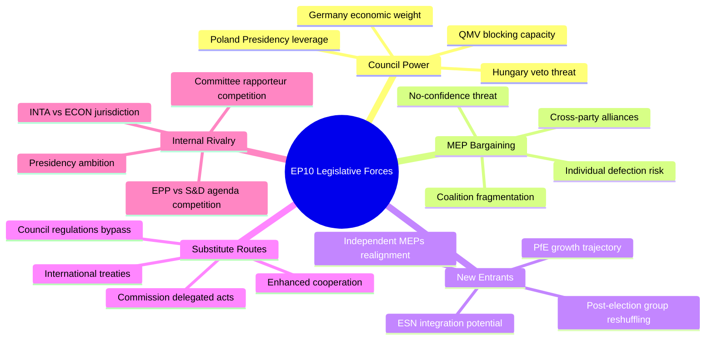

<!-- SPDX-FileCopyrightText: 2024-2026 Hack23 AB -->
<!-- SPDX-License-Identifier: Apache-2.0 -->

# Forces Analysis — EU Parliament Propositions
**Date:** 2026-04-27 | **Framework:** Porter's Five Forces (adapted for legislative environment)

---

## Reader Briefing

This forces analysis maps the competitive and structural forces shaping the EU Parliament's legislative outcomes in April 2026. Rather than market forces, the analysis adapts Porter's framework to legislative dynamics: bargaining power of member states (suppliers), bargaining power of MEPs (buyers), threat of new entrants (new political groups), threat of substitutes (alternative legislative routes), and internal rivalry (inter-institutional competition).

---

## Forces Diagram

---

## Force 1: Council Bargaining Power (Supplier Power)

**Rating:** 🔴 HIGH

The Council of the EU functions as the co-legislator whose agreement is required for all ordinary legislative procedure dossiers. Its bargaining power is maximized in spring 2026 because:

- **Anti-Corruption Directive:** Council can effectively veto via Hungarian emergency brake (Article 83(3) TFEU). Even QMV on the substance requires navigating the emergency brake procedural mechanism.
- **US Tariffs Regulation:** Council negotiating position (limiting Commission delegated authority) clashes directly with EP's preferred text. Council leverage: QMV needed but member state interests diverge on tariff strategy.
- **SRMR3:** Council already signed (March 30, 2026). Council power here is **low** — the legislative stage is complete.

**Counter-force:** Polish Presidency (H1 2026) is broadly pro-EU, reducing Council blocking incentives. Poland wants legislative deliverables to demonstrate institutional credibility post-PiS era.

---

## Force 2: MEP Bargaining Power (Buyer Power)

**Rating:** 🟡 MEDIUM-HIGH

Individual MEPs and political groups hold exceptional leverage in EP10's fragmented environment. Because no group can form a majority alone:

- **Every vote is a negotiation.** MEPs in swing groups (Renew, Greens/EFA, ECR) can extract policy concessions, committee positions, or rapporteurship assignments in exchange for voting discipline.
- **Internal EPP discipline:** Weber needs to maintain 185 MEPs on complex votes while simultaneously managing right-flank pressure (ECR/PfE) and centrist demands (S&D/Renew co-operation). Individual EPP defections have outsized significance.
- **The Left paradox:** The Left's 46 seats can tip the balance on anti-corruption votes — their support is sought by EPP on rule-of-law issues, giving The Left leverage disproportionate to its seat count.

---

## Force 3: New Entrants (New Political Forces)

**Rating:** 🟡 MEDIUM

The political landscape is not static:

- **PfE trajectory:** PfE grew rapidly from founding (June 2024) to 85 seats. If European elections were held today, PfE would likely maintain or grow this position, based on polling in France, Italy, and Hungary.
- **ESN (European Sovereigntists and Nationalists, 27 seats):** Smaller than PfE but growing. Potential merger or coordination with PfE would create a 112-seat right-nationalist bloc — closer to EPP's 185 but more ideologically coherent.
- **Group reshuffling risk:** If Renew continues to weaken (reflecting national liberal party decline in France and Germany), its MEPs may migrate to EPP or Greens/EFA, reshaping coalition arithmetic.

---

## Force 4: Substitute Legislative Routes (Threat of Substitutes)

**Rating:** 🟡 MEDIUM

Several alternative routes bypass EP co-decision entirely:

- **Commission Delegated Acts:** The US Tariff regulation (2025/0261) is partly designed to give Commission authority to act via delegated acts, reducing EP legislative involvement. If this template spreads, EP loses visibility on implementation.
- **Enhanced Cooperation:** 9+ member states can proceed without unanimous Council agreement on certain policy areas. Enhanced cooperation could allow a "coalition of willing" on Anti-Corruption even without Hungary.
- **International Treaties:** The Council of Europe AI Convention (ratified March 2026) was processed via EP consent, not co-decision — a substitute route that bypasses EU legislative machinery for international norms-setting.

---

## Force 5: Internal Rivalry (Inter-Institutional Competition)

**Rating:** 🟡 MEDIUM

- **EP vs. Commission on Trade:** The trade counter-measures regulation (2025/0261) creates an ongoing rivalry: the Commission wants maximal delegated authority; the EP wants maximal scrutiny rights. This institutional tension is fundamental to the EU constitutional order.
- **EP vs. Council on Criminal Law:** The Anti-Corruption Directive is a test of the EP's expanding criminal law competence ambitions against Council's (especially Hungary's) sovereignty resistance.
- **Committee Jurisdictions:** ECON, JURI, INTA, and AFET all have stakes in the April 2026 dossiers. Committee rivalry for rapporteurship and plenary agenda priority is an internal competitive force.

---

## Forces Balance Assessment

| Force | Power Level | EP Position | Strategic Response |
|-------|------------|-------------|-------------------|
| Council | 🔴 HIGH | Vulnerable | Build maximum Council majority before plenary vote |
| MEP Bargaining | 🟡 MEDIUM-HIGH | Adaptive | Weber's dual-coalition strategy |
| New Entrants | 🟡 MEDIUM | Managing | Monitor PfE growth; maintain EPP cohesion |
| Substitutes | 🟡 MEDIUM | Partially favorable | Use delegated acts strategically on trade |
| Internal Rivalry | 🟡 MEDIUM | Standard | Committee chair management by Metsola |

---

*Forces Analysis: 2026-04-27 | Framework: Porter's Five Forces (legislative adaptation)*
