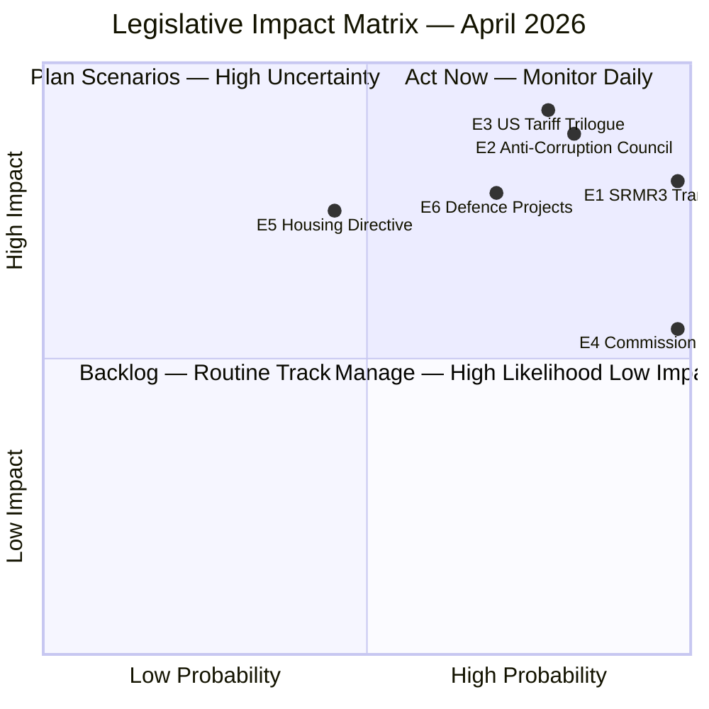

<!-- SPDX-FileCopyrightText: 2024-2026 Hack23 AB -->
<!-- SPDX-License-Identifier: Apache-2.0 -->

# Impact Matrix — EU Parliament Propositions
**Date:** 2026-04-27 | **Framework:** Impact Classification

---

## Reader Briefing

This impact matrix maps the key legislative events of April 2026 against their stakeholder impact and probability of policy outcome. It is intended for parliamentary researchers, MEP offices, and policy analysts who need a rapid visual assessment of where to focus attention. The most critical quadrant (high impact, high probability) should be monitored daily; the top-right quadrant (high impact, uncertain) warrants scenario planning; bottom-right items can be tracked weekly.

---

## Event List

| ID | Event | Probability | Stakeholder Impact | Cascade Potential |
|----|-------|------------|-------------------|------------------|
| E1 | SRMR3 OJ Publication + Transposition Start | 100% (done) | Financial sector, member states, SRB | HIGH — banking architecture |
| E2 | Anti-Corruption Directive Council negotiations | 85% (will proceed) | Justice ministries, EPPO, civil society | HIGH — rule of law |
| E3 | US Tariff Trilogue Round 2 | 80% (likely May) | EU-US trade, automotive, agriculture | CRITICAL — trade architecture |
| E4 | Commission ACT_FOLLOWUPs response | 100% (done April 22) | EP-Commission relations, institutional | MEDIUM |
| E5 | Housing Resolution legislative follow-up | 45% (directive possible) | Citizens, housing sector, member states | HIGH — social policy |
| E6 | Defence Industrial Projects implementation | 70% (under way) | Industry, defence ministers, NATO interface | HIGH — strategic autonomy |

---

## Impact Matrix

---

## Stakeholder Impact Assessment

| Stakeholder | SRMR3 | Anti-Corruption | US Tariffs | Housing |
|-------------|-------|----------------|-----------|---------|
| EPP | 🟢 Credit | 🟡 Risky (internal) | 🟡 Divided | ⚪ |
| S&D | 🟢 Credit | 🟢 Strong support | 🟡 Conditions | 🟢 Strong |
| Citizens | 🟡 Indirect | 🟢 Strong positive | 🟡 Mixed | 🟢 Direct |
| Financial sector | 🔴 Compliance | ⚪ | 🟡 Affected | ⚪ |
| Industry | ⚪ | ⚪ | 🔴 High stakes | ⚪ |
| Member states | 🔴 Transposition | 🔴 Blocking risk | 🟡 Varied | 🟡 Discretion |

---

## Heat Map

| | High Probability | Low Probability |
|-|-----------------|----------------|
| **High Impact** | E1 (SRMR3), E2 (Anti-Corruption), E3 (US Tariffs) | E5 (Housing Directive) |
| **Low Impact** | E4 (Commission Follow-ups) | — |

---

## Cascade Analysis

**E3 → E1 → E2 cascade risk:** If US tariffs escalate AND SRMR3 transposition fails in any major banking-sector member state, the combination could trigger a banking confidence crisis AND an EU-US trade crisis simultaneously — a compound emergency that would overwhelm current EP legislative bandwidth.

**E2 → E5 cascade opportunity:** A successful Anti-Corruption Directive Council adoption would strengthen EP's institutional confidence in using Article 83 treaty base for future legislation, potentially accelerating the Housing Social Rights Directive on legal grounds.

---

*Impact Matrix: 2026-04-27 | Framework: Event/Stakeholder Impact Analysis*
