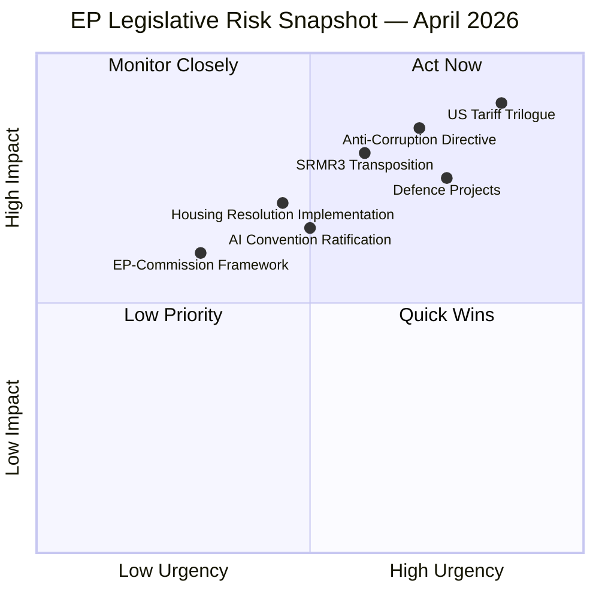

<!-- SPDX-FileCopyrightText: 2024-2026 Hack23 AB -->
<!-- SPDX-License-Identifier: Apache-2.0 -->

# Executive Brief — EU Parliament Propositions Analysis
**Date:** 2026-04-27 | **Type:** Propositions | **Classification:** UNCLASSIFIED
**Confidence:** 🟡 Medium | **Admiralty Grade:** B2

---

## BLUF (Bottom Line Up Front)

The week of April 20–27, 2026 marks a pivotal legislative moment for the European Parliament: the **SRMR3 bank resolution regulation published in the EU Official Journal** on April 20 signals the completion of a multi-year reform cycle for EU financial stability architecture. Simultaneously, the **Anti-Corruption Directive first reading position** (adopted March 26) moves to the Council, and the **US tariff counter-measure trilogue** entered its first round on April 13. The Commission issued six follow-up action documents on April 22 in response to March 2026 EP positions, indicating active institutional follow-through across the legislative pipeline.

**Strategic assessment:** EP10 faces a compressed timeline with rising output (+46.2% year-on-year), operating under a structurally fragmented political landscape where no two-group majority exists and minimum winning coalition requires 3+ parties. The right bloc (52.3% of seats) is increasingly dominant, but internal divisions between EPP, ECR, and PfE complicate governance.

---

## Three Decisions Required

1. **SRMR3 Transposition Calendar:** Member State governments must now initiate domestic transposition of the Single Resolution Mechanism Regulation 3. The EP Legal Affairs Committee and Finance Ministers must coordinate implementing guidelines — a 12–18 month window is critical. **Decision required:** EP should adopt a transposition monitoring resolution by Q3 2026.

2. **Anti-Corruption Directive: Council Negotiations Strategy:** The EP's strong first reading position (voted March 26) now awaits Council response. The EP negotiating team must decide how far to defend mandatory minimum sentences and independent prosecutor provisions against expected Council resistance from member states (notably Hungary, Poland, Bulgaria). **Decision required:** EP JURI/LIBE committees to confirm red lines before Council's general approach (expected Q2 2026).

3. **US Tariff Response Modalities:** With the first trilogue on the Regulation 2025/0261(COD) completed April 13, the INTA Committee must signal whether to push for a stronger retaliatory schedule against US goods or accept a negotiation-facilitation approach. EU GDP growth trajectories (Germany: -0.496% in 2024) and the risk of a trade war with the world's largest economy add urgency. **Decision required:** INTA plenary hearing on trilogue modalities in May 2026.

---

## 60-Second Read

The European Parliament's legislative pipeline in April 2026 is characterized by **three concurrent streams**: (a) completing multi-year legislative cycles (SRMR3, Insolvency Harmonization), (b) advancing new institutional-quality legislation (Anti-Corruption Directive, AI Convention), and (c) responding to the geopolitical shift from US tariffs and the ongoing Russia-Ukraine war. The parliament operates with 719 MEPs under a right-leaning plurality where EPP (25.73%, 185 seats) dominates but needs ECR/PfE support to reach the 361-seat majority threshold, making every major vote a coalition negotiation.

EP10's Q1 2026 output (104 adopted texts through Q1) is on track to exceed the projected 114 legislative acts for the year — a 46.2% increase versus 2025. The Commission's six follow-up documents of April 22 indicate the Commission responding to March 26 Strasbourg positions at unusually high speed, suggesting either political urgency or coordination pressure.

---

## Top Documents / Procedures Reference

| Priority | Procedure ID | Title | Stage | Last Activity |
|----------|-------------|-------|-------|---------------|
| 🔴 CRITICAL | 2023/0111(COD) | SRMR3 — Bank Resolution Reform | **Published OJ** | 2026-04-20 |
| 🔴 CRITICAL | 2023/0135(COD) | Anti-Corruption Directive | First Reading Adopted | 2026-03-26 |
| 🔴 HIGH | 2025/0261(COD) | US Tariff Counter-measures | **Trilogue Round 1** | 2026-04-13 |
| 🟡 MEDIUM | TA-10-2026-0096 | US Tariffs Adjustment (adopted) | Adopted | 2026-03-26 |
| 🟡 MEDIUM | TA-10-2026-0092 | SRMR3 Plenary adoption | Adopted | 2026-03-26 |
| 🟡 MEDIUM | TA-10-2026-0064 | Housing Crisis Resolution | Adopted | 2026-03-10 |
| 🟡 MEDIUM | TA-10-2026-0066 | AI Copyright Challenges | Adopted | 2026-03-10 |
| 🟢 TRACKED | TA-10-2026-0071 | AI Convention Ratification | Adopted | 2026-03-11 |
| 🟢 TRACKED | TA-10-2026-0080 | Defence Industrial Projects | Adopted | 2026-03-11 |
| 🟢 TRACKED | SP-2026-04-22 (×6) | Commission Follow-ups | Commission Response | 2026-04-22 |

---

## Mermaid Risk Snapshot

**Risk Legend:** Upper-right quadrant (Act Now) = requires immediate EP response. Red items indicate active geopolitical pressure points.

---

## Top Forward Trigger

**Monitor:** First trilogue outcome for 2025/0261(COD) — if the EU-US trade negotiations fail to produce a compromise by June 2026, the EP may be called to vote on emergency trade defense measures in July or September. This could reshape the EPP-ECR coalition dynamics, as ECR's national industries benefit differently from tariff protection vs. free trade.

**Watch:** The Council's response to the Anti-Corruption Directive (2023/0135(COD)). If Hungary or Poland objects to the independent prosecutor provisions, the directive may trigger a qualified-majority override attempt, testing EPP's commitment to rule-of-law conditionality ahead of its 2027 budget negotiations.

---

## Confidence Assessment

| Component | Confidence | Basis |
|-----------|-----------|-------|
| Procedure tracking (SRMR3, Anti-Corruption) | 🟢 HIGH | Direct EP API timeline data |
| Political seat counts | 🟢 HIGH | EP MEP roster real-time |
| Trilogue status (US tariffs) | 🟡 MEDIUM | Timeline confirms meeting; outcome not yet published |
| Commission follow-up content | 🟡 MEDIUM | Document IDs confirmed; full text pending retrieval |
| Economic context (Germany GDP) | 🟡 MEDIUM | World Bank 2024 actuals; IMF forecasts not yet retrieved |
| Voting record details (March 2026) | 🔴 LOW | EP API roll-call vote delay (4–6 weeks) |

---

*Analysis produced: 2026-04-27 | Run: propositions | Source: EP Open Data Portal via european-parliament-mcp-server@1.2.15*
