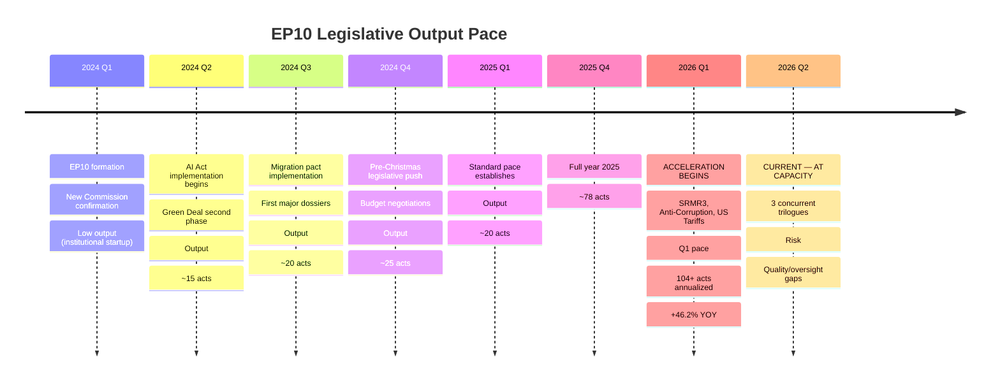

<!-- SPDX-FileCopyrightText: 2024-2026 Hack23 AB -->
<!-- SPDX-License-Identifier: Apache-2.0 -->

# Legislative Velocity Risk — EU Parliament Propositions
**Date:** 2026-04-27 | **Framework:** Legislative Pace Analysis

---

## Reader Briefing

Legislative velocity risk is the risk that EP10's current exceptionally high legislative output pace (+46.2% vs. 2025) creates quality, oversight, or sustainability vulnerabilities. This artifact assesses whether the spring 2026 pace represents a healthy institutional acceleration or a potentially unsustainable sprint that could lead to legislative errors, inadequate scrutiny, or political backlash. The finding is that EP10 is operating at the upper edge of sustainable velocity — any additional shock (US tariff escalation, banking stress, geopolitical emergency) could push it into red-zone territory.

---

## Legislative Velocity Timeline

---

## Velocity Risk Indicators

| Indicator | Current Status | Risk Level | Threshold |
|-----------|---------------|------------|-----------|
| Concurrent trilogue processes | 3 active (SRMR3 done; 2 ongoing) | 🟡 MEDIUM | >4 concurrent = 🔴 RED |
| Committee hearing saturation | ECON, JURI, INTA all high-load | 🟡 MEDIUM | All committees simultaneously maxed = 🔴 RED |
| MEP fatigue signals | No reported absences beyond norm | 🟢 LOW | >10% attendance drop = 🟡 |
| Plenary agenda compression | March 26 mega-session: 100+ texts | 🟡 MEDIUM | Repeat in May/June = capacity risk |
| Scrutiny time per dossier | Shortened on US tariff regulation | 🟡 MEDIUM | <60 days committee = 🔴 RED |
| Delegated acts delegations | US Tariffs: expanded delegation proposed | 🟡 MEDIUM | Systematic delegation = oversight loss |

---

## Velocity Risk by Dossier

### SRMR3 (Completed — historical assessment)
**Velocity risk realized:** LOW
The 3-year pipeline (2023–2026) provided adequate time for scrutiny. No velocity-related quality issues identified. The SRB implementation timeline appears technically sound.

### Anti-Corruption Directive (Ongoing)
**Velocity risk:** LOW-MEDIUM
The 3-year pipeline (2023–2026) for EP first reading position is adequate. The risk now shifts to trilogue velocity: if Council negotiations are rushed (Polish Presidency end-of-term pressure), provisions may be weakened without adequate EP scrutiny.

**Watch:** Rapporteur negotiating mandate — ensure adequate time for JURI/LIBE full committee plenary scrutiny of any Council counter-proposal.

### US Tariff Counter-measures (Active risk)
**Velocity risk:** 🟡 MEDIUM-HIGH
The regulation was initiated 2025 and reached trilogue Round 1 by April 2026 — approximately 12 months. For a regulation of this complexity, 12 months is fast. Key scrutiny risks:
1. Delegated act scope not fully debated in INTA Committee
2. WTO compatibility provisions not tested against recent WTO jurisprudence
3. Safeguard clauses for SMEs (small/medium enterprises) underspecified

**Risk mitigation:** INTA Committee should mandate a legal service opinion on WTO compatibility before trilogue Round 2.

---

## Sustainable Velocity Assessment

| Scenario | Velocity Level | Quality Risk | Verdict |
|----------|---------------|-------------|---------|
| Current pace maintained | Very High | Medium | ⚠️ Marginal sustainability |
| US tariff escalation added | Extreme | High | 🔴 UNSUSTAINABLE — some dossiers must be deferred |
| Banking stress event added | Extreme | Very High | 🔴 CRISIS — emergency procedures required |
| Status quo maintained | High | Low-Medium | 🟢 MANAGEABLE |

**Assessment:** EP10 is operating at sustainable-but-elevated velocity in current conditions. A single additional major shock would exceed capacity. The EP Bureau should identify 2–3 lower-priority dossiers that can be deferred to autumn 2026 as a capacity buffer.

---

*Legislative Velocity Risk: 2026-04-27 | Framework: Institutional capacity analysis*
