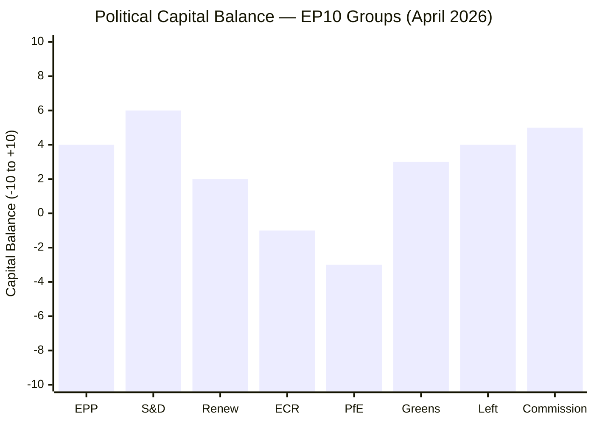

<!-- SPDX-FileCopyrightText: 2024-2026 Hack23 AB -->
<!-- SPDX-License-Identifier: Apache-2.0 -->

# Political Capital Risk — EU Parliament Propositions
**Date:** 2026-04-27 | **Framework:** Political Capital Analysis

---

## Reader Briefing

Political capital is the finite reservoir of goodwill, credibility, and coalition trust that political actors spend to pass legislation. This artifact assesses the political capital stakes for the key actors in EP10's April 2026 dossiers — where capital is being spent, accumulated, and at risk. For EPP Group under Weber, the spring 2026 period is the highest-stakes political capital moment of EP10's first half: success or failure on the anti-corruption directive and US tariff response will define his legislative legacy through 2027.

---

## Political Capital Scorecard

*Score interpretation: Positive = net capital accumulation this quarter; Negative = spending capital without equivalent gains*

---

## Group-by-Group Analysis

### EPP (+4 net)
**Capital spent:**
- Negotiating SRMR3 through complex trilogue process
- Managing right-flank demands (ECR/PfE on migration, borders) vs. centrist demands (S&D/Renew on rule-of-law)
- Internal discipline on anti-corruption (risk of Eastern European member defections)

**Capital earned:**
- SRMR3 published (banking reform complete) — strong economic governance credential
- US tariff counter-measures trilogue launched — proactive on strategic autonomy
- Coalition management demonstrating EP10 is functional despite fragmentation

**Net risk:** If Anti-Corruption Directive fails due to Council, EPP may take disproportionate blame (as the governing group) even though Hungary is the blocking actor. Reputational damage could accelerate EPP's right-shift as Weber seeks to consolidate by leaning toward ECR/PfE.

### S&D (+6 net)
**Capital spent:**
- Accepting SRMR3 without full social safeguards on bail-in
- Tolerating US tariff response without comprehensive social protection clauses

**Capital earned:**
- Primary political owner of Anti-Corruption Directive (first reading position driven by S&D rapporteur)
- Housing Resolution (TA-10-2026-0064) — direct social constituency
- Consistent record of pro-rule-of-law position with cross-spectrum coalition building

**Net risk:** If EPP shifts right and abandons S&D on key votes, S&D enters an oppositional role. Loss of co-governing status would require rebuilding as principled opposition — possible but politically costly.

### Commission (+5 net)
**Capital spent:**
- Managing US trade tension while preserving bilateral relationship
- Navigating SRMR3 implementation architecture
- Six ACT_FOLLOWUP documents (institutional bandwidth cost)

**Capital earned:**
- SRMR3 publication: executive competence demonstrated
- Anti-Corruption Directive initiative: governance credibility
- Fast legislative response to US tariffs (2025/0261): strategic autonomy credibility

**Net risk:** If Commission delegated authority in US tariff regulation is reduced by EP in trilogue, it sets a precedent limiting Commission executive action across all trade dossiers.

### Hungary/PfE (-3 net)
**Capital spent:**
- Blocking tactics create EU-wide criticism
- Emergency brake invocation (anticipated) will generate significant negative press

**Capital earned:**
- Domestic audience sees blocking as sovereignty defense
- Demonstrates PfE can use EU institutional mechanisms to frustrate "federalist" agenda

**Net assessment:** Hungary is playing domestic political capital strategy against EU institutional credibility. For Orbán, this is rational: domestic capital > EU institutional standing.

---

## Political Capital Risk Events

| Event | Capital at Stake | Winners | Losers | Probability |
|-------|-----------------|---------|--------|------------|
| Anti-Corruption Council adoption | Very High | S&D, EPP, Commission | Hungary, PfE | 55–65% |
| Anti-Corruption directive failure | Very High | Hungary, PfE | EPP, S&D, Commission | 35–45% |
| US Tariff regulation adopted | High | EPP, Germany, Commission | None (balanced) | 65–75% |
| G7 trade de-escalation | High | EPP, Renew, Commission | ECR (protection agenda) | 35–45% |
| SRMR3 transposition failures | Medium | None | Commission, EP ECON | 15–25% |

---

## EPP Capital Crisis Threshold

Weber's political capital crisis threshold: if **both** (a) Anti-Corruption Directive fails in Council AND (b) US tariff response is inadequate, Weber faces a dual legitimacy crisis. He would have failed on the centrist rule-of-law agenda (credibility with S&D, Renew, Greens) while also failing on trade defense (credibility with Germany BDI, Southern European industry). Under this scenario, EPP's right-shift to ECR/PfE would accelerate significantly.

**Probability of dual failure:** 15–25% (low but not negligible)

---

*Political Capital Risk: 2026-04-27 | Framework: Bourdieu-inspired political capital analysis*
