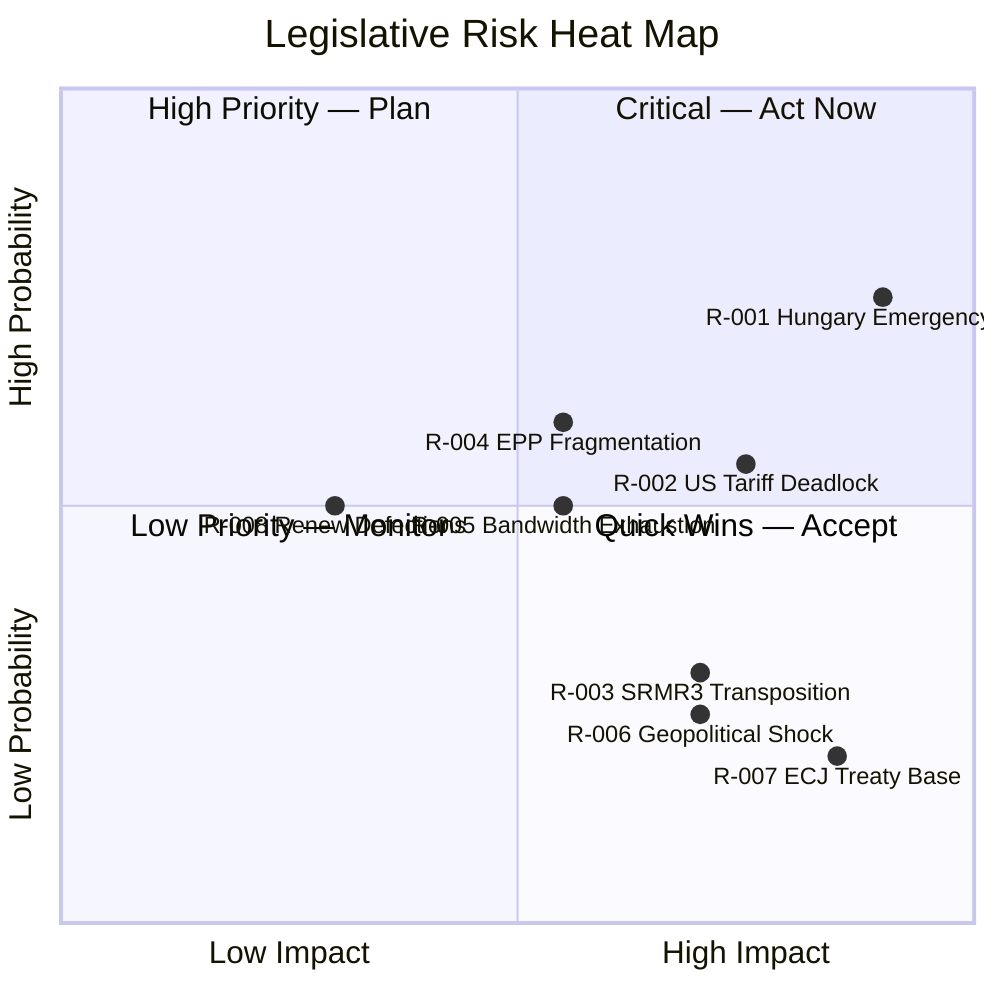

<!-- SPDX-FileCopyrightText: 2024-2026 Hack23 AB -->
<!-- SPDX-License-Identifier: Apache-2.0 -->

# Risk Matrix — EU Parliament Propositions
**Date:** 2026-04-27 | **Confidence:** 🟡 Medium

---

## Overview

This risk matrix assesses the top legislative risks facing the EP's April 2026 propositions pipeline. Risks are scored on Probability (P) and Impact (I) using a 1–5 scale, then mapped to a heat level.

| Score | Probability | Impact |
|-------|------------|--------|
| 5 | >70% | Structural/catastrophic |
| 4 | 50–70% | Major disruption |
| 3 | 30–50% | Significant delay |
| 2 | 15–30% | Minor setback |
| 1 | <15% | Negligible |

**Heat = P × I | Priority: 🔴 15–25 | 🟡 8–14 | 🟢 1–7**

---

## Risk Register

### R-001: Hungary Emergency Brake on Anti-Corruption Directive
- **P:** 4 (55–65%) | **I:** 5 (structural — voids directive)
- **Heat:** 20 🔴 CRITICAL
- **Description:** Hungary invokes Article 83(3) TFEU emergency brake, triggering European Council unanimity requirement. This effectively gives Hungary a single-state veto over EU criminal law harmonization.
- **Mitigation:** Commission narrows scope; EP building cross-party coalition to maximize political pressure on Council; Article 7 TEU escalation threat as leverage.
- **Residual Risk:** Even if Council votes with QMV on the substance, Hungary's procedural options could delay by 12–18 months.

### R-002: US Tariff Trilogue Deadlock
- **P:** 3 (35–45%) | **I:** 4 (major — EU unable to respond to escalating US tariffs)
- **Heat:** 12 🟡 SIGNIFICANT
- **Description:** EP-Council disagreement on scope of Commission delegated authority stalls trilogue. With only Round 1 completed (April 13), 3–4 additional rounds needed. If US escalates tariffs before EU counter-measure regulation adopted, the Commission must use existing TPR regulation (less flexible).
- **Mitigation:** Fast-track procedure; Renew and EPP alignment on "negotiation leverage" framing rather than "automatic retaliation."
- **Residual Risk:** Even if stalled, Commission retains fallback powers under existing trade law.

### R-003: SRMR3 Transposition Failure (Multiple Member States)
- **P:** 2 (15–25%) | **I:** 4 (major — resolution gaps at next banking stress event)
- **Heat:** 8 🟡 SIGNIFICANT
- **Description:** If 5+ member states fail to transpose SRMR3 on schedule, the unified EU resolution architecture will have legal gaps. This is particularly risky if a banking stress event occurs during the transposition window.
- **Mitigation:** SRB technical assistance; Commission infringement proceedings threat; prior SRMR experience provides institutional memory.
- **Residual Risk:** Low; precedent favors compliance within 6 months of deadline.

### R-004: EPP Internal Fragmentation on Rule-of-Law
- **P:** 3 (40–50%) | **I:** 3 (significant — delayed legislative pipeline)
- **Heat:** 9 🟡 SIGNIFICANT
- **Description:** EPP MEPs from Eastern European member states defect on Anti-Corruption vote, threatening the majority. Particularly: Romanian EPP MEPs (country under EPPO scrutiny), Bulgarian EPP MEPs (ongoing corruption investigations), Hungarian EPP-adjacent MEPs (Fidesz left EPP in 2021 but smaller groups remain).
- **Mitigation:** EPP leadership disciplined whipping on rule-of-law dossiers; S&D + Greens + The Left provide surplus votes on anti-corruption coalition.
- **Residual Risk:** Moderate; surplus votes mitigate individual EPP defections.

### R-005: EP10 Legislative Bandwidth Exhaustion
- **P:** 3 (35–45%) | **I:** 3 (significant — priorities must be deferred)
- **Heat:** 9 🟡 SIGNIFICANT
- **Description:** With EP10 running at 46.2% above 2025 output pace, there is a genuine risk of bandwidth exhaustion: committee chairs overbooked, plenary agenda saturated, MEP fatigue increasing. If the US tariff situation escalates, it may crowd out Anti-Corruption Directive, Housing, and AI legislation.
- **Mitigation:** EP Bureau scheduling optimization; delegation of follow-on dossiers to autumn 2026.
- **Residual Risk:** Moderate; scheduling flexibility exists.

### R-006: Geopolitical Shock Disruption (Ukraine/Russia)
- **P:** 2 (15–25%) | **I:** 4 (major — EP emergency session displaces planned agenda)
- **Heat:** 8 🟡 SIGNIFICANT
- **Description:** A sudden geopolitical escalation (Russia-Ukraine ceasefire collapse, Russian escalation, hybrid attack on EU infrastructure) triggers an EP emergency session, displacing planned legislative agenda.
- **Mitigation:** EP protocols for emergency sessions allow rapid plenary convening without displacing scheduled legislation; precedent from COVID shows adaptation capacity.
- **Residual Risk:** Low-medium.

### R-007: ECJ Ruling Against Treaty Base (Anti-Corruption)
- **P:** 2 (10–20%) | **I:** 5 (structural — directive void or remanded)
- **Heat:** 10 🟡 SIGNIFICANT
- **Description:** A member state challenges the Article 83(1) TFEU treaty base before or during transposition; ECJ rules that the scope of criminal law harmonization exceeds EU competence.
- **Mitigation:** Commission legal service analysis; precedent favors EP/Commission on Article 83 scope for transnational crime.
- **Residual Risk:** Low; ECJ has consistently upheld EU criminal law competence extensions when well-grounded in treaty.

### R-008: Renew Defections on US Tariff Counter-measures
- **P:** 3 (35–45%) | **I:** 2 (minor — forced to rely on ECR/PfE majority)
- **Heat:** 6 🟢 MANAGEABLE
- **Description:** If regulation text is drafted too aggressively (mandatory automatic counter-measures), Renew's free-trade MEPs abstain or vote against. EPP would then need ECR/PfE votes, imposing political conditions.
- **Mitigation:** "Negotiation leverage" framing in regulation design (Commission discretion triggers, not automatic); Renew leadership endorsement sought before plenary vote.

---

## Risk Heat Map

---

## Aggregate Risk Score

**Overall Risk Level:** 🟡 MEDIUM-HIGH
**Highest Priority Risks:** R-001 (Hungary veto), R-002 (US tariff deadlock)
**Most Likely Materialization:** R-004 (EPP fragmentation) and R-005 (bandwidth exhaustion) are the most likely to manifest, even if their individual impact is lower

---

*Risk Matrix: 2026-04-27 | Method: 5×5 probability-impact scoring*
