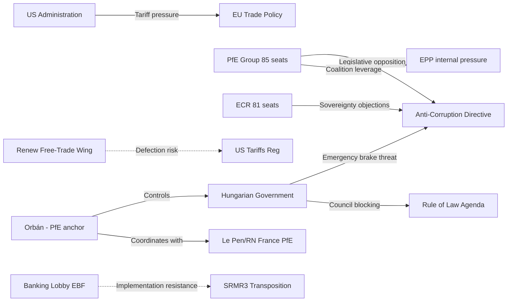

<!-- SPDX-FileCopyrightText: 2024-2026 Hack23 AB -->
<!-- SPDX-License-Identifier: Apache-2.0 -->

# Actor Threat Profiles — EU Parliament Propositions
**Date:** 2026-04-27 | **Framework:** Threat Actor Analysis

---

## Reader Briefing

This artifact profiles the specific actors who pose legislative or institutional threats to the EP's April 2026 propositions pipeline. Unlike the stakeholder map (which profiles all actors), this document focuses exclusively on actors with demonstrated or credible adversarial positions. For EP legislative strategists, the Hungarian government's posture on the Anti-Corruption Directive is the single most critical threat variable to monitor.

---

## Threat Actor Network

---

## Profile 1: Hungarian Government (Fidesz / Orbán) — 🔴 CRITICAL THREAT

**Threat Type:** Council blocking (Anti-Corruption Directive)
**Primary Mechanism:** Article 83(3) TFEU Emergency Brake invocation
**Capability:** VERY HIGH — single-state veto right under emergency brake procedure
**Intent:** VERY HIGH — Anti-Corruption Directive directly threatens governance model
**Operational History:**
- 2018: Hungary's Article 7 TEU proceedings initiated; ongoing
- 2022: ECJ ruled Hungary in systematic rule-of-law breach
- 2023–2024: Hungary used Council veto on Ukraine financial support, causing year-long delays
- 2024: European Court of Justice issued daily fines against Hungary for migration law non-compliance
- 2025: Hungary blocked justice reform clauses in MFF negotiations

**Threat Assessment:** Orbán will almost certainly attempt to block or severely weaken the Anti-Corruption Directive in Council. The emergency brake is the most likely mechanism. Even if the brake fails (Council overrides by European Council vote), Hungary will use maximum delay tactics.

**Counter-threat options for EP:** (1) Commission threatens accelerated Article 7 sanctions; (2) Coalition builds public pressure campaign; (3) Article 83(3) override requiring European Council unanimity — fails if any other member state supports Hungary; (4) Enhanced cooperation: 9 willing member states proceed without Hungary.

---

## Profile 2: PfE Group (85 seats) — 🟡 SIGNIFICANT THREAT

**Threat Type:** EP vote opposition (Anti-Corruption, Housing, AI governance)
**Primary Mechanism:** Bloc voting against; withholding votes from EPP coalition on rule-of-law dossiers
**Capability:** HIGH — 85 votes can swing close outcomes; RN (France) + Fidesz-adjacent + Lega (Italy)
**Intent:** HIGH on rule-of-law; MEDIUM on trade (divided)

**Key Dynamic:** PfE's 85 seats provide EPP leverage on right-flank dossiers (defence, borders). In exchange, PfE expects EPP tolerance of their opposition to Anti-Corruption and rule-of-law enforcement. This creates a structural incentive for EPP to downgrade rule-of-law enforcement to preserve PfE cooperation on other dossiers.

---

## Profile 3: ECR Group (81 seats) — 🟡 SIGNIFICANT THREAT (conditional)

**Threat Type:** Coalition discipline fracture; Anti-Corruption opposition
**Primary Mechanism:** Bloc votes against Anti-Corruption Directive; Sovereignty rhetoric
**Capability:** MEDIUM-HIGH — 81 seats; includes Italy (MEP delegation), Poland (in transition), Belgium
**Intent:** HIGH on criminal law sovereignty; LOW-MEDIUM on trade (Meloni's Italy prefers EU-US negotiation)

**Key Dynamic:** ECR is split on Anti-Corruption: Italian MEPs (Meloni's FdI) have domestic anti-corruption credibility and may support moderate provisions; Polish ECR MEPs are in post-PiS transition and may align with EP mainstream. This creates internal ECR dynamics that EPP can exploit.

---

## Profile 4: US Administration (Trump) — 🔴 CRITICAL EXTERNAL THREAT

**Threat Type:** Geopolitical legislative pressure; trade escalation
**Primary Mechanism:** Tariff announcements that force EU legislative responses
**Capability:** EXTREME — unilateral trade action capacity
**Intent:** MEDIUM-HIGH — tariff policy is a negotiating tool, not necessarily permanent

**Key Dynamic:** Unlike domestic political threats, the US administration threat is partly complementary to EU legislative momentum — it creates urgency that accelerates the counter-measures regulation. However, escalation could overtake the legislative process, forcing Commission to use emergency procedures that bypass normal EP scrutiny.

---

## Threat Priority Matrix

| Actor | Capability | Intent | Overall Threat | Primary Target |
|-------|-----------|--------|---------------|---------------|
| Hungary | 🔴 VERY HIGH | 🔴 VERY HIGH | 🔴 CRITICAL | Anti-Corruption Directive |
| US Administration | 🔴 EXTREME | 🟡 MEDIUM | 🔴 CRITICAL | Trade Policy |
| PfE Group | 🟡 HIGH | 🟡 HIGH | 🟡 HIGH | Rule-of-Law; Housing |
| ECR Group | 🟡 MEDIUM-HIGH | 🟡 MEDIUM | 🟡 MEDIUM | Anti-Corruption |
| Renew Free-Trade Wing | 🟡 MEDIUM | 🟡 MEDIUM | 🟡 MEDIUM | US Tariffs Regulation |
| Banking Lobby | 🟢 MEDIUM | 🟡 MEDIUM | 🟢 LOW-MEDIUM | SRMR3 Transposition |

---

*Actor Threat Profiles: 2026-04-27 | Framework: MITRE ATT&CK (legislative adaptation)*
