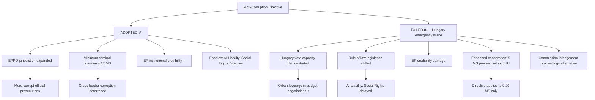
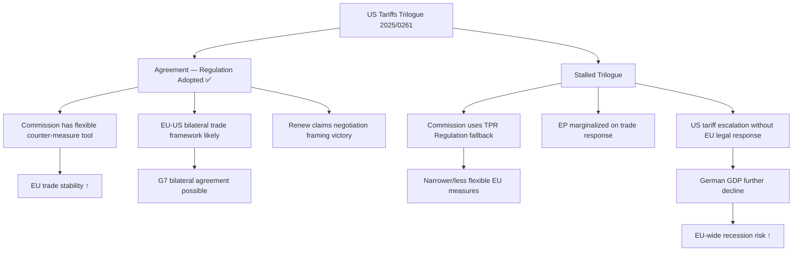
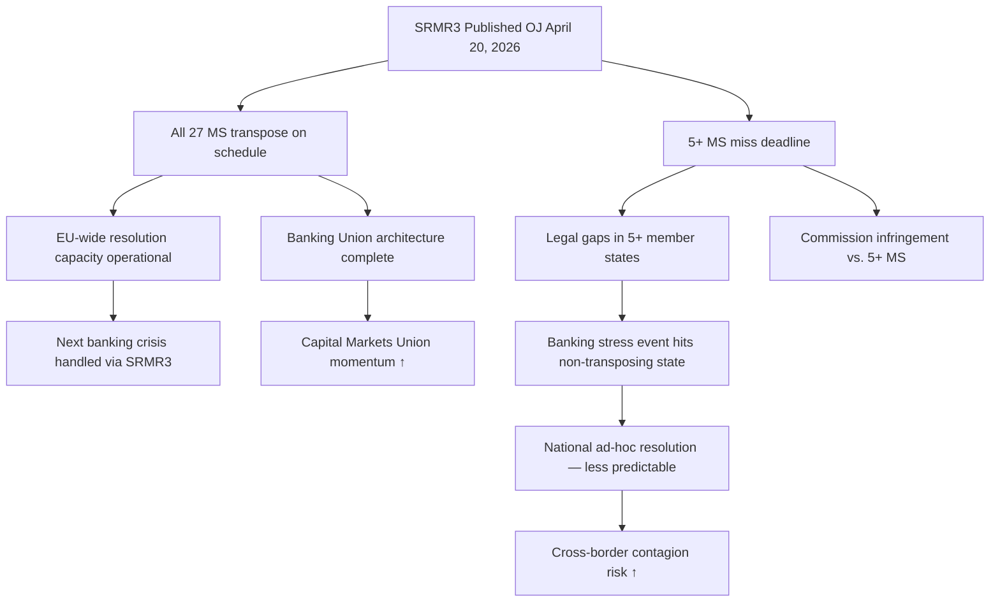

<!-- SPDX-FileCopyrightText: 2024-2026 Hack23 AB -->
<!-- SPDX-License-Identifier: Apache-2.0 -->

# Consequence Trees — EU Parliament Propositions
**Date:** 2026-04-27 | **Framework:** Consequence/Event Tree Analysis

---

## Reader Briefing

Consequence trees trace the downstream effects of key legislative outcomes in the EP's April 2026 propositions pipeline. Each tree starts from a key decision point and maps the cascade of institutional, political, and social consequences. For strategic planners, the Anti-Corruption Directive failure tree has the most branching negative consequences — it is the highest-leverage single decision point in the current pipeline.

---

## Tree 1: Anti-Corruption Directive Adoption vs. Failure

---

## Tree 2: US Tariff Counter-measures — Outcomes

---

## Tree 3: SRMR3 Transposition — Success vs. Gap

---

## Summary Consequence Assessment

| Decision Point | Best Case Consequence | Worst Case Consequence | Probability Best |
|---------------|----------------------|----------------------|-----------------|
| Anti-Corruption adopted | EPPO expansion; rule of law strengthened | — | 55–65% |
| Anti-Corruption fails | — | Hungary veto demonstrated; legislation chilled | 35–45% |
| US Tariff Reg adopted | EU-US bilateral framework; trade stability | — | 65–75% |
| US Tariff Reg stalls | — | Commission TPR fallback; EP marginalized | 25–35% |
| SRMR3 full transposition | Banking Union complete; CMU momentum | — | 75–85% |
| SRMR3 partial transposition | — | Resolution gaps; contagion risk | 15–25% |

---

*Consequence Trees: 2026-04-27 | Framework: Event/Consequence tree analysis*
