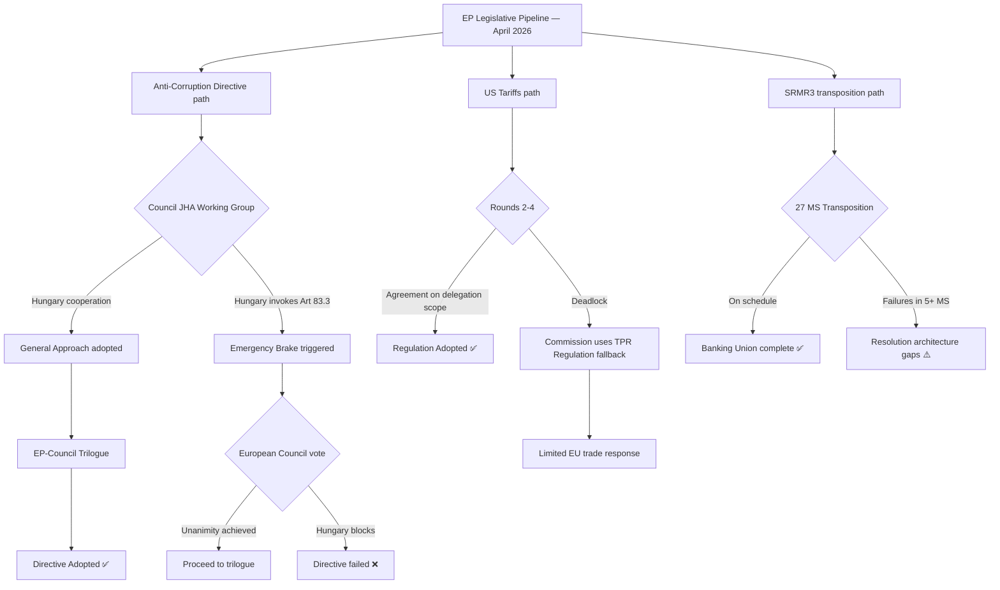

<!-- SPDX-FileCopyrightText: 2024-2026 Hack23 AB -->
<!-- SPDX-License-Identifier: Apache-2.0 -->

# Legislative Disruption Assessment — EU Parliament Propositions
**Date:** 2026-04-27 | **Framework:** Legislative Risk Trees

---

## Reader Briefing

This document assesses the mechanisms by which the EP's April 2026 legislative pipeline could be disrupted, delayed, or derailed. It is intended for EP legislative coordinators, political group advisors, and Commission liaison officers. The most critical disruption path runs through Hungary's Council blocking capacity on the Anti-Corruption Directive — this is the near-term focus. The US tariff regulation faces a different type of disruption: not blockage but inadequacy (regulation too slow or too weak to address escalating US measures).

---

## Disruption Flowchart

---

## Disruption Pathway Analysis

### Path A: Anti-Corruption Directive — Emergency Brake (Highest Risk)

**Trigger:** Hungary formally invokes Article 83(3) TFEU before or during Council working group deliberations.

**Mechanism:** The emergency brake sends the matter to the European Council for unanimous decision. If any member state supports Hungary (Slovakia under Fico is the most likely candidate), the directive dies. Even without a supporting member state, the European Council unanimity requirement gives Hungary maximum leverage for renegotiation.

**Probability of trigger:** 55–65%
**Probability of directive survival if triggered:** 45–55% (depends on Fico position)

**Impact if failed:** 
- EP institutional credibility damage on criminal law agenda
- Emboldened PfE/ECR anti-EU governance narrative
- Commission must pivot to infringement proceedings or enhanced cooperation as alternative
- EPPO scope expansion stalled

**Disruption timeline:** Emergency brake invocation → 3-month European Council process → outcome by September 2026

### Path B: US Tariffs — Speed-Inadequacy Failure

**Trigger:** US announces auto-sector tariffs (25%) before EU regulation 2025/0261 is adopted.

**Mechanism:** Commission must respond using existing TPR (Trade Policy Regulation) and safeguard mechanisms — more limited, less targeted than the new regulation. The legislative "weapon" arrives after the battle starts.

**Probability:** 30–40% (depends on US announcement timing)

**Impact if triggered:**
- EU exports to US affected before legal counter-measure framework in place
- EP's reputation for speed-of-response damaged
- Renew and free-trade MEPs use "regulation too late" argument against further legislative delegation to Commission

### Path C: SRMR3 Transposition — Implementation Gap

**Trigger:** 5+ member states miss the transposition deadline.

**Probability:** 15–20%

**Impact:** Legal gaps in resolution architecture during the transposition window (estimated 12–18 months from OJ publication). If a banking stress event occurs during this window, the new resolution tools may be unusable in non-transposing states.

---

## Disruption Early Warning Indicators

| Pathway | Early Warning Indicator | Lead Time |
|---------|------------------------|-----------|
| Anti-Corruption Emergency Brake | Hungarian Council delegation requests indefinite postponement | 4–8 weeks |
| Anti-Corruption Emergency Brake | Fico/Slovakia signals support for Hungarian position | 4–8 weeks |
| US Tariffs Speed Failure | White House announcement of auto tariff schedule | Immediate |
| US Tariffs Speed Failure | USTR Federal Register notice | 2–4 weeks |
| SRMR3 Transposition Gap | Commission infringement pre-notification to 3+ MS | 3–6 months |

---

*Legislative Disruption: 2026-04-27 | Framework: Disruption pathway analysis*
