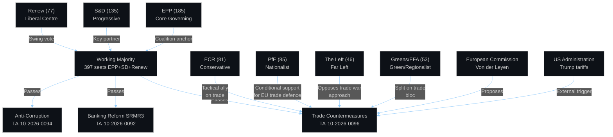

<!-- SPDX-FileCopyrightText: 2024-2026 Hack23 AB -->
<!-- SPDX-License-Identifier: Apache-2.0 -->

# Actor Mapping — EU Parliament Breaking News — 2026-04-28

**Run:** breaking-run1777360024 | **Date:** 2026-04-28 | **Session:** Strasbourg April 27-30, 2026
**Data Sources:** EP Open Data Portal — generate_political_landscape, analyze_coalition_dynamics

---

## For Citizens — Plain Language Summary

Who are the key players shaping EU policy right now? The European Parliament has 719 elected representatives (MEPs) from 27 countries, organised into 9 political groups. The centre-right EPP group (185 members) is the largest force, leading coalition negotiations on trade, banking, and anti-corruption legislation. The centre-left S&D (135 members) is the second-largest actor. Together with centrist Renew (77), they form the core working majority needed to pass legislation (361 votes required). On the right flank, ECR (81), PfE (85), and ESN (27) form a nationalist/conservative bloc. The EP currently navigates a US-EU trade conflict as its most pressing external challenge.

---

## 1. Actor Roster

### Primary Institutional Actors

| Actor | Type | Role | Influence | EP10 Status |
|-------|------|------|-----------|-------------|
| EPP (185 seats) | Political Group | Lead coalition party | DOMINANT | Core governing coalition |
| S&D (135 seats) | Political Group | Progressive anchor | HIGH | Key coalition partner |
| Renew (77 seats) | Political Group | Liberal centre | HIGH | Coalition swing vote |
| ECR (81 seats) | Political Group | Conservative opposition | MEDIUM-HIGH | Tactical partner on trade |
| PfE (85 seats) | Political Group | Nationalist right | MEDIUM | Opposition — pro-EU trade defence |
| Greens/EFA (53 seats) | Political Group | Progressive left | MEDIUM | Case-by-case support |
| The Left (46 seats) | Political Group | Far left | LOW-MEDIUM | Opposition — anti-trade-war |
| NI (30 seats) | Non-attached | Diverse opposition | LOW | Unpredictable |
| ESN (27 seats) | Political Group | Far-right nationalist | LOW | Opposition |
| European Commission | EU Institution | Initiator/implementer | STRATEGIC | Von der Leyen Commission |
| Council of EU | EU Institution | Co-legislator | STRATEGIC | Rotating presidency |
| CJEU | EU Institution | Legal arbiter | HIGH | EU-Mercosur opinion pending |

### Key Individual MEPs (Identified by Recent Actions)

| MEP | Group | Country | Recent Action | Influence |
|-----|-------|---------|---------------|-----------|
| Grzegorz Braun | NI | PL | Immunity waiver subject | LOW (isolated) |
| Commission President Von der Leyen | - | DE | Trade policy driver | CRITICAL |

---

## 2. Influence Network Analysis

---

## 3. Alliance Network

### Coalition Mathematics (April 2026)
- **EPP + S&D + Renew = 397 seats** (majority: 361 required) — grand coalition viable
- **EPP alone = 185** (far below threshold — needs partners)
- **Conservative bloc (EPP+ECR+PfE+ESN) = 378** — has majority but rarely cohesive
- **Progressive bloc (S&D+Renew+Greens+Left) = 311** — minority, needs EPP cooperation

### Active Coalitions by Issue Area

| Issue | Coalition | Vote Estimate | Confidence |
|-------|-----------|--------------|------------|
| Trade countermeasures | EPP+S&D+Renew+ECR | ~450+ | MEDIUM |
| Banking reform | EPP+S&D+Renew | ~397 | HIGH |
| Anti-corruption | EPP+S&D+Renew+Greens | ~450 | HIGH |
| Ukraine finance | EPP+S&D+Renew+Greens+Left | ~480 | HIGH |
| EU-Canada solidarity | EPP+S&D+Renew+Greens | ~450 | MEDIUM |

---

## 4. Actor Position Map — Trade War Context

| Actor | Position on US Tariff Response | Rationale |
|-------|-------------------------------|-----------|
| EPP | STRONG SUPPORT — proportionate countermeasures | Protect EU industry, negotiate from strength |
| S&D | SUPPORT — with labour protection caveats | Workers' rights in trade policy |
| Renew | SUPPORT — de-escalation preferred | Liberal free trade ethos, but US provoked first |
| ECR | SUPPORT — nationalist economic defence | EU sovereignty/industry protection |
| PfE | MIXED — some oppose escalation | Domestic political considerations (some pro-Trump) |
| ESN | OPPOSE — pro-US populist stance | Ideological alignment with Trump movement |
| Greens/EFA | CAUTIOUS — trade war risks | Environmental standards in trade agenda |
| The Left | OPPOSE — different anti-globalisation logic | Trade deals harmful to workers/environment |

---

## 5. Threat Actor Assessment

| Threat Actor | Type | Threat Vector | Risk Level |
|-------------|------|--------------|------------|
| US Administration | External State | Trade coercion escalation | HIGH |
| PfE internal dissidents | Internal/Group | Coalition defection on trade | MEDIUM |
| Hungary government | Member State | Blocking tactics in Council | MEDIUM |
| Russian hybrid ops | External | Disinformation on EU unity | MEDIUM-HIGH |
| ESN cross-group influence | Internal | Delegitimisation of institutions | LOW |

---

## 6. Data Sources and Provenance

| Source | Tool | Data Used | Reliability |
|--------|------|-----------|-------------|
| EP Open Data Portal | generate_political_landscape | Group compositions (719 MEPs) | B-1 |
| EP Open Data Portal | analyze_coalition_dynamics | Coalition size analysis | B-2 |
| EP Open Data Portal | early_warning_system | Structural warnings | B-2 |
| EP Open Data Portal | get_adopted_texts | Document actor attribution | B-1 |

**Attribution:** European Parliament Open Data Portal (data.europarl.europa.eu) — CC BY 4.0
