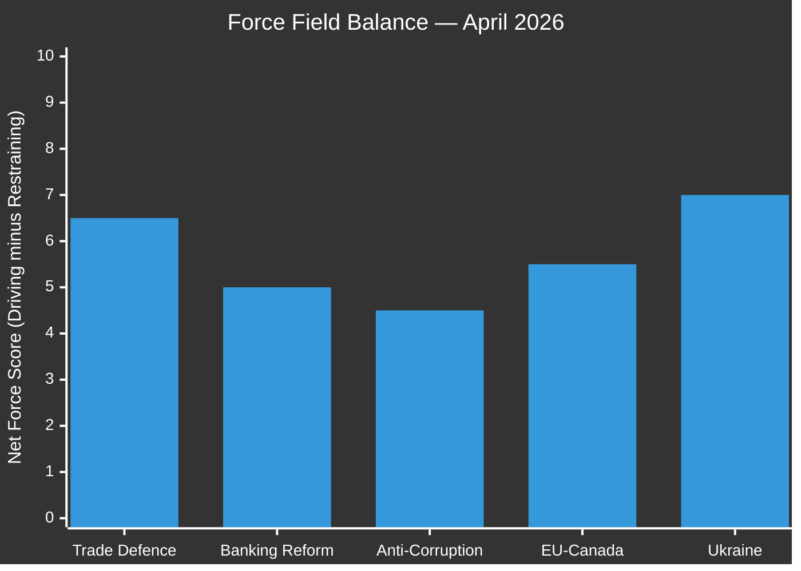

<!-- SPDX-FileCopyrightText: 2024-2026 Hack23 AB -->
<!-- SPDX-License-Identifier: Apache-2.0 -->

# Forces Analysis — EU Parliament Breaking News — 2026-04-28

**Run:** breaking-run1777360024 | **Date:** 2026-04-28 | **Session:** Strasbourg April 27-30, 2026
**Methodology:** Kurt Lewin Force Field Analysis adapted for parliamentary dynamics

---

## For Citizens — Plain Language Summary

Force field analysis examines what is pushing the EU Parliament to act (driving forces) and what is holding it back or creating resistance (restraining forces). On the key issue of EU-US trade policy, the driving forces — US tariff pressure, industry lobbying, MEP electoral concerns — are currently stronger than the restraining forces — diplomatic caution, free-trade ideology, transatlantic security dependency. This imbalance has produced concrete legislative action (TA-10-2026-0096) and signals more may follow.

---

## 1. Issue Frame

**Primary Issue:** EU Parliament response to US trade policy escalation (2026)
**Secondary Issue:** Banking Union completion and financial stability architecture
**Tertiary Issue:** Democratic governance and rule-of-law enforcement

**Analytical Question:** What forces are accelerating or decelerating EU legislative assertiveness in Spring 2026?

---

## 2. Driving Forces (Forces Favouring Legislative Action)

### Political Drivers
| Force | Strength (1-10) | Trend | Evidence |
|-------|-----------------|-------|----------|
| US tariff escalation pressure | 9 | Increasing | Section 232/301 actions, Trump rhetoric |
| EPP governing mandate | 8 | Stable | EP10 investiture coalition, majority arithmetic |
| European sovereignty discourse | 8 | Increasing | Strategic autonomy agenda, Commission priorities |
| Public opinion — anti-US-tariffs | 7 | Increasing | Eurobarometer, member state polling |
| Industry lobbying for protection | 8 | High | BUSINESSEUROPE, sectoral associations active |
| Electoral accountability | 7 | Stable | MEPs face 2029 re-election on delivery |
| Ukraine geopolitical momentum | 8 | Stable | Continued Russian aggression, G7 support mechanism |

### Institutional Drivers
| Force | Strength (1-10) | Trend | Evidence |
|-------|-----------------|-------|----------|
| Commission agenda-setting | 8 | Proactive | Von der Leyen Commission priority legislation queue |
| Council co-legislation | 7 | Cooperative | Qualified majority voting on most dossiers |
| Banking Union completion pressure | 7 | Sustained | ECB, SSM, SRB advocacy for SRMR3 |
| CJEU legal architecture | 6 | Stable | EU-Mercosur opinion request signals rule-of-law focus |

---

## 3. Restraining Forces (Forces Opposing or Slowing Action)

### Political Restraints
| Force | Strength (1-10) | Trend | Evidence |
|-------|-----------------|-------|----------|
| Transatlantic security dependency | 7 | Decreasing | NATO burden-sharing debates, US withdrawal risk |
| Free-trade ideological commitment | 6 | Weakening | Renew group internal divisions on trade defence |
| PfE/ESN pro-Trump factions | 5 | Stable | Ideological alignment with US right-wing |
| Hungarian veto threat in Council | 6 | Persistent | Orban pro-Russia, pro-Trump positioning |
| Rule-of-law coalition fractures | 5 | Variable | Poland recovering; Hungary entrenched |

### Institutional Restraints
| Force | Strength (1-10) | Trend | Evidence |
|-------|-----------------|-------|----------|
| WTO rules compliance | 6 | Active constraint | EU bound by WTO safeguard disciplines |
| Proportionality principle | 5 | Moderate | Legal counsel caution on escalation |
| Council unanimity requirements | 6 | On some issues | CFSP, taxation decisions need unanimity |
| Parliamentary fragmentation | 5 | Moderate | 9 groups require complex coalition management |

---

## 4. Net Pressure Assessment

**Net Assessment:**
- **Trade Defence (TA-10-2026-0096):** Net driving force = +6.5/10. Driving forces significantly outweigh restraints. Action already taken; further escalation possible.
- **Banking Reform (SRMR3):** Net driving force = +5.0/10. Balanced but technical consensus enables passage.
- **Anti-Corruption:** Net driving force = +4.5/10. Politically complex; member state resistance from some capitals.
- **EU-Canada Solidarity:** Net driving force = +5.5/10. Geopolitical urgency offsets diplomatic complexity.
- **Ukraine Support:** Net driving force = +7.0/10. Overwhelming political consensus; restraints minimal.

---

## 5. Intervention Points

Key moments where force balance can be shifted:

1. **G7 Summit (June 2026):** Could recalibrate US-EU trade tensions — either escalation trigger or de-escalation opening
2. **ECJ Opinion on EU-Mercosur:** If compatible, activates new trade coalition dynamics; if incompatible, strains trade defence narrative
3. **Council SRMR3 adoption:** Completion of Banking Union is an intervention point — if delayed, restraining forces strengthen
4. **Hungarian elections (if early):** Would potentially remove a key restraining force on EU-Canada and anti-corruption dossiers
5. **US midterm electoral dynamics:** Changes to US Congress composition could affect Trump administration trade autonomy

---

## 6. Force Field Summary Table

| Domain | Total Driving | Total Restraining | Net Balance | Trajectory |
|--------|--------------|-------------------|-------------|-----------|
| Trade Policy | 55/70 | 35/70 | +20 (Pro-action) | Escalating |
| Banking Union | 40/50 | 25/50 | +15 (Pro-reform) | Completing |
| Rule of Law | 35/50 | 30/50 | +5 (Marginal) | Contested |
| Ukraine Support | 45/50 | 10/50 | +35 (Strong) | Stable-High |
| Transatlantic Relations | 30/50 | 35/50 | -5 (Cautious) | Deteriorating |

---

## Reader Briefing

**What does this mean for EU citizens?**

The European Parliament is in an assertive phase. External pressure (US tariffs, Russian aggression) is the dominant driver of legislative activity, overcoming traditional restraints (free-trade ideology, diplomatic caution). The Banking Union completion reduces systemic financial risk. The anti-corruption directive strengthens rule-of-law protections that citizens depend on. The driving forces outweigh restraining forces across most key issue areas, meaning more assertive EU legislative action is likely in H2 2026, particularly if the US-EU trade dispute escalates further.

---

## Data Sources

| Source | Tool | Data Type | Reliability |
|--------|------|-----------|-------------|
| EP Open Data Portal | generate_political_landscape | Group composition | B-1 |
| EP Open Data Portal | early_warning_system | Structural indicators | B-2 |
| EP Open Data Portal | get_adopted_texts | Legislative outcomes | B-1 |
| EP Open Data Portal | analyze_coalition_dynamics | Coalition size metrics | B-2 |

**Attribution:** European Parliament Open Data Portal (data.europarl.europa.eu) — CC BY 4.0
