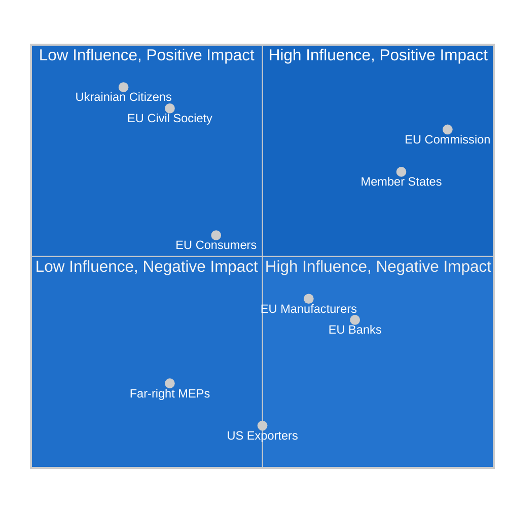

<!-- SPDX-FileCopyrightText: 2024-2026 Hack23 AB -->
<!-- SPDX-License-Identifier: Apache-2.0 -->

# Impact Matrix — EU Parliament Breaking News — 2026-04-28

**Run:** breaking-run1777360024 | **Date:** 2026-04-28 | **Session:** Strasbourg April 27-30, 2026
**Methodology:** Multi-dimensional stakeholder impact scoring

---

## For Citizens — Plain Language Summary

This impact matrix maps how the EU Parliament's recent legislative actions affect different groups in society. The trade counter-measures affect exporters and consumers (higher prices on some US goods). Banking reform affects depositors and financial institutions (safer banking system). Anti-corruption affects businesses and public officials. Ukraine loan support affects Ukrainian citizens and EU taxpayers. Not all impacts are negative — stronger institutions and more resilient finance systems benefit EU citizens broadly.

---

## 1. Event List

| Event | Date | Policy Domain | Geographic Scope |
|-------|------|--------------|-----------------|
| EU Tariff Counter-Response (TA-10-2026-0096) | 2026-03-26 | Trade Policy | EU-US bilateral |
| SRMR3 Banking Reform (TA-10-2026-0092) | 2026-03-26 | Financial Regulation | EU-wide |
| Anti-Corruption Directive (TA-10-2026-0094) | 2026-03-26 | Rule of Law | All EU member states |
| Braun Immunity Waiver (TA-10-2026-0088) | 2026-03-26 | Parliamentary Governance | EP institutional |
| EU-Canada Cooperation (TA-10-2026-0078) | 2026-03-11 | Foreign Policy | EU-Canada |
| Ukraine Loan (TA-10-2026-0010) | 2026-01-21 | Defence/Finance | EU-Ukraine |
| Financial Stability Rec. (TA-10-2026-0004) | 2026-01-20 | Economic Governance | EU-wide |

---

## 2. Stakeholder Impact Assessment

| Stakeholder | Trade Tariffs | Banking Reform | Anti-Corruption | Ukraine | Overall |
|------------|--------------|----------------|----------------|---------|---------|
| EU manufacturers (export) | -3 (risk of US retaliation) | 0 | 0 | +1 | -2 |
| EU consumers | -2 (higher US import costs) | +2 (safer deposits) | +1 | 0 | +1 |
| EU financial institutions | -1 (compliance costs) | -2 (stricter resolution) | -1 | 0 | -4 |
| EU member state govts | +2 (solidarity signal) | +2 (reduced crisis risk) | -3 (corruption enforcement) | +2 | +3 |
| US exporters to EU | -5 (tariff impact) | 0 | 0 | 0 | -5 |
| Ukrainian citizens | 0 | 0 | 0 | +5 | +5 |
| EU civil society/NGOs | +3 (anti-corruption wins) | +2 | +4 | +3 | +12 |
| Far-right MEPs (Braun/NI) | 0 | 0 | -2 | -3 | -5 |
| European Commission | +3 (mandate vindicated) | +3 | +2 | +3 | +11 |
| Council of EU | +2 | +2 | +1 | +2 | +7 |

*Scale: -5 (highly negative) to +5 (highly positive) | 0 = neutral/no significant impact*

---

## 3. Impact Matrix Visualisation

---

## 4. Heat Map — Policy Domain Impact Intensity

| Stakeholder | Trade | Finance | Rule-of-Law | Geopolitics | Total |
|------------|-------|---------|-------------|-------------|-------|
| EU Industry | HIGH | MEDIUM | LOW | LOW | HIGH |
| EU Consumers | MEDIUM | HIGH | MEDIUM | LOW | MEDIUM-HIGH |
| Financial Sector | LOW | HIGH | MEDIUM | LOW | HIGH |
| Member States | HIGH | HIGH | HIGH | HIGH | CRITICAL |
| Third Countries | HIGH | LOW | LOW | HIGH | HIGH |
| EP Institutional | MEDIUM | MEDIUM | HIGH | MEDIUM | HIGH |

---

## 5. Cascade Effects Analysis

### Trade Tariff Cascade (TA-10-2026-0096)
1. **Immediate (0-3 months):** EU customs duties adjusted on selected US goods. US exporters face higher costs. EU domestic producers gain competitive relief.
2. **Short-term (3-6 months):** US counter-retaliation possible. Agricultural and aviation sectors particularly exposed.
3. **Medium-term (6-18 months):** Potential WTO dispute proceedings. Negotiated tariff reduction deal or escalation ladder.
4. **Long-term (18+ months):** Structural shift in EU-US trade architecture; potential rebalancing toward non-US suppliers.

### Banking Reform Cascade (TA-10-2026-0092)
1. **Immediate:** Banks must update resolution plans to meet new SRMR3 criteria. SRB supervision intensified.
2. **Short-term:** Higher capital buffer requirements during transition. Market confidence improves.
3. **Medium-term:** Reduced probability of disorderly bank failure. Taxpayer bail-out risk reduced.
4. **Long-term:** Banking Union completion strengthens euro area financial integration.

---

## Reader Briefing

**Why this matters to ordinary citizens:**

The three major legislative actions of late March 2026 create ripple effects across multiple areas of daily life:

- **Trade tariffs:** If EU-US tensions escalate, some American goods may become more expensive in EU shops. However, EU producers compete more effectively, which may preserve jobs.
- **Banking reform:** The new SRMR3 makes the European banking system safer. If a bank fails, taxpayers are less likely to be called to bail it out — resolution funds bear more of the cost.
- **Anti-corruption:** New harmonised criminal standards mean corruption cases have clearer cross-border enforcement. This particularly affects public procurement, construction, and media ownership.

The net impact on EU citizens is cautiously positive, though the trade conflict introduces uncertainty.

---

## 6. Data Sources and Provenance

| Source | Tool | Data Type | Reliability |
|--------|------|-----------|-------------|
| EP Open Data Portal | get_adopted_texts | Legislative scope | B-1 |
| EP Open Data Portal | generate_political_landscape | Political context | B-1 |
| EP Open Data Portal | early_warning_system | Risk assessment | B-2 |

**Attribution:** European Parliament Open Data Portal (data.europarl.europa.eu) — CC BY 4.0
