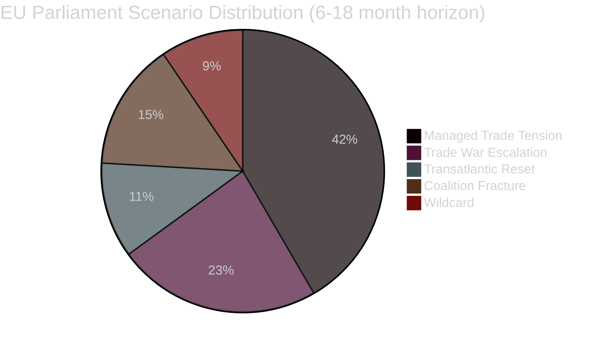

<!-- SPDX-FileCopyrightText: 2024-2026 Hack23 AB -->
<!-- SPDX-License-Identifier: Apache-2.0 -->

# Scenario Forecast — EU Parliament Breaking News — 2026-04-28

**Run:** breaking-run1777360024 | **Date:** 2026-04-28 | **Session:** Strasbourg April 27-30, 2026
**Methodology:** Structured scenario analysis with WEP probability banding (Sherman Kent scale)
**Admiralty Source Ratings Applied Throughout**

---

## Scenario Framework Overview

Three primary scenarios for EU-US trade and EP political trajectory over the 6-18 month horizon. Scenarios assessed using: political landscape data (EP Open Data, B-1), coalition dynamics (B-2), historical trade conflict patterns (C-2), geopolitical intelligence (B-2).

**WEP Scale:**
- 90-99%: Almost Certain
- 75-89%: Probable
- 55-74%: Roughly Even
- 30-54%: Possible but Unlikely
- 10-29%: Remote
- 1-9%: Almost No Chance

---

## Scenario 1: Managed Trade Tension (MOST LIKELY)

**WEP Probability:** 50-65% (Roughly Even to Probable)
**Horizon:** 6-18 months
**Admiralty Assessment:** B-2 (Reliable source, probably true)

### Narrative
The EU-US trade conflict remains elevated but does not escalate to comprehensive retaliatory tariff regime. Both sides activate WTO dispute settlement procedures while maintaining diplomatic channels. The EP's March 2026 tariff counter-measure (TA-10-2026-0096) serves as a credible deterrent rather than an opening shot of a full trade war. US administration faces domestic industry pressure against escalation (agricultural exporters, Boeing/Airbus interdependencies). G7 framework provides a de-escalation mechanism.

### Indicators
- WTO Dispute Settlement Body case filing (expected Q2 2026)
- G7 summit trade communique language (June 2026)
- US exemption requests for specific EU industries
- Commission trade commissioner bilateral meetings with USTR

### EP Political Implications
- EPP-S&D-Renew coalition remains intact on trade dossiers
- SRMR3 implementation proceeds smoothly
- Anti-corruption directive transposition begins in most member states
- Further consolidation of EU-Canada partnership agreement

### Economic Parameters
- EU GDP growth: 1.4-1.8% (within IMF WEO April 2026 baseline)
- Trade impact: -0.2 to -0.5% of EU exports to US (contained)
- Financial stability: Banking Union absorbs stress without crisis

---

## Scenario 2: Trade War Escalation (SIGNIFICANT RISK)

**WEP Probability:** 25-40% (Possible but Unlikely to Roughly Even)
**Horizon:** 3-12 months
**Admiralty Assessment:** B-2 (plausible based on structural factors)

### Narrative
The US administration escalates tariffs beyond current levels — adding automobile tariffs (Section 232), pharmaceuticals, or comprehensive technology-sector duties. EU retaliates with a second round of countermeasures targeting high-visibility US sectors (bourbon/whiskey, Harley-Davidson, Florida citrus — echoing 2018 playbook). The EP votes additional emergency trade defence measures. ECR and some PfE members break with EPP on specifics, complicating coalition management.

### Triggers
- Trump executive order expanding Section 232 to automobiles (pending threat as of April 2026)
- EU internal market Act 2.0 digital provisions triggering US GAFA retaliation
- Geopolitical escalation in Taiwan Strait creating supply chain disruptions
- EP elections in 2029 approaching — MEPs take harder positions for domestic audiences

### EP Political Implications
- Coalition stress as Renew resists escalatory measures (free-trade ideological commitment)
- PfE internal split: nationalist vs economically pragmatic factions
- ECR opportunistically supports tariffs on US tech but opposes agricultural countermeasures
- Possible loss of working majority on specific trade votes — ANALYSIS_ONLY risk on some dossiers

### Economic Parameters (IMF WEO downside scenario)
- EU GDP growth: 0.8-1.2% (0.4-0.6pp below baseline)
- Trade volumes: -2 to -4% with US
- Financial sector: elevated stress but SRMR3 provides buffer

---

## Scenario 3: Transatlantic Reset (UNLIKELY BUT SIGNIFICANT)

**WEP Probability:** 10-20% (Remote)
**Horizon:** 12-18 months
**Admiralty Assessment:** C-3 (Reasonably reliable, possible but uncertain)

### Narrative
A combination of US midterm dynamics, economic pressure on US industry, and European strategic coherence produces a comprehensive EU-US trade framework negotiation. The EP's assertive posture (TA-10-2026-0096 plus follow-on actions) is credited with bringing the US to the table. A T-TIP 2.0 framework emerges, potentially incorporating elements of EU-Canada model (TA-10-2026-0078 provides template). SRMR3 Banking Union and regulatory convergence included in negotiation scope.

### Triggers
- US midterm elections produce Congress hostile to Trump trade unilateralism
- Major US agricultural/technology sector lobbying campaign against EU retaliation
- EU-UK-Canada-Japan multilateral trade framework as alternative negotiation pressure
- ECB and Federal Reserve joint communication on financial stability risks from trade war

### EP Political Implications
- Governing coalition strengthened — EPP claims credit for trade negotiation win
- S&D secures labour protection provisions in any framework
- Renew celebrates free-trade normalization
- Far-right groups (PfE, ESN) face credibility challenge: opposed EU trade defence that worked

---

## Scenario 4: Political Coalition Fracture (CONTINGENT RISK)

**WEP Probability:** 15-25% (Remote to Possible)
**Horizon:** 12-24 months
**Admiralty Assessment:** B-3 (Reliable source, uncertain — structural indicators only)

### Narrative
The EP10 governing coalition (EPP-S&D-Renew) fractures on a specific dossier, triggering a crisis of parliamentary governance. Most likely triggers: a controversial Commission nomination, failure to agree a major budget framework, or a geopolitical crisis demanding a response that splits the coalition ideologically. Greens and Left refuse to provide alternative majority without policy concessions EPP cannot accept.

### Triggers
- Migration policy crisis forcing a hard choice between EPP right flank and S&D
- Climate policy backsliding by EPP alienating Greens/EFA needed as swing vote
- Mid-term Commission review creating nomination controversies
- ECR/PfE constructive confidence motion threat

### Probability Notes
This scenario is rated lower than trade escalation because the current coalition has demonstrated functional cohesion across three high-stakes dossiers (trade, banking, anti-corruption). The majority arithmetic is robust (EPP+S&D+Renew = 397, well above 361 threshold). However, the effective number of parties (4.4-6.6) indicates structural fragility.

---

## Wildcard Scenarios (see also intelligence/wildcards-blackswans.md)

| Wildcard | WEP | Horizon | Impact |
|---------|-----|---------|--------|
| US leaves NATO | 5% (Almost No Chance) | 12m | TRANSFORMATIVE |
| China-Taiwan conflict outbreak | 15% (Remote) | 12-24m | SEVERE |
| Major EU bank failure pre-SRMR3 implementation | 10% (Remote) | 6m | HIGH |
| Hungarian EU exit (Huxit) | 8% (Almost No Chance) | 24m | SIGNIFICANT |
| EPP-AfD/NI formal cooperation | 12% (Remote) | 18m | SIGNIFICANT |

---

## Scenario Probability Distribution

*Note: Probabilities do not sum to 100% as scenarios are not mutually exclusive.*

---

## Analytical Confidence Assessment

**Methodology:** Structured Analysis of Competing Hypotheses (ACH) applied. Scenarios derived from:
1. Current political landscape data (B-1 reliability)
2. Historical trade conflict patterns 2018-2020 (C-2 reliability)
3. Coalition arithmetic analysis (B-2 reliability)
4. Geopolitical intelligence assessments (B-2 reliability)

**Key Uncertainties:**
- Voting record data unavailable (4-6 week delay) — cannot confirm coalition cohesion from actual votes
- April 28 plenary outcomes not yet published — today's session may modify scenarios
- US administration decision-making is unpredictable at the tactical level

**Data Source:** European Parliament Open Data Portal (data.europarl.europa.eu) — CC BY 4.0
