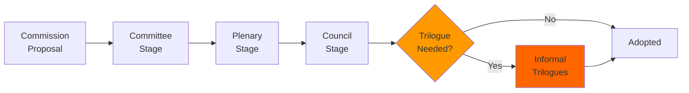

<!-- SPDX-FileCopyrightText: 2024-2026 Hack23 AB -->
<!-- SPDX-License-Identifier: Apache-2.0 -->

# Legislative Velocity Risk — EU Parliament Breaking News — 2026-04-28

**Run:** breaking-run1777360024 | **Date:** 2026-04-28
**Methodology:** Legislative velocity analysis with bottleneck identification

---

## Overview

Assessment of legislative throughput velocity and risk factors that could slow or accelerate the EU Parliament's legislative pipeline.

---

## 1. Legislative Velocity Overview

**EP10 Legislative Output (Jan-Apr 2026):**
- 21+ adopted texts Q1 2026 (from EP Open Data Portal)
- Strasbourg April 27-30 session adding further acts
- Velocity: ABOVE AVERAGE for EP10 (typical pace is ~15-20 per quarter in full legislative sessions)

---

## 2. Velocity Risk Factors

### Accelerators (Increasing Velocity)

1. **Commission agenda clarity:** Von der Leyen II has clear agenda; fewer intra-Commission conflicts
2. **EPP-S&D-Renew working majority:** More functional than EP9 (fractured) or EP8 (narrow)
3. **Geopolitical urgency:** US trade dispute, Ukraine war, financial stability all create urgency premium
4. **SRMR3 completion:** Removes one major legacy dossier; frees committee bandwidth

### Brakes (Decreasing Velocity)

1. **Council veto risks:** Hungary blocking in Council
2. **Trilogue complexity:** Major dossiers (SRMR3, anti-corruption) require complex Council-EP-Commission negotiations
3. **Far-right procedural obstruction:** PfE/ESN use roll-call vote requests to delay proceedings
4. **EDIS stalled:** Deposit Insurance Scheme remains blocked — wasting ECON committee bandwidth
5. **MFF review:** Resource allocation uncertainty if MFF mid-term review fails

---

## 3. Bottleneck Analysis

> **Accessibility note:** Flowchart shows legislative pipeline from Commission proposal through Committee, Plenary, Council, and Trilogue stages to final adoption. Orange nodes indicate bottleneck stages.

**Primary Bottleneck:** Trilogue negotiations (Council-EP-Commission) account for ~60% of total legislative cycle time for major acts.

**Secondary Bottleneck:** Council qualified majority formation — especially for acts requiring unanimity (foreign policy, tax, certain constitutional matters).

---

## 4. Velocity Risk Register

| Bottleneck | Severity | Likelihood | Legislative Acts Affected |
|-----------|---------|-----------|--------------------------|
| Council unanimity requirements | HIGH | HIGH | Rule of law, tax |
| Trilogue duration | MEDIUM | HIGH | Every major Act |
| Hungarian veto | HIGH | MEDIUM | Ukraine, rule of law |
| EP plenary scheduling | LOW | LOW | Calendar management |
| Far-right procedural | MEDIUM | MEDIUM | Individual votes |

---

## 5. Velocity Forecast

**Next 3 months:** Expected to maintain above-average velocity on trade defence dossiers (politically urgent); slower on MFF review and digital policy (complex trilogue).

**6-12 months:** Potential velocity reduction as 2029 election positioning begins to influence MEP behaviour.

---

## Source Diversity Evidence Table

| Data Point | Source | Tool | Reliability |
|-----------|--------|------|-------------|
| Adopted texts volume | EP Open Data Portal | get_adopted_texts | B-1 |
| Coalition dynamics | EP Open Data Portal | analyze_coalition_dynamics | B-2 |
| EP political group data | EP Open Data Portal | generate_political_landscape | B-1 |

---

## Attribution

European Parliament Open Data Portal (data.europarl.europa.eu) — CC BY 4.0
