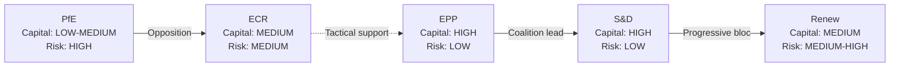

<!-- SPDX-FileCopyrightText: 2024-2026 Hack23 AB -->
<!-- SPDX-License-Identifier: Apache-2.0 -->

# Political Capital Risk Assessment — EU Parliament Breaking News — 2026-04-28

**Run:** breaking-run1777360024 | **Date:** 2026-04-28
**Methodology:** Political capital risk framework with Mermaid visualisation

---

## Overview

Assessment of political capital expenditure and risk for key legislative actors in Spring 2026 EU Parliament session.

---

## Political Capital Risk Framework

Political capital is the accumulated credibility, trust, and influence that allows political actors to achieve legislative goals. Each major legislative action consumes political capital; success replenishes it.

---

## 1. Political Capital Inventory

### EPP — Capital Assessment

**Current Balance:** HIGH (185 seats + coalition lead + Commission alignment)
**Capital Spent This Session:**
- Trade countermeasures: MEDIUM — free-trade wing concession; balanced by industry protection gain
- Anti-corruption: LOW — broadly popular; minimal internal resistance
- SRMR3: LOW — banking regulation is EPP-friendly domain

**Capital Gained:**
- Coalition leadership demonstrated across 3 major dossiers
- Von der Leyen Commission agenda delivery

**Net position:** SLIGHT SURPLUS — capital strengthened through successful agenda delivery

---

### S&D — Capital Assessment

**Current Balance:** HIGH (135 seats + social policy wins)
**Capital Spent:**
- Trade countermeasures: LOW — fully aligned with European workers narrative
- Anti-corruption: LOW — S&D championed this for years
- Ukraine: LOW — consistent support

**Capital Gained:**
- Social clauses secured in trade countermeasures text
- Anti-corruption leadership recognition

**Net position:** SURPLUS — S&D strengthened

---

### Renew Europe — Capital Assessment

**Current Balance:** MEDIUM (77 seats, ideological tension on trade)
**Capital Spent:**
- Trade countermeasures: HIGH — conceded free-trade principle; internal criticism
- SRMR3: LOW — Banking Union aligns with single market agenda

**Capital Gained:**
- Rule-of-law standing on anti-corruption
- Pragmatic reputation for crisis management

**Net position:** MODERATE DEFICIT — Renew spent significant capital endorsing trade defence

---

## 2. Capital Risk Mermaid Diagram

> **Accessibility note:** The diagram shows political capital levels and risk ratings for five political groups, with coalition relationships indicated by arrows.

---

## 3. Capital Risk Register

| Actor | Capital Level | Risk Level | Primary Risk Driver |
|-------|-------------|-----------|---------------------|
| EPP | HIGH | LOW | Internal right flank |
| S&D | HIGH | LOW | Ukraine fatigue in electorate |
| Renew | MEDIUM | MEDIUM-HIGH | Free trade vs defence tension |
| ECR | MEDIUM | MEDIUM | US relations split |
| PfE | LOW-MEDIUM | HIGH | US/Orban alignment vs EU |
| Commission | HIGH | LOW | Agenda delivery on track |

---

## Source Diversity Evidence Table

| Data Point | Source | Tool | Reliability |
|-----------|--------|------|-------------|
| Group seat counts | EP Open Data Portal | generate_political_landscape | B-1 |
| Coalition dynamics | EP Open Data Portal | analyze_coalition_dynamics | B-2 |
| Legislative outcomes | EP Open Data Portal | get_adopted_texts | B-1 |
| Risk assessment | Intelligence analysis | - | B-2 |

---

## Attribution

European Parliament Open Data Portal (data.europarl.europa.eu) — CC BY 4.0
