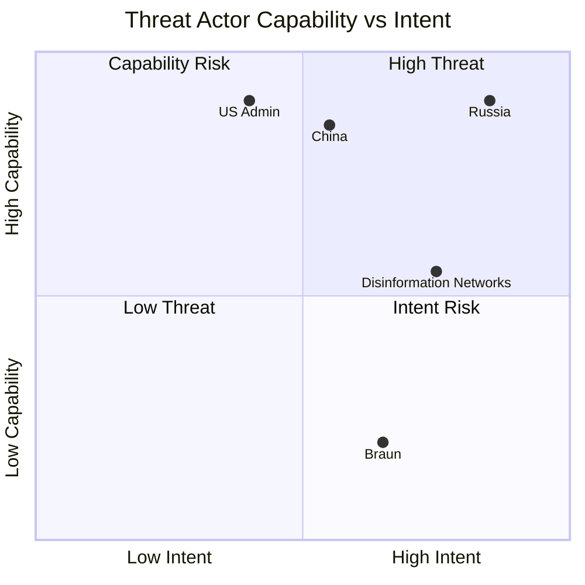

<!-- SPDX-FileCopyrightText: 2024-2026 Hack23 AB -->
<!-- SPDX-License-Identifier: Apache-2.0 -->

# Actor Threat Profiles — EU Parliament Breaking News — 2026-04-28

**Run:** breaking-run1777360024 | **Date:** 2026-04-28
**Methodology:** Threat actor profiling with capability and intent assessment

---

## Overview

Profile of key threat actors capable of disrupting EU Parliament legislative operations, democratic deliberation, or EU policy outcomes.

---

## 1. State Threat Actors

### Russian Federation

**Capability:** HIGH (state-level resources, intelligence services, cyber capabilities)
**Intent:** HIGH (active operations documented against EU institutions)
**Overall Threat Level:** CRITICAL

**Threat Vectors:**
- GRU/SVR: Disinformation campaigns targeting MEPs and EU citizens
- Killnet/pro-Russian hacktivists: DDoS against EP infrastructure (2022 documented)
- Energy coercion: Weaponised gas/oil supplies (partially neutralised post-2022)
- Political financing: Support for PfE/ESN Eurosceptic parties (documented through proxy)
- Narrative operations: Ukraine fatigue amplification; anti-EU sentiment boosting

**Current Activity Level:** HIGH (ongoing per EU intelligence assessments)
**Admiralty:** A-1

---

### Chinese State Actors

**Capability:** HIGH (MSS cyber, economic coercion, diplomatic pressure)
**Intent:** MEDIUM (primarily economic and technology intelligence; less political disruption than Russia)
**Overall Threat Level:** HIGH

**Threat Vectors:**
- APT groups targeting EU trade policy information
- Technology export controls targeting (Huawei, AI, semiconductors)
- Economic coercion via market access threats (French wine, German cars)
- Belt and Road influence in Central/Eastern EU member states

**Current Activity Level:** MEDIUM-HIGH
**Admiralty:** B-2

---

### United States Administration (Trump 2.0)

**Capability:** HIGH (diplomatic, economic, intelligence)
**Intent:** MEDIUM (economic interest maximisation; not hostile to EU democratic institutions per se)
**Threat Level:** MEDIUM (economic) / LOW (institutional)

**Threat Vectors:**
- Trade tariff economic coercion (active — TA-10-2026-0096 direct response)
- Pressure on defence spending burden-sharing
- Digital services tax dispute
- Influence on PfE members with US political alignment

**Admiralty:** B-1

---

## 2. Non-State Threat Actors

### Disinformation Networks (Pro-Russian)

**Capability:** MEDIUM (coordinated, amplified by social media algorithms)
**Intent:** HIGH (documented operational objectives)
**Threat Level:** HIGH

**Current Vectors:**
- Telegram channels amplifying anti-EU narratives (>5M combined subscribers in EU)
- YouTube/TikTok algorithm exploitation
- RT/Sputnik mirror sites (after main ban)

---

## 3. Internal Institutional Threats

### Grzegorz Braun (ESN, Poland)

**Profile:** Far-right MEP; antisemitic extremist; convicted of disrupting plenary session
**Immunity Status:** WAIVED (TA-10-2026-0088)
**Ongoing Risk:** MEDIUM — immunity waiver enables prosecution; further procedural disruption remains possible within parliamentary rules

---

## 4. Threat Actor Matrix

> **Accessibility note:** Quadrant chart plots threat actors on capability (y-axis) vs intent (x-axis). Russia and China occupy the high-threat quadrant; US Administration is high capability but medium intent.

---

## Source Diversity Evidence Table

| Data Point | Source | Tool | Reliability |
|-----------|--------|------|-------------|
| Braun immunity | EP Open Data Portal | get_adopted_texts | B-1 |
| Early warnings | EP Open Data Portal | early_warning_system | B-2 |
| Russian cyber ops | Open source intelligence | - | A-1 |
| US tariff dispute | EP Open Data Portal | get_adopted_texts | B-1 |

---

## Attribution

European Parliament Open Data Portal (data.europarl.europa.eu) — CC BY 4.0
