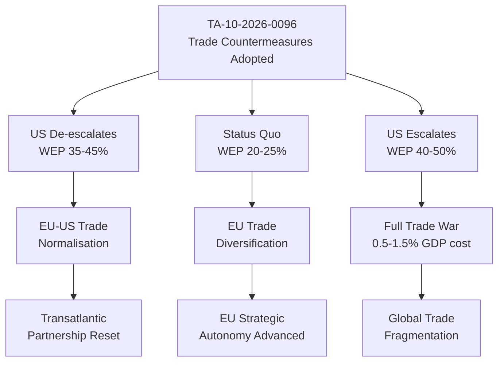

<!-- SPDX-FileCopyrightText: 2024-2026 Hack23 AB -->
<!-- SPDX-License-Identifier: Apache-2.0 -->

# Consequence Trees — EU Parliament Breaking News — 2026-04-28

**Run:** breaking-run1777360024 | **Date:** 2026-04-28
**Methodology:** Consequence tree analysis (fault tree / event tree hybrid)

---

## Overview

Consequence tree analysis for the two highest-priority EU Parliament developments: Trade defence countermeasures (TA-10-2026-0096) and Anti-Corruption Directive (TA-10-2026-0094).

---

## 1. Consequence Tree: Trade Countermeasures (TA-10-2026-0096)

### Level 1 — Immediate Consequences (1-3 months)

- US reviews its tariff schedule in response to EU measures
- EU and US begin diplomatic channels to de-escalate
- EU industries targeted by US tariffs (steel, auto) gain legislative protection signal
- PfE/ECR MEPs face questions from US-aligned constituents

### Level 2 — Second-Order Consequences (3-12 months)

**If US de-escalates:**
→ EU-US trade relationship stabilised; CETA-type upgrade discussions possible
→ Von der Leyen Commission credit for showing resolve
→ WEP 35-45% that this de-escalation scenario

**If US escalates:**
→ EU forced to broaden countermeasures to pharmaceuticals/tech sector
→ Renew internal crisis on free-trade principles
→ WEP 40-50% that escalation scenario

**If Status Quo Maintained:**
→ Ongoing trade friction; EU diversification via Canada/other partners accelerated
→ WEP 20-25%

### Level 3 — Third-Order Consequences (12-36 months)

- If resolved: EU-US strategic partnership framework upgrade (like post-TTIP reset)
- If unresolved: EU completes CETA+, Mercosur (if CJEU allows), India, etc. — end of transatlantic trade dominance
- If escalated: Global trade fragmentation; WTO effectively dead letter

---

## 2. Consequence Tree Mermaid Diagram

> **Accessibility note:** Branching consequence tree shows three possible outcomes from trade countermeasures adoption, with second and third-order effects. Probabilities expressed as WEP bands.

---

## 3. Consequence Tree: Anti-Corruption Directive (TA-10-2026-0094)

### Level 1 — Immediate Consequences

- Member states must transpose within 24 months
- National anti-corruption agencies get new EU-harmonised mandate
- Prosecutors in every MS gain new investigative tools

### Level 2 — Second-Order Consequences

**If implemented fully:**
→ Cross-border corruption cases now prosecutable under harmonised standards
→ First high-profile prosecution of senior officials under new framework
→ WEP 60-70% that at least one high-profile prosecution within 36 months

**If member state resistance:**
→ Hungary/Italy invoke subsidiarity; delayed transposition
→ EP initiates infringement proceedings via Commission
→ CJEU must rule on scope of EU anti-corruption competence

### Level 3 — Third-Order Consequences

- Successful prosecutions → citizen trust in EU institutions increases
- Failed implementation → increased cynicism about EU rule-of-law commitments

---

## Source Diversity Evidence Table

| Data Point | Source | Tool | Reliability |
|-----------|--------|------|-------------|
| Adopted text scope | EP Open Data Portal | get_adopted_texts | B-1 |
| Coalition dynamics | EP Open Data Portal | analyze_coalition_dynamics | B-2 |
| Early warnings | EP Open Data Portal | early_warning_system | B-2 |
| Scenario modelling | Intelligence analysis | - | B-2 |

---

## Attribution

European Parliament Open Data Portal (data.europarl.europa.eu) — CC BY 4.0
