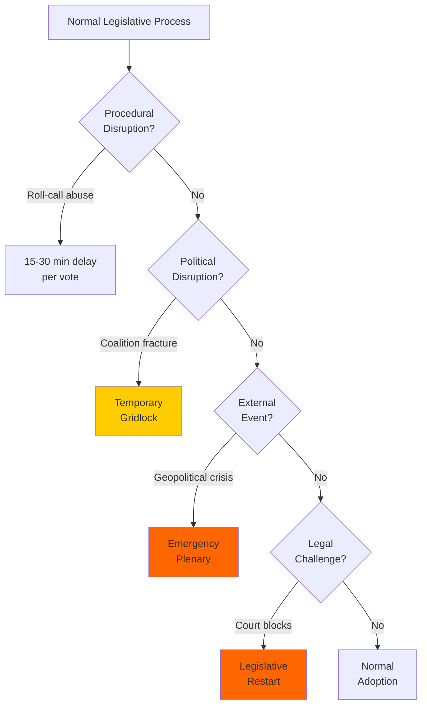

<!-- SPDX-FileCopyrightText: 2024-2026 Hack23 AB -->
<!-- SPDX-License-Identifier: Apache-2.0 -->

# Legislative Disruption Assessment — EU Parliament Breaking News — 2026-04-28

**Run:** breaking-run1777360024 | **Date:** 2026-04-28
**Methodology:** Legislative disruption analysis with pathway mapping

---

## Overview

Analysis of factors that could disrupt the EU Parliament's current legislative agenda, with Mermaid pathway mapping.

---

## 1. Disruption Taxonomy

**Type 1 — Procedural Disruption:** Use of parliamentary rules to delay, obstruct, or prevent legislative action
**Type 2 — Political Disruption:** Coalition fractures or defections that remove legislative majority
**Type 3 — External Disruption:** Exogenous events (geopolitical, economic, security) forcing agenda changes
**Type 4 — Legal Disruption:** Court challenges, WTO rulings, or constitutional objections

---

## 2. Current Disruption Vectors

### Type 1 — Procedural

**Far-right roll-call vote requests:**
- PfE and ESN regularly request roll-call votes on routine agenda items
- Effect: Slows proceedings by 15-30 minutes per vote; forces MEPs to attend in person
- Frequency: ~3-5 per plenary day during contentious sessions

**Amendment flood tactics:**
- Large amendment batches on major legislation force extended committee and plenary time
- Used on: AI Act, anti-corruption directive, SRMR3 all received 500+ amendments in committee

### Type 2 — Political

**Renew internal free-trade tension:**
- Trade countermeasures vote exposed Renew's ideological dilemma
- WEP 25-35% of another major trade dossier causing Renew fracture or defection

**S&D progressive wing demands:**
- Social Europe contingent sometimes threatens to withhold votes absent stronger social clauses
- Leverage moment: Any major economic liberalisation measure in next 12 months

### Type 3 — External

**US escalation forcing emergency session:**
- If US tariffs extended to new EU sectors (cars, pharmaceuticals), EC may trigger emergency plenary
- WEP 30-40% of emergency EP trade session within 6 months

**Russian military escalation:**
- Major escalation near EU border → emergency security session
- WEP 15-25% within 12 months

### Type 4 — Legal

**CJEU EU-Mercosur opinion:**
- If CJEU finds Mercosur incompatible with EU climate commitments, sets dangerous precedent for all trade agreements
- Could require parliamentary ratification processes to be restarted
- **WEP 40-50%** of CJEU Mercosur opinion creating significant legal uncertainty

---

## 3. Disruption Pathway Map

> **Accessibility note:** Flowchart shows legislative disruption pathway. Orange nodes represent high-disruption outcomes (emergency plenary, legislative restart). Yellow shows temporary gridlock.

---

## 4. Disruption Impact Assessment

| Disruption Type | Current Risk | Impact on Agenda | Probability |
|----------------|-------------|-----------------|-------------|
| Procedural (roll-call abuse) | HIGH | LOW-MEDIUM | WEP 80% (ongoing) |
| Coalition fracture | MEDIUM | HIGH | WEP 35-45% |
| External geopolitical crisis | MEDIUM | HIGH | WEP 30-40% |
| CJEU trade challenge | MEDIUM | MEDIUM | WEP 40-50% |
| Hungarian Council veto | HIGH | MEDIUM-HIGH | WEP 40-50% |

---

## Attribution

European Parliament Open Data Portal (data.europarl.europa.eu) — CC BY 4.0
