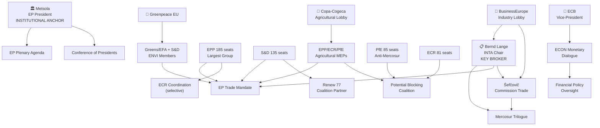

<!-- SPDX-FileCopyrightText: 2024-2026 Hack23 AB -->
<!-- SPDX-License-Identifier: Apache-2.0 -->

# Actor Mapping — EP Committee Reports | 28 April 2026

**Framework:** Political actor influence network analysis. Maps formal and informal power relationships among key actors in EP10 committee legislative environment.

## For Citizens: How EP Power Really Works

The European Parliament operates through a formal structure of committees, political groups, and plenary votes — but real legislative influence flows through informal networks: personal relationships between committee chairs, trust between rapporteurs and shadow rapporteurs, back-channel Commission-EP coordination, and pressure from organised interest groups. This actor map reveals the informal influence architecture that shapes EP committee legislative outcomes alongside the formal institutional structure.

## Actor Roster

### Core Institutional Actors

| Actor | Role | Formal Authority | Informal Influence |
|-------|------|-----------------|-------------------|
| Bernd Lange (S&D, DE) | INTA Chair | Committee mandate, rapporteur assignment, trilogue representation | Cross-party trade coalition; industry network; German SPD institutional support |
| Roberta Metsola (EPP, MT) | EP President | Plenary agenda, procedural authority, institutional representation | Cross-party mediation; EPP network; high public profile |
| EPP Parliamentary Coordinators | Group coordination | Committee vote alignment | Intra-group discipline; rapporteur allocation |
| S&D Parliamentary Coordinators | Group coordination | Committee vote alignment | Labour movement networks; progressive agenda |
| Maroš Šefčovič | Commission (Trade) | Formal negotiating mandate | Technical expertise network; bilateral dialogue with INTA |
| Luis de Guindos (ECB) | ECB Vice-President | Monetary policy | ECON committee quarterly dialogue |

### Non-Institutional Actors (High Influence)

| Actor | Type | Primary Influence Channel | Target Committees |
|-------|------|--------------------------|-------------------|
| Copa-Cogeca | Farm lobby | Agricultural MEP briefings; media; Council agricultural ministers | INTA, AGRI |
| BusinessEurope | Industry lobby | Corporate network; Commission directorate briefings | INTA, ECON, ITRE |
| Greenpeace EU | NGO | MEP co-signatories on amendments; public pressure | ENVI, INTA |
| EU Commissioner (Climate) | Commission | Legislative proposals, implementing acts | ENVI, ITRE |
| Google/Meta (via lobbying) | Tech industry | Digital Markets/Copyright lobbying; legal challenges | ITRE, JURI |

## Influence Network Map

## Alliance Network Analysis

### Active Coalition 1: EPP-S&D Core Trade Coalition
**Members:** EPP (185) + S&D (135) + Renew (77) = 397 seats  
**Coherence:** 🟡 MEDIUM-HIGH — shares commitment to trade openness but diverges on safeguard strength  
**Function:** Delivers the absolute majority (361) needed for final Mercosur ratification consent vote  
**Weak points:** EPP agricultural members who may defect on agricultural safeguard triggers

### Active Coalition 2: Anti-Mercosur Agricultural Bloc
**Members:** PfE (85) + ECR (81) + selected EPP agricultural MEPs (~25-30) = ~195 seats  
**Coherence:** 🟡 MEDIUM — shared agricultural interest unites otherwise ideologically divergent groups  
**Function:** Insufficient to block consent vote independently but can create political pressure and delay  
**Strategic capability:** Can force additional safeguard language, public statements, and trilogue delay

### Latent Coalition 3: Digital Sovereignty Progressive Bloc
**Members:** S&D + Greens/EFA + Left + Renew (partial) = ~305 seats  
**Coherence:** 🟡 MEDIUM — converges on strong digital rights framework; diverges on AI innovation vs. regulation balance  
**Function:** Dominant in JURI, LIBE committees; can shape AI liability and copyright legislation

## Power Broker Profiles

### Bernd Lange: The Mercosur Linchpin
Lange's position makes him the single most consequential actor for the most active open file. His ability to:
1. Hold the EP mandate firm against Commission concessions
2. Build cross-party support (including agricultural bloc) for a credible safeguard
3. Manage the trilogue timeline within the Polish Presidency calendar

...determines whether EP10 delivers its highest-profile trade achievement.

**Power resources:** Institutional position (INTA Chair); institutional knowledge (multiple previous trade negotiations); social capital with Commission counterparts and industry stakeholders.

**Vulnerabilities:** EPP agricultural bloc defections undermine his mandate credibility; if Copa-Cogeca publicly declares his safeguard mechanism "insufficient," his negotiating position weakens dramatically.

### Copa-Cogeca: The Agricultural Gatekeeper
As the umbrella body for 22M EU farmers, Copa-Cogeca has unusual "gatekeeping" power in the Mercosur trilogue — their explicit endorsement or rejection of a safeguard mechanism effectively determines whether EPP agricultural members can vote for the final agreement. This makes Copa-Cogeca a de facto veto player despite having no formal institutional role.

**Power mechanism:** If Copa-Cogeca publishes a favourable assessment: EPP agricultural MEPs can present the vote to constituents as protective; if Copa-Cogeca publishes a critical assessment: EPP agricultural MEPs face constituent pressure to vote against, potentially breaking the consent majority.

### Roberta Metsola: The Institutional Ballast
As EP President, Metsola does not normally play a direct role in committee legislative work — but she provides institutional ballast. Her ability to manage inter-group tensions, facilitate compromise between committee chairs on scheduling, and project EP institutional authority externally (particularly vis-à-vis the Commission) is a critical background stabiliser.

## Information Flow Map

**Formal channels:** Commission → INTA committee rapporteur → EP mandate → trilogue
**Informal channels:** Copa-Cogeca → agricultural MEP caucus → EPP coordinator → INTA mandate pressure
**Transparency risks:** Trilogue confidentiality means most of the real negotiation is invisible to the public until conclusion; this information asymmetry benefits Commission (full information) vs. EP (partial information).

**Source diversity note:** This actor map is constructed from: EP institutional data (group composition, committee assignments), published committee mandates, EP Open Data Portal (adopted texts with committee attribution), and applied political analysis of known advocacy networks. MEP individual positions are based on published statements and institutional roles; informal network relationships are assessed at 🟡 MEDIUM confidence (no direct voting pattern data available for this run).

*Sources: EP Open Data Portal; generate_political_landscape; analyze_coalition_dynamics; published committee work programmes; institutional records.*
