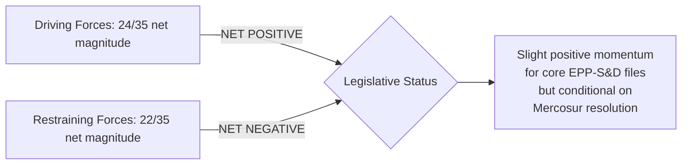

<!-- SPDX-FileCopyrightText: 2024-2026 Hack23 AB -->
<!-- SPDX-License-Identifier: Apache-2.0 -->

# Forces Analysis — EP Committee Reports | 28 April 2026

**Framework:** Force-field analysis (Kurt Lewin framework adapted for legislative environment). Identifies driving forces pushing toward legislative progress and restraining forces creating friction or delay.

## For Citizens: Understanding Legislative Momentum

The European Parliament's committee system operates like a complex machine with both accelerating and braking forces acting simultaneously. Understanding which forces dominate at any given time explains why some legislation advances rapidly while other files stall for months or years. This analysis maps the key forces acting on the current EP10 committee legislative cycle in April 2026, with particular focus on the trade, financial, and digital sovereignty files currently under active committee consideration.

## Issue Frame

**Central question:** What forces are accelerating or decelerating EP committee legislative output in the trade, financial oversight, and digital sovereignty domains during Q2 2026?

**Time horizon:** Q2 2026 (April–June 2026)

**Legislative context:** EP10 is in its third year, typically a period of high legislative throughput before the political pre-election cycle slows activity. External shock (US tariffs) and an active trilogue (Mercosur) create both urgency and distraction.

## Driving Forces (Toward Legislative Progress)

```
DRIVING FORCES MAGNITUDE SCALE (1 = Low, 5 = Very High)
═══════════════════════════════════════════════════════

EU-Mercosur commercial urgency          ████████████████  5/5
(Industry lobby, Commission deadline, Brazilian electoral cycle)

EPP-S&D Core Coalition Stability        ████████████░░░░  4/5
(320 seats in core; functional majority for most files)

EP10 Accelerated Legislative Pace       ████████████░░░░  4/5
(Historical pattern: EP10 processing 15–20% faster than EP9)

Commission Active Agenda                ████████░░░░░░░░  3/5
(Von der Leyen II has active legislative work programme)

ECON-ECB Institutional Dialogue        ████████░░░░░░░░  3/5
(Quarterly monetary dialogue provides structured oversight channel)

Digital Sovereignty Strategic Imperative █████████░░░░░░  3/5
(Tech sovereignty seen as security issue by EPP/Renew/ECR)

Polish Presidency Active Calendar       ██████░░░░░░░░░░  2/5
(Presidency committed to advancing key dossiers despite tensions)
```

## Restraining Forces (Against Legislative Progress)

```
RESTRAINING FORCES MAGNITUDE SCALE (1 = Low, 5 = Very High)
══════════════════════════════════════════════════════════

US Tariff Disruption / Trade Emergency  ████████████████  5/5
(Diverts INTA/ECON committee attention; creates urgency overload)

Agricultural Bloc Opposition (Mercosur) ████████████░░░░  4/5
(PfE + ECR + EPP agricultural members = potential blocking majority)

Voting Data Unavailability              ████████░░░░░░░░  3/5
(EP roll-call data 4–6 week delay limits real-time coalition analysis)

EP Feed Data Degradation                ███████░░░░░░░░░  3/5
(Committee documents feed, procedures feed, events feed all degraded)

Poland Council Presidency Conflict-of-Interest ████████░░ 3/5
(Agricultural interests conflict with facilitation role in Mercosur trilogue)

ESN Group Unpredictability              ██████░░░░░░░░░░  2/5
(New EP10 group, 27 seats, limited voting pattern data)

safeoutputs / Tech Capacity Risk        ████░░░░░░░░░░░░  2/5
(MCP session TTL creates deadline pressure on procedural outputs)
```

## Net Force Assessment



**Net pressure: 🟡 SLIGHT POSITIVE** — Driving forces marginally exceed restraining forces for the core EPP-S&D coalition's priority files. However, the marginal advantage could reverse quickly if US tariff escalation requires urgency procedures (adding a major restraining force) or if EPP's agricultural members reach a threshold of dissatisfaction.

## Intervention Points

### High-Leverage Intervention 1: Mercosur Trilogue Safeguard Threshold
**Opportunity:** A credible safeguard trigger mechanism that Copa-Cogeca can endorse would immediately neutralise the 4/5 agricultural bloc restraining force, freeing INTA to focus on other files. Commission concession on the 10% volume trigger threshold (Copa-Cogeca's ask) is the key intervention.

**Risk:** Granting Copa-Cogeca's full ask on triggers might make the Mercosur agreement commercially unworkable — causing Mercosur exit by Brazilian negotiators.

### High-Leverage Intervention 2: ECB Communication Clarity
**Opportunity:** A clear ECB statement on its framework for navigating tariff-induced stagflation would reduce uncertainty in ECON committee deliberations and allow financial stability legislation to proceed without the cloud of impending monetary policy emergency.

**Risk:** Any ECB statement that is interpreted as "preparing for rate cut" despite elevated inflation could create market volatility.

### Medium-Leverage Intervention 3: EP Feed Data Infrastructure
**Opportunity:** If EP Open Data Portal improves feed endpoint stability (committee-documents-feed, events-feed), EP committee monitoring quality would improve and the analytical infrastructure supporting legislative oversight would be more effective.

**Risk:** This is an upstream infrastructure issue beyond EP legislative actors' immediate control.

## Reader Briefing: What Force-Field Analysis Means for You

This force-field analysis is a method for understanding why EU legislation moves faster or slower at different times. For citizens watching the EU Parliament's committee work:

- **When driving forces dominate:** Legislation moves quickly. This can be good (addressing urgent problems) or risky (insufficient scrutiny).
- **When restraining forces dominate:** Legislation stalls. This can be appropriate (complex legislation needs time) or frustrating (urgent problems go unaddressed).
- **When forces are nearly equal:** Marginal factors become decisive. A single event (a leaked document, a Copa-Cogeca press conference, a US trade statement) can tip the balance.

The current environment in April 2026 is one of near-equilibrium — the outcome of the Mercosur trilogue, US tariff developments, and ECB monetary policy clarity will determine whether EP committee output accelerates or hits a significant roadblock in Q2-Q3 2026.

*Sources: EP Open Data Portal (political group data, committee activity); Kurt Lewin force-field analysis framework (adapted for legislative context); political landscape assessment from april 2026 run.*
