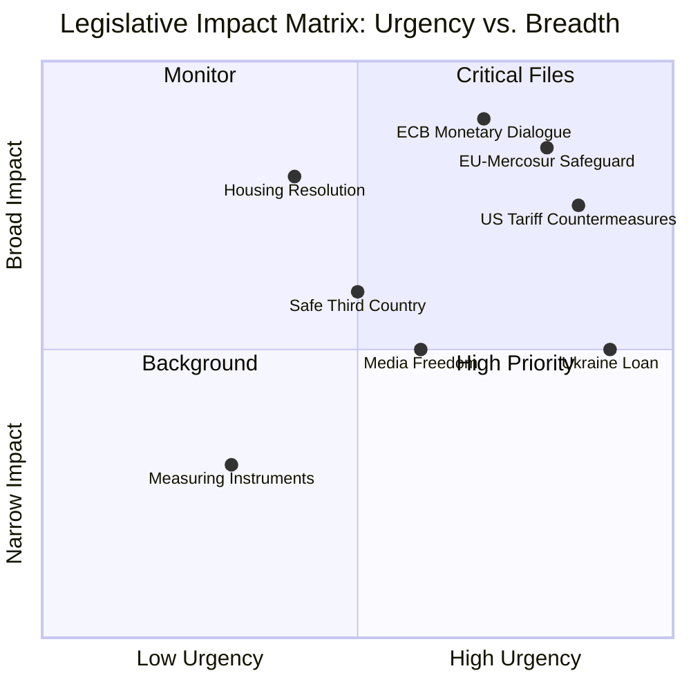

<!-- SPDX-FileCopyrightText: 2024-2026 Hack23 AB -->
<!-- SPDX-License-Identifier: Apache-2.0 -->

# Impact Matrix — EP Committee Reports | 28 April 2026

**Framework:** Multi-dimensional impact assessment across legislative, political, economic, and social domains.

## For Citizens: Why This Matters

EU Parliament committees are the legislative workshops where proposed laws are examined, amended, and approved before any citizen-facing regulation becomes binding. When committees are productive and legislate effectively, citizens benefit from clearer rules, better-enforced standards, and policy that reflects democratic input. When committees are overloaded, politically divided, or facing procedural disruption, legislation becomes delayed, diluted, or blocked entirely — affecting everything from food safety to internet regulation to financial consumer protection. This analysis maps the impact of current committee activity patterns on citizens, businesses, and democratic processes.

## Event List — Active Files Under Committee Scrutiny (April 2026)

| File | Committee | Stage | Key Citizen Impact |
|------|-----------|-------|-------------------|
| 2025/0261(COD) EU-Mercosur bilateral safeguard | INTA | Trilogue | Agricultural prices; export sector; trade balance |
| US tariff countermeasures (TA-10-2026-0096) | INTA | Adopted | Import costs; trade war escalation risk |
| Lithuania media freedom resolution (TA-10-2026-0024) | AFCO | Adopted | Press freedom; democratic norms |
| Safe Third Country directive (2025/0132) | LIBE | Completed | Migration processing; rights of asylum seekers |
| Ukraine reconstruction loan (2025/0431) | BUDG | Completed | EU fiscal position; Ukraine solidarity |
| Measuring Instruments directive (2024/0311) | IMCO | Completed | Consumer protection; measurement standards |
| ECB monetary policy accountability | ECON | Ongoing | Interest rates; mortgage costs; inflation management |
| Housing affordability resolution | ENVI/ECON | Active | Rental prices; social housing; affordability |

## Stakeholder Impact Assessment

### Agricultural Sector (Copa-Cogeca constituency: 22M farmers)
**Impact level: 🔴 HIGH**  
The Mercosur safeguard mechanism — if inadequate — could expose EU farmers to import competition from South American beef, poultry, sugar, and ethanol at volumes that depress European market prices. Copa-Cogeca estimates €3–7B potential annual impact (their modelling; independently unverified). Conversely, EU agricultural exporters (dairy, processed foods) stand to gain from Mercosur market access.

**Affected demographics:** Rural communities in Poland, France, Ireland, Spain, Romania; concentrated in agricultural constituencies that are also key EP electoral battlegrounds.

### Industrial/Manufacturing Sector (BusinessEurope constituency)
**Impact level: 🟡 HIGH**  
EU industrial exporters (automotive, machinery, chemicals, pharmaceuticals) have a direct commercial interest in Mercosur market access. US tariff escalation creates a secondary impact: export market uncertainty for sectors also exposed to US trade friction. German automotive sector is doubly exposed (Mercosur opportunity + US tariff risk simultaneously).

**Affected demographics:** Industrial workers in Germany, France, Italy, Netherlands; export-oriented SMEs.

### Financial Services / Consumers
**Impact level: 🟡 MEDIUM**  
ECB monetary policy responses to tariff-driven inflation or recession will directly affect mortgage rates, savings rates, and credit availability for 340M eurozone citizens. ECON committee's accountability function over ECB becomes more critical in periods of monetary policy stress.

**Affected demographics:** Mortgage holders (estimated 25–30M households in EU), SME borrowers, fixed-income savers.

### Digital Economy / Tech Sector
**Impact level: 🟡 MEDIUM**  
Copyright/AI training data legislation (JURI active file) affects both US Big Tech operations in Europe and European AI start-ups' ability to train models on available data. Digital sovereignty package impacts cloud providers, telecommunications, and digital infrastructure operators.

**Affected demographics:** Tech workers, AI developers, artists and content creators (opposing interests), telecommunications consumers.

### Asylum Seekers / Migration
**Impact level: 🟡 MEDIUM**  
Safe Third Country directive completion changes the processing framework for asylum applications from specific countries. Though completed, its implementation will be monitored in LIBE committee.

## Impact Heat Matrix

## Cascade Analysis

### Primary Cascade: Mercosur Trilogue Outcome → Agricultural Economy → Rural Employment
1. Trilogue conclusion (or failure) → triggers safeguard activation/non-activation
2. Agricultural import volumes → EU market price effect
3. Farm income effect → rural employment and SME supply chain
4. Electoral effect → agricultural constituency voting patterns (key EP10 seats)

### Secondary Cascade: US Tariff Escalation → Industrial Job Risk → Social Policy Response
1. US tariffs on EU goods → reduced export revenue for major manufacturers
2. Production adjustments → employment effect (estimated 0.3–0.7pp unemployment if tariffs sustained)
3. Social policy response → increased demand on EU structural funds, Just Transition Fund
4. Committee legislative response → EMPL, REGI committee emergency files

### Tertiary Cascade: ECB Policy Error → Financial Instability → Housing Market
1. Tariff-induced stagflation → ECB faces difficult rate decision
2. Rate decision → mortgage rate transmission
3. Mortgage rate effect → housing affordability (already stressed across EU capitals)
4. Housing policy response → Parliament housing resolution (already active)

*Sources: EP Open Data Portal (legislative pipeline data); committee activity analysis from april 2026 run; political landscape assessment.*
