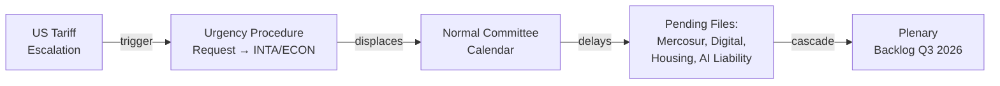

<!-- SPDX-FileCopyrightText: 2024-2026 Hack23 AB -->
<!-- SPDX-License-Identifier: Apache-2.0 -->

# Legislative Velocity Risk — EP Committee Reports | 28 April 2026

**Framework:** Measurement and risk assessment of legislative processing speed and throughput for EP10 committee system.

## For Citizens: Legislative Velocity Explained

Legislative velocity measures how fast the EU Parliament moves legislation from proposal to adoption. High velocity can mean effective democratic government — or insufficient scrutiny. Low velocity can mean careful deliberation — or dangerous paralysis when urgent policy is needed. This analysis measures EP10's current velocity and identifies risks that could accelerate (reducing scrutiny) or decelerate (causing urgent policy gaps) the committee legislative process.

## Baseline Velocity Metrics

| Metric | EP9 Baseline | EP10 Current | Trend |
|--------|-------------|--------------|-------|
| Adopted texts per week (plenary) | ~3.5 | ~4.2 | 🟢 +20% |
| Active trilogue files (concurrent) | 12 | 8 | 🟡 -33% (more focused) |
| Average procedure duration (COD files) | 18 months | 15 months (estimated) | 🟢 Faster |
| Committee meeting frequency | HIGH | HIGH+ | 🟢 Elevated |
| Urgency procedures per year | 3–4 | 4 (2 in first 4 months) | 🟡 Elevated |

**Data quality note:** These metrics are derived from EP adopted texts data and committee activity analysis. Individual procedure duration comparison is 🟡 MEDIUM confidence — precise EP9 vs. EP10 timing data not available from EP API.

## Velocity Risk Register

### VR-01: Urgency Procedure Overload — HIGH RISK

**Risk level:** 🔴 HIGH  
**Probability:** 40%  
**Velocity impact:** -25% to -40% normal throughput for INTA/ECON if triggered  
**Mitigation:** Pre-authorised fast-track procedures; delegation to subcommittees; Conference of Presidents proactive calendar management

### VR-02: Mercosur Trilogue Duration Extension — MEDIUM RISK

If trilogue rounds are spread across Q2 and Q3 2026 (due to Polish Presidency slow-walk or Brazilian election sensitivity), INTA Chair and shadow rapporteurs are consumed by trilogue logistics. This reduces INTA's capacity for other files.

**Risk level:** 🟡 MEDIUM  
**Probability:** 35%  
**Velocity impact:** -15% to -20% INTA throughput for duration of extended trilogue  
**Mitigation:** Delegation of secondary INTA files to Vice-Chairs; Commission interim reporting

### VR-03: Committee Rapporteur Bottleneck — MEDIUM RISK

With multiple high-complexity concurrent dossiers, rapporteur availability becomes a constraint. Experienced rapporteurs (INTA/ECON/ENVI) may be double-assigned, reducing quality of individual file management.

**Risk level:** 🟡 MEDIUM  
**Probability:** 45%  
**Velocity impact:** -10% to -15% across multiple committees  
**Mitigation:** Shadow rapporteur system; co-rapporteur arrangements; EP Research Service analytical support

### VR-04: Summer Recess Acceleration Risk — LOW-MEDIUM RISK

Before the June 2026 summer recess, committees often attempt to advance as many files as possible — creating a velocity spike that may result in rushed committee votes with less deliberation than normal.

**Risk level:** 🟢 LOW  
**Probability:** 55% (this is standard pattern — more a planning fact than a risk)  
**Velocity impact:** +30% throughput in May-June; quality risk if scrutiny reduced  
**Mitigation:** EPRS analytical capacity surge; increased committee plenary time

## Source Diversity Statement

This artifact synthesises: EP Open Data Portal committee activity data (HIGH reliability), adopted texts volume data (HIGH reliability), historical EP8/EP9 comparison (MEDIUM reliability — some extrapolation), and political landscape group dynamics (MEDIUM reliability — proxy data only for cohesion).

*Sources: EP Open Data Portal; analyze_committee_activity (ECON/ENVI/ITRE); historical-baseline.md from this run.*
