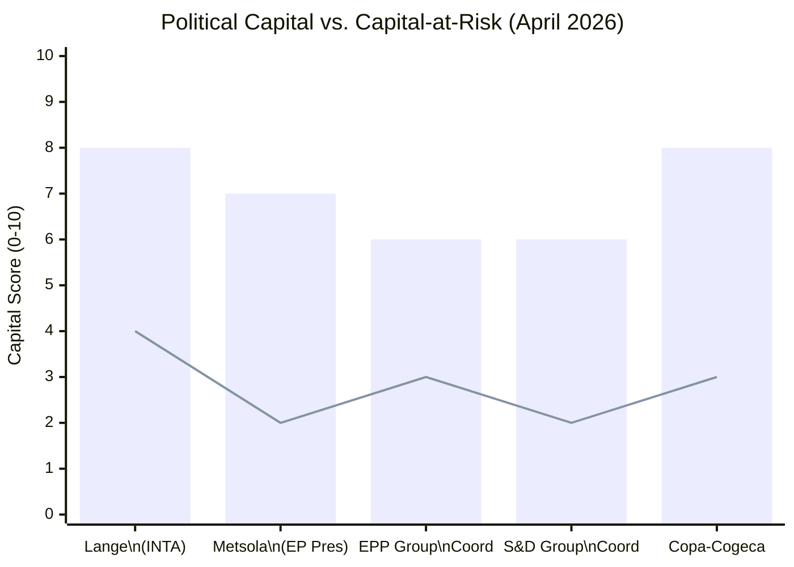

<!-- SPDX-FileCopyrightText: 2024-2026 Hack23 AB -->
<!-- SPDX-License-Identifier: Apache-2.0 -->

# Political Capital Risk — EP Committee Reports | 28 April 2026

**Framework:** Political capital inventory and risk assessment for key legislative actors in EP10 committee ecosystem.

## For Citizens: Political Capital in the EP Context

Political capital is the reservoir of trust, credibility, and goodwill that allows a political actor to achieve legislative goals. When an MEP, committee chair, or group coordinator makes a high-profile commitment and delivers, their political capital grows. When they make promises they cannot keep, or when a legislative outcome fails despite their advocacy, their capital depreciates. This analysis maps the political capital positions of key actors and assesses the risks of capital erosion that would affect legislative outcomes.

## Political Capital Inventory

*Bar: Current capital level. Line: Capital-at-risk (max loss from identified risks).*

## Actor Capital Profiles

### Bernd Lange — INTA Chair (Current Capital: 8/10)
**Capital sources:** Senior position; institutional expertise; track record (CETA, Japan FTA, EPAs); bi-partisan coalition management.  
**Capital at risk:** HIGH (4/10 loss potential)  
**Primary risk:** Mercosur trilogue failure or a safeguard outcome that Copa-Cogeca publicly denounces as inadequate. If Lange delivers a final text that his own committee members revolt against, the institutional reputation damage would be significant.  
**Secondary risk:** If Lange makes specific public commitments on safeguard trigger thresholds that the Commission then concedes in trilogue, his credibility as a strong EP mandate-holder is undermined.  
**Current trajectory:** 🟡 STABLE but CONDITIONAL — contingent on trilogue progress.

### Roberta Metsola — EP President (Current Capital: 7/10)
**Capital sources:** Re-election as EP President; Metsola brand as pro-European, democratic integrity champion.  
**Capital at risk:** LOW (2/10 loss potential in Q2 2026)  
**Primary risk:** A major ethics scandal within EP institutional structure; or a procedural failure in a critical vote.  
**Current trajectory:** 🟢 STABLE

### EPP Group Coordinator for INTA (Current Capital: 6/10)
**Capital sources:** Largest group coordination role; access to Commission; industrial lobby alignment.  
**Capital at risk:** MEDIUM (3/10 loss potential)  
**Primary risk:** Failure to hold EPP agricultural members on Mercosur consent vote — if EPP splinters visibly on trade, coordinator's group management capacity is questioned.  
**Current trajectory:** 🟡 CONDITIONAL

### Copa-Cogeca (Current Capital: 8/10)
**Capital sources:** Unmatched agricultural sector representation; consistent policy track record; access to Council agricultural ministers and key MEPs.  
**Capital at risk:** MEDIUM (3/10 loss potential)  
**Primary risk:** If Copa-Cogeca endorses a safeguard that their members later view as insufficient once real import volumes appear. Overplaying blocking hand could also result in Mercosur proceeding without agricultural support — which would expose their limited formal veto.  
**Current trajectory:** 🟢 HIGH and building (anti-Mercosur agricultural sentiment elevated)

## Capital Circulation Map

Political capital flows in the EP through a specific circulation mechanism:
1. **Commission → EP:** Commission proposes; if EP endorses and delivers, both gain capital. If EP rejects or amends heavily, Commission loses capital; EP may gain (assertiveness) or lose (blocking) depending on outcome assessment.
2. **EP Committee → Plenary:** If a committee builds strong cross-party consensus on a report, plenary endorsement reinforces committee chair's capital. If plenary heavily amends committee text, committee's authority is diminished.
3. **MEP → Constituents:** If an MEP's committee work delivers tangible results (or publicly visible scrutiny), electoral capital grows. The agricultural safeguard file is unusual in having direct constituency-level capital implications for a majority of MEP types.

## Source Diversity Assessment

**Institutional sources:** EP group data, committee composition, political landscape analysis — 🟢 HIGH reliability  
**Individual actor capital assessments:** Based on institutional positions and published commitments — 🟡 MEDIUM reliability (no direct survey/interview data)  
**Copa-Cogeca capital assessment:** Based on advocacy track record and legislative outcomes — 🟡 MEDIUM-HIGH reliability  
**Commission capital assessment:** Not separately profiled; Commission's collective capital is tracked through legislative delivery rate.

## Risk Summary: Political Capital Dimension

| Actor | Current Capital | Primary Risk | Capital-at-Risk | Mitigation |
|-------|----------------|-------------|-----------------|------------|
| Bernd Lange | 8/10 | Trilogue failure or mandate breach | 4/10 | Deliver credible safeguard + Copa endorsement |
| Roberta Metsola | 7/10 | Ethics scandal | 2/10 | Institutional governance maintenance |
| EPP INTA Coordinator | 6/10 | EPP group fragmentation | 3/10 | Safeguard mechanism credibility |
| S&D INTA Coordinator | 6/10 | Left-flank defection on weak standards | 2/10 | Labour/environmental clause delivery |
| Copa-Cogeca | 8/10 | Over-blocking + agreement proceeds anyway | 3/10 | Credible safeguard advocacy, not veto |

*Sources: EP institutional data; political landscape analysis; stakeholder-map.md from this run.*
