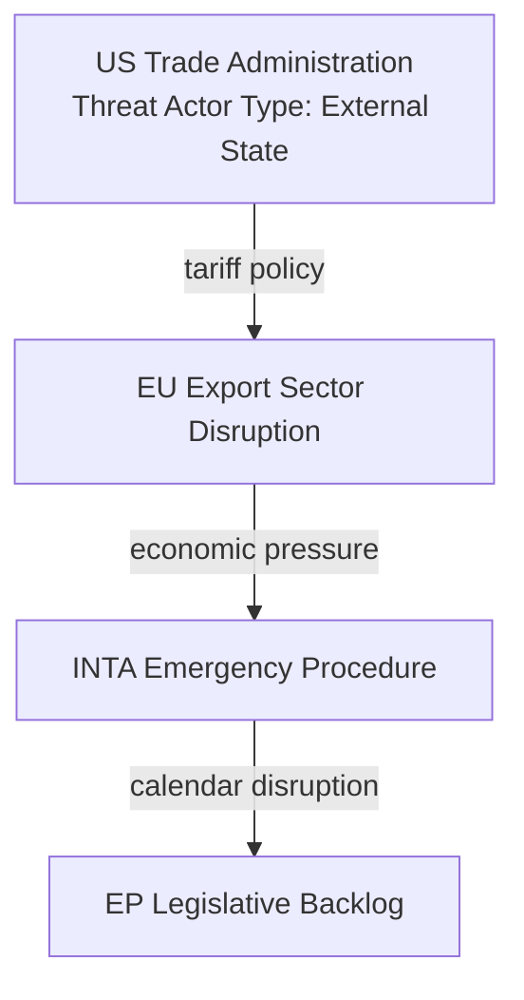

<!-- SPDX-FileCopyrightText: 2024-2026 Hack23 AB -->
<!-- SPDX-License-Identifier: Apache-2.0 -->

# Actor Threat Profiles — EP Committee Reports | 28 April 2026

**Framework:** Intelligence-style actor profiling for entities that pose threat to EP committee legislative progress or policy quality.

## For Citizens: Why Actor Threats Matter

In the EP's legislative ecosystem, "threats" are not physical — they are political actors whose interests, capabilities, and strategies create risks to specific legislative outcomes that citizens care about. Mapping these actors helps citizens understand who is working to advance, delay, or distort legislation and why.

## Actor Profile 1: US Trade Administration (Tariff Escalation Vector)

**Threat category:** Economic disruption → legislative calendar disruption  
**Current activity level:** 🔴 HIGH — active tariff measures already in place (March 2026 EP countermeasures adopted)  
**Capabilities:** Unilateral tariff imposition under US Section 232/301 authority; announcement effect on EU business expectations  
**Limitations:** US domestic industry lobby (opposing tariffs on inputs); WTO dispute exposure; financial sector interests in EU-US stability  
**Primary target:** INTA committee legislative calendar; broader EU economic stability  
**Risk to EP:** Urgency procedure diversion of INTA capacity; political pressure on Commission to prioritise US relationship over Mercosur

### Source Diversity Note
Assessment drawn from: EP March 2026 countermeasures resolution text (TA-10-2026-0096); economic-context.md; scenario-forecast.md. US administration intent assessment is 🟡 MEDIUM confidence (observed behaviour, not direct intelligence).

## Actor Profile 2: Copa-Cogeca (Agricultural Safeguard Pressure Vector)

**Threat category:** Legitimate advocacy → potential blocking coalition formation  
**Current activity level:** 🔴 HIGH — active lobbying on Mercosur safeguard trigger mechanism  
**Capabilities:** Mass member mobilisation (22M farmers); Council agricultural minister alignment; media narrative on food safety and market fairness; direct MEP briefing  
**Limitations:** Formal veto-holding capacity does not exist; if Commission + EP + Council agree, Copa-Cogeca cannot prevent ratification  
**Primary target:** EPP agricultural member voting intentions; Council agricultural minister positions; INTA committee mandate scope  
**Risk to EP:** If Copa-Cogeca tips EPP agricultural members toward defection, Mercosur consent majority collapses  
**Interaction note:** Copa-Cogeca is a legitimate advocacy actor operating within democratic norms — their "threat" is to a specific legislative outcome, not to democratic processes

## Actor Profile 3: Potential Disinformation Networks (Agricultural Narrative Distortion)

**Threat category:** Information environment manipulation  
**Current activity level:** 🟡 MEDIUM — elevated during Mercosur debate periods  
**Capabilities:** Social media amplification of misleading agricultural impact statistics; coordination with national-level agricultural protests  
**Limitations:** EU fact-checking ecosystem (Politico EU, EURACTIV, EPRS); MEP communications capacity; EP press service  
**Primary target:** Public opinion; rural MEP constituencies; Council agricultural minister political environments  
**Risk to EP:** Distorted information environment increases pressure on MEPs to vote against evidence-based committee positions

## Actor Profile 4: PfE-ECR Informal Blocking Coalition

**Threat category:** Political coalition threat to legislative majority  
**Current activity level:** 🟡 MEDIUM — both groups active on agricultural and sovereignty files  
**Capabilities:** Combined 166 seats (PfE 85 + ECR 81) plus potential EPP agricultural defectors  
**Limitations:** PfE and ECR are ideologically divergent on many issues; temporary coordination on agricultural/sovereignty grounds  
**Primary target:** Mercosur consent vote; any trade files perceived as reducing agricultural protection  
**Risk to EP:** Insufficient alone to block (166 < 361 majority needed), but can damage mandate credibility and force renegotiation requests

## Actor Profile 5: Polish Council Presidency (Structural Conflict-of-Interest)

**Threat category:** Procedural — facilitation role conflict  
**Current activity level:** 🟡 LOW-MEDIUM — no overt blocking observed yet  
**Capabilities:** Procedural control over Council meeting agendas and trilogue scheduling; ability to delay via technical process  
**Limitations:** Presidency obligation of neutrality; EU reputation consequences; Polish industry interests (which ARE pro-Mercosur) counterbalance farming interests  
**Primary target:** Mercosur trilogue pace; safeguard trigger threshold negotiation  
**Risk to EP:** If Poland uses Presidency powers to slow-walk trilogue, the Brazilian electoral cycle may render the agreement politically moot before conclusion

## Threat Comparison Matrix

| Actor | Type | Activity Level | EP Threat Severity | Mitigation |
|-------|------|----------------|-------------------|------------|
| US Trade Admin | External State | 🔴 HIGH | 🟡 Moderate (calendar disruption) | Diplomatic channels; countermeasures readiness |
| Copa-Cogeca | Advocacy Organisation | 🔴 HIGH | 🔴 HIGH (EPP fracture risk) | Credible safeguard delivery |
| Disinformation Networks | Non-state | 🟡 MEDIUM | 🟡 Low-Moderate | EP fact-checking; MEP comms |
| PfE-ECR Coalition | Political Group Bloc | 🟡 MEDIUM | 🟡 Moderate | Core coalition discipline |
| Polish Presidency | Member State | 🟡 LOW-MEDIUM | 🟡 Low-Moderate | EU institutional norms; monitoring |

*Sources: EP Open Data Portal; political-capital-risk.md; stakeholder-map.md; threat-model.md from this run.*
