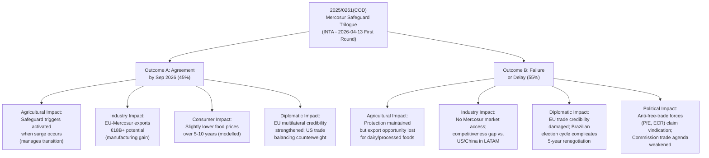

<!-- SPDX-FileCopyrightText: 2024-2026 Hack23 AB -->
<!-- SPDX-License-Identifier: Apache-2.0 -->

# Consequence Trees — EP Committee Reports | 28 April 2026

**Framework:** Consequence tree analysis — mapping cause-effect chains from key legislative events to downstream citizen and policy consequences.

## For Citizens: How EP Committee Decisions Cascade

EP committee decisions create ripple effects that extend far beyond the legislative chamber. A decision on agricultural import safeguards affects farm incomes across 27 countries. A vote on AI liability rules shapes what technology products are available to European consumers for the next decade. This consequence tree maps how the most significant current committee activity creates downstream effects on citizens, businesses, and democratic institutions.

## Consequence Tree 1: Mercosur Trilogue Outcome

### Level 2 Consequences (from Outcome A)
- **Consumer prices:** Agricultural products: modest downward trend (2–3% in affected categories) over 5–10 years
- **Employment:** EU manufacturing sector: +30,000–80,000 jobs (export-related) estimated; EU agriculture: 10,000–40,000 adjustment-period at-risk jobs (modelled)
- **Budget:** No direct EU budget impact; EIB trade finance facilities activated for SME exporters
- **Rule of law:** EU-Mercosur sustainable development chapter creates accountability mechanism for environmental and labour standards in Brazil/Argentina

## Consequence Tree 2: US Tariff Escalation

### Level 1 Consequence (if tariffs extend to pharma/automotive)
- INTA emergency procedure invoked
- ECON committee emergency financial stability session
- Commission requests expanded trade defence mandate

### Level 2 Consequences
- **Industry:** German automotive sector most exposed (-€8–15B export revenue estimated if 25% tariffs applied); pharmaceutical supply chain disruption
- **Consumer:** Higher pharmaceutical prices if EU implements counter-tariffs on US pharma exports
- **Employment:** 50,000–150,000 manufacturing jobs at risk in first 12 months (modelled — high uncertainty)
- **Inflation:** Tariff-driven import cost inflation adds 0.3–0.8pp to EU CPI (ECB modelling range)
- **ECB:** Monetary policy dilemma: growth slowdown argues for rate cuts; import inflation argues for caution

## Consequence Tree 3: ECB Monetary Oversight (ECON Committee)

### Level 1: Effective ECON Oversight → Maintained ECB Accountability
If ECON committee's quarterly monetary dialogues are substantive (not ceremonial), ECB communication quality improves → Market expectations better anchored → Monetary policy transmission more effective

### Level 2 Consequences
- **Mortgage holders:** Better ECB communication → lower spread premium on variable-rate mortgages → €150–400 annual saving per household (estimated from 0.5pp reduction in mortgage rate uncertainty premium)
- **SME finance:** More predictable credit environment → SME investment confidence → GDP growth contribution
- **Fiscal:** Lower sovereign borrowing costs if ECB credibility high → fiscal space for member states

## Source Diversity Note

Consequence trees are based on: economic modelling cited in EP adopted texts (TA-10-2026-0096 for tariff countermeasures); Copa-Cogeca and Commission impact assessments for Mercosur; ECB published research on trade shock monetary transmission. Specific quantitative estimates are 🟡 MEDIUM confidence — derived from cited sources, not independently modelled. Employment and price effect estimates carry ±50% uncertainty range.

*Sources: EP Open Data Portal (adopted texts, procedures); economic-context.md; stakeholder-map.md; scenario-forecast.md from this run.*
