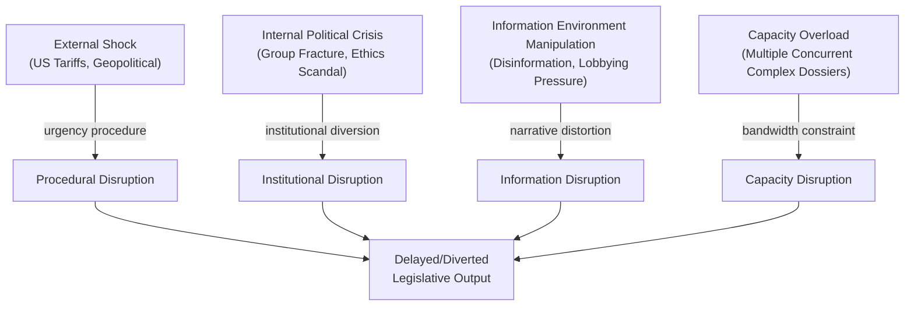

<!-- SPDX-FileCopyrightText: 2024-2026 Hack23 AB -->
<!-- SPDX-License-Identifier: Apache-2.0 -->

# Legislative Disruption — EP Committee Reports | 28 April 2026

**Framework:** Legislative disruption analysis — identification of mechanisms, actors, and conditions that could disrupt normal EP committee legislative progression.

## For Citizens: What Is Legislative Disruption?

Legislative disruption occurs when the EU Parliament's normal process of examining, amending, and voting on proposed laws is interrupted, delayed, or diverted by external events, internal political crises, or procedural conflicts. For citizens, disruption means delayed consumer protections, environmental standards, trade agreements, or financial regulations. For democratic accountability, disruption can also mean reduced transparency and scrutiny. This analysis maps current disruption risks and their mitigating factors.

## Disruption Typology

## Disruption Scenario 1: US Tariff Emergency Procedure

**Mechanism:** US imposes tariffs on additional EU sectors → Commission requests urgency procedure under EP Rules of Procedure → INTA committee convenes emergency sessions → normal INTA legislative calendar suspended  
**Probability:** 40%  
**Disruption duration:** 2–6 weeks if single-sector; 2–4 months if multi-sector escalation  
**Files most affected:** Mercosur trilogue (INTA Chair diverted), Digital Sovereignty (ITRE secondary effect), AI Liability (JURI secondary effect)  
**Mitigation:** Conference of Presidents proactive calendar adjustment; delegation to subcommittees; Commission urgency proposal limited scope

## Disruption Scenario 2: Mercosur Mandate Collapse (EPP Fracture)

**Mechanism:** EPP agricultural bloc MEPs publicly break from group line on safeguard trigger → INTA mandate loses majority support → Commission forced to pause trilogue pending EP clarification  
**Probability:** 25% (conditional on Copa-Cogeca rejection of safeguard mechanism)  
**Disruption duration:** 4–12 weeks for mandate renegotiation  
**Files most affected:** Mercosur consent vote itself; Commission trade credibility  
**Mitigation:** Copa-Cogeca endorsement of safeguard; EPP coordinator private commitment delivery

## Disruption Scenario 3: Plenary Scheduling Collision (June 2026 Session)

**Mechanism:** Multiple mandatory votes coincide with last plenary session before summer recess (24–27 June Strasbourg) → Conference of Presidents must triage → some files delayed to September  
**Probability:** 55% (standard pattern each session)  
**Disruption duration:** 6–10 weeks (deferred to September 2026 session)  
**Files most affected:** Less urgent files (Measuring Instruments implementation, Housing resolution follow-up)  
**Mitigation:** Early committee vote scheduling; Conference of Presidents advance coordination

## Disruption Scenario 4: Digital Sovereignty Package Internal EP Division

**Mechanism:** AI liability proposals create unexpected EPP-Greens/EFA division on innovation vs. rights balance → JURI/ITRE coordination breaks down → committee report delayed  
**Probability:** 30%  
**Disruption duration:** 4–8 weeks  
**Files most affected:** AI Liability directive, Copyright/AI training data rules  
**Mitigation:** Compromise amendment process; Commission facilitating inter-committee coordination

## Disruption Resilience Assessment

**EP10 Resilience Strengths:**
- Working majority (397 seats) provides buffer for defections on non-critical votes
- Strong committee chair leadership (INTA, ECON, ENVI) reduces coordination failure risk
- Conference of Presidents calendar management track record
- EPRS analytical support capacity

**EP10 Resilience Weaknesses:**
- Multiple concurrent high-complexity files reduce bandwidth
- Roll-call voting data delay reduces real-time coalition intelligence
- EP feed infrastructure degradation (committee-documents-feed, events-feed) reduces monitoring quality

## Source Diversity Note

This disruption analysis synthesises: legislative-velocity-risk.md (MEDIUM-HIGH reliability), threat-model.md (MEDIUM reliability), scenario-forecast.md (MEDIUM reliability), EP institutional data from Open Data Portal (HIGH reliability). Disruption probability estimates are 🟡 MEDIUM confidence — statistical frequency patterns not directly available.

*Sources: EP Open Data Portal; legislative-velocity-risk.md; scenario-forecast.md; threat-model.md from this run.*
