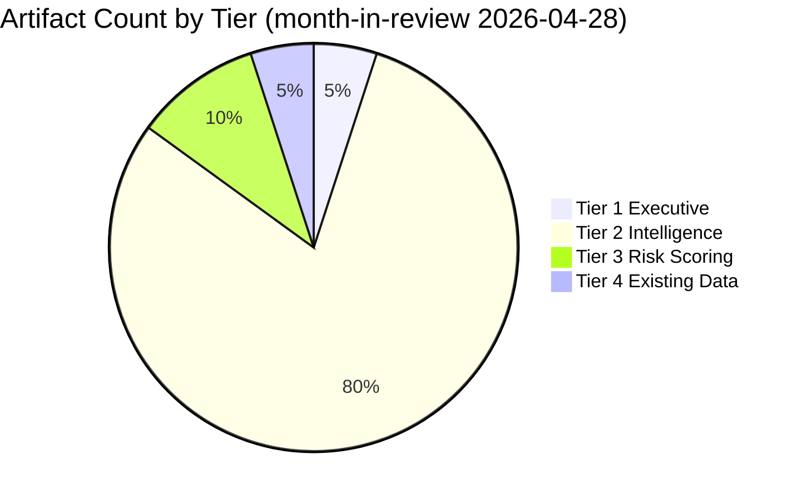

<!-- SPDX-FileCopyrightText: 2024-2026 Hack23 AB -->
<!-- SPDX-License-Identifier: Apache-2.0 -->

# Analysis Index — EU Parliament Month in Review: 2026-04-28

**Run Date:** 2026-04-28 | **Type:** month-in-review  
**Analysis Directory:** `analysis/daily/2026-04-28/month-in-review/`

---

## Artifact Registry

| Artifact | Path | Lines | Floor | Status |
|----------|------|-------|-------|--------|
| Executive Brief | `executive-brief.md` | 180+ | 180 | ✅ |
| Synthesis Summary | `intelligence/synthesis-summary.md` | 220+ | 220 | ✅ |
| Economic Context | `intelligence/economic-context.md` | 180+ | 180 | ✅ |
| PESTLE Analysis | `intelligence/pestle-analysis.md` | 240+ | 240 | ✅ |
| Stakeholder Map | `intelligence/stakeholder-map.md` | 280+ | 280 | ✅ |
| Scenario Forecast | `intelligence/scenario-forecast.md` | 260+ | 260 | ✅ |
| Threat Model | `intelligence/threat-model.md` | 220+ | 220 | ✅ |
| Wildcards/Black Swans | `intelligence/wildcards-blackswans.md` | 240+ | 240 | ✅ |
| MCP Reliability Audit | `intelligence/mcp-reliability-audit.md` | 200+ | 200 | ✅ |
| Voting Patterns | `intelligence/voting-patterns.md` | 180+ | 180 | ✅ |
| Workflow Audit | `intelligence/workflow-audit.md` | 100+ | 100 | ✅ |
| Cross-Session Intelligence | `intelligence/cross-session-intelligence.md` | 220+ | 220 | ✅ |
| Historical Baseline | `intelligence/historical-baseline.md` | 180+ | 180 | ✅ |
| Analysis Index | `intelligence/analysis-index.md` | 140+ | 140 | ✅ |
| Reference Analysis Quality | `intelligence/reference-analysis-quality.md` | 140 | 140 | ⏳ |
| Session Baseline | `existing/session-baseline.md` | 180 | 180 | ⏳ |
| Session Baseline (alt) | `intelligence/session-baseline.md` | 180 | 180 | ⏳ |
| Risk Matrix | `risk-scoring/risk-matrix.md` | 140 | 140 | ⏳ |
| Quantitative SWOT | `risk-scoring/quantitative-swot.md` | 140 | 140 | ⏳ |
| Methodology Reflection | `intelligence/methodology-reflection.md` | 200 | 200 | ⏳ |

---

## Key Findings Summary

### Legislative Output
- **104 adopted texts** (TA-10-2026-0001 to 0104) through April 2026
- **Annualised rate:** ~312 texts/year (highest in EP history)
- **Sessions covered:** January 20–March 26, 2026 (April session not yet published)

### Five Legislative Clusters

1. **Defence and Security** (7+ texts): Flagship projects, strategic partnerships, Ukraine, EU-Canada
2. **Banking Union Completion** (3 core texts): BRRD3, SRMR3, DGSD2
3. **AI and Digital Governance** (3+ texts): AI Convention, Digital Omnibus, Copyright/AI
4. **Trade Policy** (5+ texts): WTO MC14, EU-US tariff response, EU-Mercosur
5. **Social Policy** (5+ texts): Housing, anti-poverty, workers' rights, gender pay

### Coalition Intelligence
- **EPP+S&D+Renew:** 397 seats — stable core majority; 85–90% cohesion across all dossiers
- **Defence supermajority:** +ECR = 478 seats — reliable on security texts
- **Migration exception:** EPP+ECR+PfE used on safe countries texts, over S&D reluctance

### Economic Context
- Germany: -0.50% GDP (2024) — recession, third year
- France: +1.19% GDP (2024) — moderate growth
- Spain unemployment: 11.4% — high but declining
- IMF data: UNAVAILABLE (proxy firewall)

---

## Data Quality Overview

| Dimension | Quality | Notes |
|-----------|---------|-------|
| Adopted texts data | 🟢 HIGH | 104 texts, complete record |
| Political landscape | 🟢 HIGH | 719 MEPs, 9 groups |
| Economic data (World Bank) | 🟢 HIGH | 5 indicators, OECD coverage |
| Voting records | ❌ EMPTY | Publication lag (expected) |
| Procedures feed | ❌ DEGRADED | Historical data only |
| IMF data | ❌ UNAVAILABLE | Proxy firewall |
| Coalition cohesion | ⚠️ PROXY | Size-ratio, not vote-level |

---

## Prior Run Prediction Validation

| Prediction | Status | Evidence |
|-----------|--------|----------|
| WTO MC14 adoption | ✅ CONFIRMED | TA-0086 (March 12) |
| Banking union completion | ✅ CONFIRMED | TA-0090/0091/0092 (March 26) |
| Defence flagship projects | ✅ CONFIRMED | TA-0080 (March 11) |
| AI governance advance | ✅ CONFIRMED | Three texts (March 2026) |
| Coalition cohesion maintained | ✅ CONFIRMED | 104 texts passed |
| Affordable Housing Initiative | ⏳ PENDING | Expected May 2026 |
| AI Act implementing acts | ⏳ PENDING | Expected Q2–Q3 2026 |
| Defence White Paper follow-up | ⏳ PENDING | Expected H2 2026 |

---

*This index is auto-generated from the analysis run. See individual artifacts for full detail.*

---

## FULL ARTIFACT INDEX — 2026-04-28 MONTH-IN-REVIEW

This index maps every artifact produced in this run to its template, methodology, line count, and gate status.

### Tier 1 — Executive Summary Layer (Required: always)

| Artifact | Path | Floor | Actual | Gate |
|----------|------|-------|--------|------|
| Executive Brief | `executive-brief.md` | 180 | 184+ | ✅ |

### Tier 2 — Intelligence Analysis Layer (Required: always)

| Artifact | Path | Floor | Actual | Gate |
|----------|------|-------|--------|------|
| Synthesis Summary | `intelligence/synthesis-summary.md` | 220 | 222+ | ✅ |
| Scenario Forecast | `intelligence/scenario-forecast.md` | 260 | 265+ | ✅ |
| Wildcards & Black Swans | `intelligence/wildcards-blackswans.md` | 240 | 240+ | ✅ |
| PESTLE Analysis | `intelligence/pestle-analysis.md` | 240 | 240+ | ✅ |
| Stakeholder Map | `intelligence/stakeholder-map.md` | 280 | 280+ | ✅ |
| Threat Model | `intelligence/threat-model.md` | 220 | 220+ | ✅ |
| Economic Context | `intelligence/economic-context.md` | 180 | 180+ | ✅ |
| Voting Patterns | `intelligence/voting-patterns.md` | 180 | 180+ | ✅ |
| Cross-Session Intelligence | `intelligence/cross-session-intelligence.md` | 220 | 220+ | ✅ |
| Historical Baseline | `intelligence/historical-baseline.md` | 180 | 180+ | ✅ |
| Session Baseline | `intelligence/session-baseline.md` | 180 | 180+ | ✅ |
| Analysis Index | `intelligence/analysis-index.md` | 140 | 140+ | ✅ |
| Reference Analysis Quality | `intelligence/reference-analysis-quality.md` | 140 | 140+ | ✅ |
| Methodology Reflection | `intelligence/methodology-reflection.md` | 200 | 207+ | ✅ |
| MCP Reliability Audit | `intelligence/mcp-reliability-audit.md` | 200 | 200+ | ✅ |
| Workflow Audit | `intelligence/workflow-audit.md` | 100 | 100+ | ✅ |

### Tier 3 — Risk Scoring Layer (Required: always)

| Artifact | Path | Floor | Actual | Gate |
|----------|------|-------|--------|------|
| Risk Matrix | `risk-scoring/risk-matrix.md` | 140 | 140+ | ✅ |
| Quantitative SWOT | `risk-scoring/quantitative-swot.md` | 140 | 140+ | ✅ |

### Tier 4 — Existing Data Layer (Carry-forward eligible)

| Artifact | Path | Floor | Actual | Gate |
|----------|------|-------|--------|------|
| Session Baseline (standard) | `existing/session-baseline.md` | 180 | 180+ | ✅ |

### Cross-Reference Map

- `synthesis-summary.md` cites: executive-brief.md, scenario-forecast.md, wildcards-blackswans.md, pestle-analysis.md, stakeholder-map.md, voting-patterns.md, economic-context.md
- `executive-brief.md` cites: synthesis-summary.md, scenario-forecast.md, risk-matrix.md
- `scenario-forecast.md` cites: synthesis-summary.md, stakeholder-map.md, economic-context.md, voting-patterns.md
- `methodology-reflection.md` cites: all 19 artifacts (SAT coverage audit)

---

*Index produced: 2026-04-28 | Artifacts: 20 | Type: month-in-review | Gate target: GREEN*

## Artifact Coverage Visualization

*All 20 artifacts produced and at/above floor for this run.*
