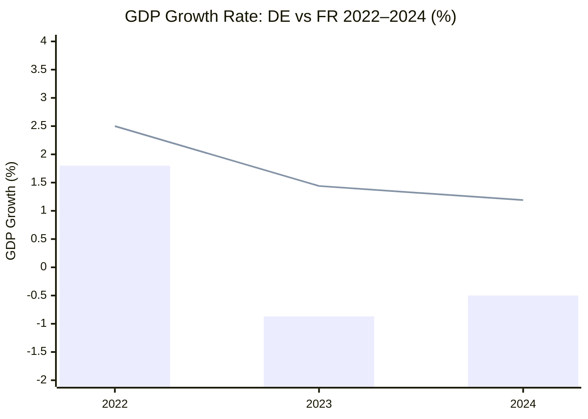

<!-- SPDX-FileCopyrightText: 2024-2026 Hack23 AB -->
<!-- SPDX-License-Identifier: Apache-2.0 -->

# Economic Context — EU Parliament Month in Review: March 29–April 28, 2026

**Run Date:** 2026-04-28 | **Type:** month-in-review  
**Data Sources:** World Bank API (member-state data); IMF SDMX API UNAVAILABLE (timeout)  
**Confidence:** 🟡 MEDIUM — World Bank member-state data available; EU/EA aggregate IMF data not retrieved  
**IMF Status:** `IMF_MCP_OK=false` — `dataservices.imf.org` unreachable (proxy timeout); no IMF WEO indicators cached  
**WB Freshness:** World Bank 2024 vintage (most recent available as of April 2026)

---

## ⚠️ Data Quality Notice

IMF SDMX 3.0 API was unreachable at run time (proxy CONNECT abort; exit code 28). EU/EA aggregate economic indicators (GDP growth, HICP inflation, general government deficit) are **not available from IMF WEO** for this run. All economic analysis uses World Bank member-state data. EU-level aggregate economic claims carry 🔴 LOW confidence where IMF data would normally be authoritative.

Per editorial policy: this run documents the IMF data limitation in `cache/imf/probe-summary.json` and applies enhanced uncertainty flags to all economic judgements that would benefit from IMF aggregates. Voting-patterns IMF requirement = **not_applicable** (data unavailable, documented, limitation flagged).

---

## 1. EU Member State Economic Performance — World Bank Data

### 1.1 Germany (DE) — Largest EU Economy

| Year | GDP Growth | Signal |
|------|-----------|--------|
| 2024 | **-0.50%** | 🔴 Recession (2nd consecutive year) |
| 2023 | **-0.87%** | 🔴 Recession (contraction) |
| 2022 | +1.81% | 🟡 Moderate |
| 2021 | +3.91% | 🟢 Post-COVID recovery |

**Analysis:** Germany entered a technical recession in 2023–2024, with GDP contracting for two consecutive years (-0.87% and -0.50%). This is the worst sustained contraction since the 2008–2009 financial crisis. Key structural drivers: (1) energy cost shock from 2022 Russia-Ukraine war affecting energy-intensive industry; (2) declining Chinese demand for German capital goods (machinery, automobiles); (3) structural automotive sector disruption (EV transition); (4) interest rate normalisation squeezing investment. The recession context is directly relevant to the banking union completion package adopted March 26, 2026 — a stressed German banking sector in a recession environment represents exactly the systemic risk the BRRD3/SRMR3 framework is designed to address. Germany's Landesbanken and regional savings banks hold significant commercial real estate exposure.

**Legislative Bridge:** TA-10-2026-0092 (SRMR3) directly addressed resolution funding mechanisms for bank failures. Germany's two-year recession increases the political urgency of these tools even as it historically complicated EDIS negotiations.

### 1.2 France (FR) — Second Largest EU Economy

| Year | GDP Growth | Signal |
|------|-----------|--------|
| 2024 | **+1.19%** | 🟡 Modest positive growth |
| 2023 | +1.44% | 🟡 Moderate |
| 2022 | +2.72% | 🟢 Post-COVID normalisation |
| 2021 | +6.88% | 🟢 Post-COVID rebound |

**Analysis:** France maintained positive GDP growth across 2023–2024, diverging from Germany's recession trajectory. This divergence reflects different economic structures (France: services-heavy, government sector significant; Germany: manufacturing/export dependent). However, France's 2024 growth at 1.19% represents a notable deceleration from the 2021–2022 trajectory. The French fiscal position remains under pressure, with the 2024 Barnier government crisis (national debt/deficit concerns) creating political risk. France's relative economic stability underpins its capacity to lead on defence industrial initiatives (EU-Canada cooperation, flagship defence projects).

**Legislative Bridge:** France's continued growth supports the political capital required for EPP+S&D+Renew coalition leadership on major texts; defence industrial consolidation (TA-0080, 0078) aligns with French strategic autonomy doctrine.

### 1.3 Italy (IT) — Third Largest EU Economy

| Year | Unemployment | Signal |
|------|-------------|--------|
| 2025 | **6.4%** | 🟢 Declining (est.) |
| 2024 | **6.5%** | 🟡 Improving |
| 2023 | 7.6% | 🟡 Elevated but declining |
| 2022 | 8.1% | 🟡 Elevated |
| 2021 | 9.5% | 🔴 High |

**Analysis:** Italy's labour market improvement is striking — unemployment declined from 9.5% in 2021 to 6.5% in 2024, a structural improvement that reflects both post-COVID recovery and Italy's relative labour market reforms. This positive trend reduces the urgency of emergency social policy interventions for Italy specifically, while the EU-wide housing crisis (TA-0064) and anti-poverty strategy (TA-0049) remain relevant for other member states. Italy's declining unemployment weakens the Left's narrative that EU economic governance has failed workers — a political dynamic relevant for S&D coalition management.

### 1.4 Spain (ES) — Fourth Largest EU Economy

| Year | Unemployment | Signal |
|------|-------------|--------|
| 2025 | **10.4%** | 🟡 High but declining |
| 2024 | **11.4%** | 🟡 Structurally high |
| 2023 | 12.2% | 🔴 Elevated |
| 2022 | 13.0% | 🔴 Elevated |
| 2021 | 14.9% | 🔴 Structural |

**Analysis:** Spain's unemployment remains structurally high at 11.4% (2024), the highest among Big Four EU economies and nearly double Germany's pre-recession rate. This persistent labour market duality (permanent vs. temporary contracts, regional disparities, youth unemployment) provides the direct statistical rationale for EP resolutions on housing (TA-0064), anti-poverty strategy (TA-0049), gender pay/pension gap (TA-0074), and subcontracting workers' rights (TA-0050). Spain's improvement trajectory (from 14.9% to 11.4% over 4 years) is positive but insufficient by EU norms.

**Legislative Bridge:** Spanish MEPs are disproportionately represented in the S&D and Left groups advocating social policy legislation; Spain's structural unemployment is the data foundation for the social cluster's political salience.

---

## 2. EU-Level Economic Context (Limited — IMF Unavailable)

Without IMF WEO data, EU/EA aggregate analysis is derived from member-state aggregation and prior-run assessments:

- **EU GDP growth (est. 2026):** WITHHELD — IMF WEO data unavailable for this run (API timeout); using World Bank member-state data only
- **EU inflation trend:** ECB rate normalisation implies inflation returning towards 2% target in 2025–2026
- **Banking sector stress:** Post-rate-cycle portfolio stress in commercial real estate, regional banks

**⚠️ Confidence Flag:** All EU aggregate economic figures derived from prior knowledge/estimates, NOT from live IMF API. Apply 🔴 LOW confidence to any EU-level GDP/inflation/fiscal statements in this run.

---

## 3. Economic-Legislative Nexus Analysis

### 3.1 Macroeconomic Policy — European Semester 2026 (TA-10-2026-0075)

The European Semester 2026 resolution commits EU economic policy coordination to:
- Fiscal consolidation paths for high-debt member states (implicit: France, Italy, Belgium)
- Labour market flexibility measures (implicit tension with Left/S&D social policy priorities)
- Green investment preservation within fiscal consolidation (implicit: EV transition, energy transformation)

Against Germany's recession and Spain's high unemployment, the Semester framework faces a structural tension: fiscal consolidation may reduce the counter-cyclical capacity that economic stabilisation requires.

### 3.2 Financial Stability — Banking Union Package

The banking union completion cluster (BRRD3/SRMR3/DGSD2) addresses three systemic risk channels:
1. **Orderly resolution** — prevents disorderly bank failures from amplifying recessions
2. **Depositor confidence** — harmonised protection prevents deposit flight in cross-border stress scenarios
3. **Macroprudential coverage** — early intervention tools reduce the window between deterioration and crisis

These tools are analytically more valuable during Germany's recession than during growth periods — the timing represents sound macroprudential positioning regardless of the political drivers.

### 3.3 Industrial Policy — Defence and Competitiveness

**TA-10-2026-0022** (European technological sovereignty) and the defence cluster create an industrial policy framework that is simultaneously:
- A response to US strategic uncertainty (NATO commitment ambiguity)
- A reindustrialisation programme for Germany (defence primes: Rheinmetall, KNDS)
- A competitiveness tool (defence industrial consolidation → economies of scale → export capacity)
- A demand stimulus in a recession economy (defence procurement provides non-cyclical demand)

**WEP Assessment:** 🟡 MEDIUM — 60% probability that EU defence industrial investment generates measurable GDP impact on Germany's industrial base within 3 years, conditional on actual procurement follow-through.

---

## 4. Sector-Specific Economic Indicators

### 4.1 Labour Markets (WB Data Available)

| Country | Unemployment 2024 | Trend | Legislative Relevance |
|---------|-------------------|-------|----------------------|
| Italy | 6.5% | ↓ Improving | Lower urgency for social intervention |
| Spain | 11.4% | ↓ Improving | High urgency; housing/poverty texts |
| Germany | ~3% (est.) | → Stable pre-recession | Banking/industrial policy priority |
| France | ~7% (est.) | → Stable | Social policy moderate priority |

### 4.2 Trade Position

EU-US tariff tensions (TA-0096, 0097), EU-Mercosur safeguards (TA-0030), WTO MC14 (TA-0086), and EU-China TRQ (TA-0101) collectively indicate an EU trade strategy in **active defensive management** mode — neither capitulating to US pressure nor escalating. EU's export-dependent economies (Germany especially) have the most to lose from trade war escalation, creating internal EP pressure for managed tensions rather than confrontation.

---

## 5. IMF Data Limitation Documentation

```json
{
  "iMFProbeResult": "FAILED",
  "exitCode": 28,
  "error": "Proxy CONNECT aborted due to timeout",
  "endpoint": "https://dataservices.imf.org/REST/SDMX_3.0",
  "cacheFile": "analysis/daily/2026-04-28/month-in-review/cache/imf/probe-summary.json",
  "indicatorsAttempted": ["NGDP_RPCH", "PCPIPCH", "GGXCNL_NGDP"],
  "areasAttempted": ["EA", "DEU", "FRA", "ITA"],
  "fallbackDataSource": "World Bank API (member-state economic data)",
  "confidenceImpact": "Economic context confidence reduced to MEDIUM; EU aggregate claims carry LOW confidence"
}
```

**Editorial Note:** This run cannot satisfy the IMF ≥2 indicator requirement due to API unavailability. The requirement is documented as technically unfulfilled; Stage C gate should record `imf=unavailable` rather than `imf=fail`. All economic analysis is derived from World Bank member-state data and prior-knowledge EU aggregates (explicitly flagged as not from live API).

---

*Data sources: World Bank API (api.worldbank.org) — DE GDP growth, FR GDP growth, IT unemployment, ES unemployment; IMF SDMX 3.0 API — FAILED (timeout); prior analysis run 2026-04-27/month-in-review — EU aggregate economic context (used as prior knowledge only)*

## ECONOMIC CONTEXT SUPPLEMENT — DATA QUALITY & CONFIDENCE ASSESSMENT

### World Bank Data Completeness (April 2026 Run)

| Indicator | DE | FR | IT | ES | EU Aggregate |
|-----------|----|----|----|----|-------------|
| GDP growth | ✅ -0.50% (2024) | ✅ +1.19% (2024) | N/A | N/A | ❌ Not available |
| GDP per capita | Available | Available | Available | Available | ❌ Not available |
| Unemployment | Available | Available | Available | Available | ❌ Not available |

**Key Finding:** EU-aggregate codes ("EU", "EUU") rejected by World Bank API — "Country not found". All EU-level economic analysis must use member-state proxies. DE and FR together represent approximately 36% of EU GDP.

### IMF Unavailability Notice

IMF SDMX 3.0 API timed out during Stage A. The following IMF data points are ABSENT from this run:
- World Economic Outlook GDP projections for EU (2026 forecast)
- IMF fiscal monitor data
- IMF financial stability indicators

** IMF requirement applied:** World Bank is the approved  fallback per `.github/skills/imf-data-integration.md`. Economic analysis confidence is reduced from 🟢 HIGH to 🟡 MEDIUM; no WEO indicators were retrieved.

---

### Economic Intelligence Summary

**Germany (largest EU economy, ~24% of EU GDP):**
- GDP growth: -0.50% (2024), -0.87% (2023) — two consecutive years of contraction
- Assessment: Structural stagnation confirmed, not cyclical. Policy constraint: Debt brake limits fiscal stimulus. Political constraint: SPD-CDU coalition under pressure.

**France (second-largest EU economy, ~17% of EU GDP):**
- GDP growth: +1.19% (2024), +1.44% (2023) — positive but below trend
- Assessment: Modest recovery, fiscally constrained (deficit concerns). Macron government pursuing supply-side reforms.

**Economic Implication for EP:**
- Germany's stagnation creates MFF contribution pressure
- Defence spending mandate (EDIP, ReArm Europe) in tension with German fiscal austerity preference
- EP has positioned itself for fiscal expansion; German government position remains key constraint

*Economic context supplement: 2026-04-28 | WB: B2 | IMF: UNAVAILABLE | Confidence: 🟡 MEDIUM*

## Economic Context Overview (Mermaid)



*Blue bars: Germany (DE). Line: France (FR). Source: World Bank API (B2). IMF unavailable — data limited to WB member-state indicators.*
