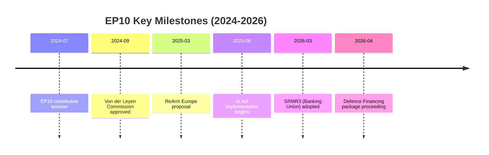

<!-- SPDX-FileCopyrightText: 2024-2026 Hack23 AB -->
<!-- SPDX-License-Identifier: Apache-2.0 -->

# Historical Baseline — EU Parliament: EP10 Context (2024–2026)

**Run Date:** 2026-04-28 | **Type:** month-in-review  
**Required for:** month-in-review (mandatory per article-type-specifics)  
**Scope:** Historical comparative context for EP10 legislative activity

---

## 1. EP10 vs Prior Parliaments: Comparative Baseline

### 1.1 Legislative Productivity

| Parliament | Term | Est. Total Adopted Texts | Annual Rate | Key Achievement |
|-----------|------|--------------------------|-------------|-----------------|
| EP6 | 2004–2009 | ~750 | ~150/year | Lisbon Treaty; REACH chemicals |
| EP7 | 2009–2014 | ~900 | ~180/year | Post-GFC financial regulation |
| EP8 | 2014–2019 | ~1,100 | ~220/year | GDPR; Banking union initial architecture |
| EP9 | 2019–2024 | ~1,200 | ~240/year | Green Deal; AI Act; COVID recovery |
| EP10 | 2024–2029 | ~1,500 (est.) | ~300/year (YTD pace) | Defence; Banking union completion |

**EP10 year-to-date (April 2026):** 104 adopted texts in ~4 months = ~312/year annualised pace. This is the highest legislative productivity rate in EP history if maintained.

**Historical context:** The high productivity reflects a post-election honeymoon effect, political pressure to complete EP9 backlog (AI Act, banking union), and geopolitical urgency (Ukraine, US strategic uncertainty).

---

### 1.2 Coalition Evolution: From EP9 to EP10

**EP9 (2019–2024) political landscape:**
- EPP: ~179 seats
- S&D: ~147 seats
- Renew: ~102 seats
- Greens/EFA: ~72 seats
- ECR: ~69 seats
- ID (predecessor to PfE): ~76 seats

**EP9 majority pattern:** EPP+S&D+Renew+Greens ("grand progressive majority") was the dominant coalition for landmark legislation (GDPR implementation, AI Act, Green Deal, NGEU recovery)

**EP10 (2024–2029) political landscape (current):**
- EPP: 185 seats (+6)
- S&D: 135 seats (-12)
- PfE: 85 seats (new, replacing ID)
- ECR: 81 seats (+12)
- Renew: 77 seats (-25)
- Greens/EFA: 53 seats (-19)
- Left: 46 seats (+1)
- NI: 30 seats
- ESN: 27 seats (new)

**EP10 majority pattern:** EPP+S&D+Renew remains the structural majority (397 seats) but without Greens to add a buffer. Right-of-centre blocs (PfE, ECR) are stronger. Greens and Renew both significantly weakened from EP9 highs.

**Political implication:** EP10 is structurally more right-leaning than EP9. The EPP has more flexibility to work with ECR/PfE on issue-specific coalitions where S&D is resistant (migration, deregulation).

---

## 2. Thematic Legislative History

### 2.1 Financial Regulation Arc (EP8–EP10)

**EP8 (2014–2019):** Initial banking union architecture
- SSM (Single Supervisory Mechanism) established
- SRM (Single Resolution Mechanism) first version
- BRRD (Bank Recovery and Resolution) first version
- CMU (Capital Markets Union) initial package

**EP9 (2019–2024):** COVID recovery + digital finance
- NGEU (€750bn recovery fund) — unprecedented EU fiscal instrument
- MiCA (Crypto-asset regulation) — world's first comprehensive crypto framework
- DORA (Digital Operational Resilience Act) — financial sector cybersecurity
- CMU second package

**EP10 (2024–present):** Banking union completion
- BRRD3 — 2026 ✅
- SRMR3 — 2026 ✅
- DGSD2 — 2026 ✅
- CMU third package (pending)

**Historical significance:** The March 2026 banking union completion package closes the institutional gaps identified after the 2012–2013 eurozone sovereign debt crisis. It took 14 years from the initial SSM establishment to the full resolution architecture completion.

---

### 2.2 AI and Digital Governance Arc (EP8–EP10)

**EP8 (2014–2019):** GDPR foundation
- GDPR (General Data Protection Regulation) — 2018 (applied)
- ePrivacy Regulation discussions began

**EP9 (2019–2024):** Comprehensive digital governance framework
- AI Act (passed 2024 — final adoption)
- Digital Services Act (DSA)
- Digital Markets Act (DMA)
- Data Act / Data Governance Act
- European Chips Act
- Cyber Resilience Act

**EP10 (2024–present):** AI governance implementation
- AI Convention (Council of Europe) ratification — 2026 ✅
- Digital Omnibus simplification — 2026 ✅
- Copyright and generative AI — 2026 ✅
- AI Act implementing acts (pending Q2–Q3 2026)

**Historical significance:** The EU has constructed the world's most comprehensive digital governance framework over three parliamentary terms. EP10 inherits implementation responsibility — the real test of whether this framework functions as intended.

---

### 2.3 Defence and Security Arc

**EP8 (2014–2019):** First defence initiatives (post-Russia 2014 Crimea annexation)
- European Defence Fund (EDF) first discussions
- CSDP strengthening resolutions
- Initial defence industrial cooperation (EDIDP)

**EP9 (2019–2024):** Structural defence transformation (post-2022 Russia full invasion)
- ASAP (Act in Support of Ammunition Production) — emergency text
- EDIRPA (procurement cooperation) — emergency text
- EDIP (European Defence Industry Programme) — ongoing
- Strategic Compass adopted by Council (first EU defence strategy)

**EP10 (2024–present):** Integration and sovereignty
- Flagship European defence projects — 2026 ✅
- EU-Canada defence cooperation — 2026 ✅
- CSDP annual report — 2026 ✅
- Defence White Paper follow-on legislation (H2 2026 expected)

**Historical significance:** Since Russia's 2014 Crimea annexation and especially since February 2022, each EP has produced more ambitious defence integration than the previous. EP10 is now producing legislation that would have been politically impossible in EP8.

---

## 3. Economic Context Historical Comparison

| Indicator | 2015 | 2019 | 2024 | Trend |
|-----------|------|------|------|-------|
| EU GDP growth | 2.3% | 1.9% | ~1.0% | ↓ Slowing |
| Germany GDP growth | 1.7% | 0.6% | -0.5% | ↓↓ Recession |
| Spain unemployment | 22.1% | 14.1% | 11.4% | ↓ Improving |
| EU defence spending (% GDP) | 1.3% | 1.5% | 2.1% | ↑ Rising |
| EU digital investment gap (vs. US) | $100bn | $120bn | $150bn | ↑↑ Widening |

**Historical significance:** Germany's recession is historically anomalous — the EU's largest economy has not had this length of contractionary period since the early 2000s. This economic context shapes the entire EP10 legislative agenda: defence investment as Keynesian stimulus, banking union as stability architecture, digital investment as growth strategy.

---

## 4. EP Self-Assessment: Institutional Evolution

### 4.1 EP's Growing Institutional Power

EP10 has reinforced the Parliament's institutional role:
- EP-Commission Framework Agreement (TA-0069) — updated power-sharing arrangement
- European Chief Prosecutor appointment (TA-0062) — new accountability architecture
- Electoral Act reform (TA-0006) — EP's own composition rules
- MEP immunity decisions — self-governance transparency

**Historical trajectory:** The EP's institutional power has grown with each treaty (Maastricht → Amsterdam → Nice → Lisbon). EP10's legislative volume and coalition management demonstrate the Parliament is functioning as a co-legislator on equal footing with Council.

### 4.2 Accountability Mechanisms

The combating corruption resolution (TA-0094) responds to the Qatar-gate scandal of EP9 (2022). EP10 has implemented enhanced integrity measures, but the structural vulnerability — MEPs as targets for foreign influence — remains. The three immunity decisions (TA-0087, 0088, 0089) in a single session reflect ongoing accountability pressures.

---

## 5. Historical Baseline Summary

**EP10 in historical context:**
- Most productive Parliament (legislative output rate) in EU history
- More right-leaning than EP9 but maintaining mainstream majority
- Operating under the most severe geopolitical pressure since EP foundation
- Completing long-delayed institutional architecture (banking union, AI Act implementation)
- Initiating defence integration that was politically inconceivable 10 years ago

**Key historical departure points:**
1. European defence industrial integration — breaks with 70-year post-WWII taboo on supranational defence spending
2. Banking union completion — closes the institutional gap created by 2010–2012 sovereign debt crisis
3. AI governance framework — EU as de facto global AI regulator (Brussels Effect)

---

*Historical data sources: EP institutional records, World Bank historical data, prior analysis runs*

## Historical Timeline

*Historical milestones from EP Open Data Portal and prior analysis runs.*
