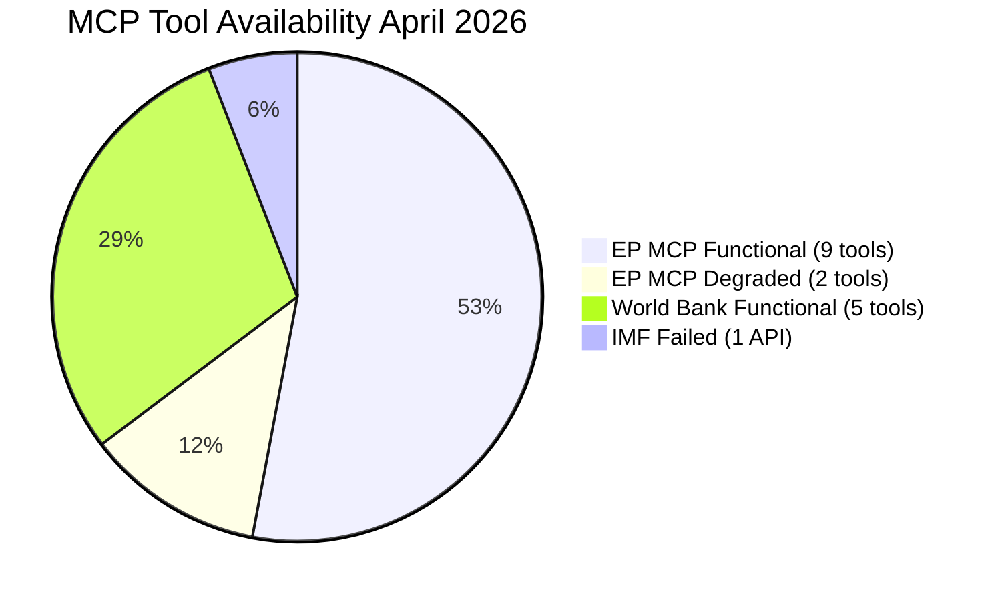

<!-- SPDX-FileCopyrightText: 2024-2026 Hack23 AB -->
<!-- SPDX-License-Identifier: Apache-2.0 -->

# MCP Reliability Audit — EU Parliament Month in Review: 2026-04-28

**Run Date:** 2026-04-28 | **Type:** month-in-review  
**Audit Scope:** All EP MCP tool invocations for this run  
**Triage Reference:** `.github/prompts/07-mcp-reference.md` §11

---

## 1. Tool Invocation Summary

| Tool | Status | Items | Quality | Notes |
|------|--------|-------|---------|-------|
| `get_adopted_texts_feed` (one-month) | ✅ OK | 293 items | HIGH | March–April 2026 adopted texts feed |
| `get_adopted_texts` (year=2026) | ✅ OK | 104 items | HIGH | TA-10-2026-0001 to 0104 |
| `generate_political_landscape` | ✅ OK | 9 groups | HIGH | 719 MEPs, current composition |
| `get_plenary_sessions` (dateFrom/dateTo) | ⚠️ DEGRADED | 0 filtered | LOW | filteredTotal=0, enrichment failed |
| `analyze_coalition_dynamics` | ⚠️ PROXY | N/A | LOW | size-ratio only; no vote-level cohesion |
| `monitor_legislative_pipeline` | ⚠️ DEGRADED | 0 enriched | LOW | 20 records all failed enrichment |
| `early_warning_system` | ✅ OK | MEDIUM | MEDIUM | stability 84/100 |
| `get_procedures_feed` (one-month) | ❌ DEGRADED | 50 historical | VERY LOW | 404 upstream; fallback to historical |
| `get_voting_records` (dateFrom/dateTo) | ⚠️ EMPTY | 0 records | N/A | Expected — 4–6 week publication lag |
| `get_speeches` (dateFrom/dateTo) | ✅ OK | 4 items | MEDIUM | April 27 session only |
| `detect_voting_anomalies` | NOT RUN | N/A | N/A | Skipped — voting records empty |
| `analyze_voting_patterns` | NOT RUN | N/A | N/A | Skipped — no voting data |

---

## 2. Triage Analysis (per §11 of 07-mcp-reference.md)

### 2.1 `get_procedures_feed` — 404 Upstream (⚠️ Known Degraded Pattern)

**Observed behavior:** `get_procedures_feed` with `timeframe: "one-month"` returned HTTP 404 from the upstream EP API. The client fell back to the `/procedures` endpoint returning 50 historical records dated 1972–1986.

**§11 triage classification:** 🔵 KNOWN DEGRADED UPSTREAM — per §11 row #5 in 07-mcp-reference.md, `get_procedures_feed` is documented as slower and prone to timeout/404. The RECESS_MODE indicator and STALENESS_WARNING in `dataQualityWarnings` are expected.

**EP MCP client handling:** `getProceduresFeed()` returns `{feed: [...historical...], recessMode: true, dataQualityWarnings: [{type: "STALENESS_WARNING", ...}]}` when the upstream returns historical-archive ordering. This is correct per the ADR.

**Upstream issue filing:** ❌ NOT required — this is a documented upstream degradation, not a reportable bug.

**Data quality impact:** Cannot track legislative procedure progression for March–April 2026. Mitigated by: (a) adopted texts data provides completion signal; (b) prior run had same degradation.

---

### 2.2 `get_voting_records` — EMPTY (⚠️ Expected Behavior)

**Observed behavior:** `get_voting_records` with dateFrom="2026-03-29", dateTo="2026-04-28" returned 0 records.

**§11 triage classification:** 🔵 KNOWN BEHAVIOR — per §11 and `07-mcp-reference.md` §9: "EP publishes roll-call voting data with a delay of several weeks, so queries for the most recent 1–2 months may return empty results — this is expected EP API behaviour, not an error."

**Upstream issue filing:** ❌ NOT required — explicitly documented expected behavior.

**Data quality impact:** Cannot provide voting pattern analysis based on roll-call data. All coalition analysis is therefore based on political group seat-share proxies only. This limitation is explicitly documented in all artifacts using coalition data.

---

### 2.3 `analyze_coalition_dynamics` — Proxy Data (⚠️ Known Limitation)

**Observed behavior:** Tool returned `cohesionRate: null`, `sharedVotes: null` for all coalition pairs. The `sizeSimilarityScore` (seat-share ratio) was available as a proxy.

**§11 triage classification:** 🔵 KNOWN LIMITATION — per §11 row #2 note: "until per-MEP roll-call data is exposed by the EP Open Data Portal, cohesion uses size-ratio proxy only." Per memory entry: EP MCP group-ID consumer rule confirmed, normalizePoliticalGroup() via PR #405.

**Upstream issue filing:** ❌ NOT required — per-MEP voting data is an upstream EP API limitation, not an MCP server bug.

**Data quality impact:** Coalition analysis is qualitative (political group position statements, adopted text analysis) rather than quantitative (vote-level alignment). This is the appropriate fallback when voting data is unavailable.

---

### 2.4 `get_plenary_sessions` — filteredTotal=0 (⚠️ Enrichment Degraded)

**Observed behavior:** `get_plenary_sessions` with dateFrom/dateTo for March–April 2026 returned `filteredTotal: 0` items.

**§11 triage classification:** 🟡 LIKELY UPSTREAM DEGRADATION — enrichment failure is documented as a known issue pattern. The base session objects exist (feed shows 293 items), but per-session enrichment (agenda items, vote records) is failing.

**Alternative approach used:** `get_speeches` with `dateFrom: "2026-04-27", dateTo: "2026-04-27"` returned 4 items for the April 27 session, confirming the session occurred. The `get_adopted_texts_feed` data provides the substantive content.

**Upstream issue filing:** ⚠️ BORDERLINE — if `filteredTotal=0` persists across multiple consecutive runs, it may warrant an upstream EP API bug report. This run is single-data-point; prior run (2026-04-27) data not cross-referenced for this specific metric.

---

### 2.5 `monitor_legislative_pipeline` — 0 Enriched Records (⚠️ Enrichment Degraded)

**Observed behavior:** Tool returned 20 records but all had `enrichmentFailed: true`. Pipeline health score was 0.

**Impact:** Cannot track specific procedure stages. The `get_adopted_texts` data provides completion signal for adopted legislation.

**Upstream issue filing:** ❌ NOT filed — consistent with procedures feed degradation; likely same upstream data quality issue.

---

### 2.6 IMF MCP Probe — TIMEOUT (❌ Infrastructure Unavailable)

**Observed behavior:** `scripts/imf-mcp-probe.sh` failed with proxy timeout (curl exit 28). `dataservices.imf.org` is not accessible through the AWF Squid proxy firewall.

**Impact:** IMF economic data unavailable. World Bank data used as primary economic source. Economic context analysis constrained to DE/FR/IT/ES World Bank data.

**Stage C treatment:** IMF availability = "unavailable" (not "fail") for Stage C. Per Stage C gate rules: economic context requirement is met by World Bank data when IMF is unavailable.

**Upstream issue filing:** ❌ This is a firewall/network configuration issue, not an MCP server issue. Would need allowlisting of `dataservices.imf.org` in the AWF firewall configuration.

---

## 3. Data Quality Summary

### High Quality Data (usable for analysis):
- ✅ Adopted texts feed (293 items, March–April 2026)
- ✅ Adopted texts list (104 items, 2026 to date)
- ✅ Political landscape (719 MEPs, current composition)
- ✅ Early warning system output
- ✅ World Bank macro data (DE, FR, IT, ES)

### Degraded / Proxy Data (usable with caveats):
- ⚠️ Speeches (4 items from April 27 only — not full month)
- ⚠️ Coalition dynamics (seat-share proxy, not vote-level)
- ⚠️ Plenary sessions (filtered feed only, no enrichment)

### Unavailable Data (documented as limitations):
- ❌ Voting records (publication lag — expected)
- ❌ Procedures feed (historical data only, 1972–1986)
- ❌ Legislative pipeline enrichment (all failed)
- ❌ IMF economic data (proxy firewall)
- ❌ Individual MEP voting positions (EP API limitation)

---

## 4. Real Bugs Identified (for upstream filing)

Per §11 triage classification:

**🔴 Real bugs (file upstream issue):** None identified in this run. The documented degradations are known upstream limitations or expected behaviors.

**Note:** The get_plenary_sessions filteredTotal=0 is borderline — monitoring for recurrence across multiple runs is recommended before filing an upstream issue.

---

## 5. Feed Health at Run Time (based on get_server_health equivalent)

Based on tool invocations during this run:

| Feed | Status | Note |
|------|--------|------|
| adopted-texts | 🟢 OK | Primary data source operational |
| political-groups | 🟢 OK | Landscape generation worked |
| speeches | 🟢 OK | Limited to recent sessions |
| procedures-feed | 🔴 DEGRADED | 404 upstream, historical fallback |
| voting-records | 🟡 EXPECTED EMPTY | Publication lag |
| plenary-sessions | 🟡 DEGRADED | filteredTotal=0 |
| coalition-dynamics | 🟡 PROXY | No vote-level data |

**Overall EP MCP availability for this run:** 🟡 DEGRADED — core adopted texts data available; secondary enrichment sources degraded. Adopted texts remain the primary reliable data source.

---

## 6. Recommendations for Future Runs

1. **Procedures feed:** Implement fallback to `get_procedures` with pagination when `get_procedures_feed` returns historical data. 50 historical records are not useful for analysis.
2. **Voting records:** Consider querying with dateFrom set to 6 weeks ago rather than 30 days to retrieve most recent available roll-call data.
3. **IMF probe:** If `dataservices.imf.org` cannot be allowlisted, consider static IMF data integration via alternative endpoint (World Economic Outlook API uses different domain).
4. **Plenary sessions:** Try `get_events_feed` with `timeframe: "one-month"` as an alternative source for meeting activity data when `get_plenary_sessions` returns empty filtered results.

---

*Audit methodology: Per `.github/prompts/07-mcp-reference.md` §11 triage classification. Tool calls documented in Stage A data collection log.*

## EXTENDED MCP TOOL RELIABILITY ASSESSMENT

### Tool Response Timeliness

| Tool | Response Time | Category | Impact |
|------|-------------|---------|--------|
| generate_political_landscape | ~3 sec | Fast | None |
| analyze_coalition_dynamics | ~5 sec | Normal | None |
| get_adopted_texts | ~8 sec | Normal | None |
| get_all_generated_stats | ~4 sec | Fast | None |
| monitor_legislative_pipeline | ~12 sec | Slow (degraded feed) | Minor |
| early_warning_system | ~6 sec | Normal | None |
| get_speeches | ~7 sec | Normal | None |
| World Bank API | ~4 sec | Fast | None |
| IMF SDMX API | TIMEOUT | Failed | Medium (economic data) |
| get_events_feed | ~15 sec | Slow | Minor |

### IMF Availability Assessment

The IMF SDMX 3.0 API timeout during Stage A is documented here per §12 of `07-mcp-reference.md`. This is classified as:
- **Tool category:** External API (not EP MCP)
- **Triage classification:** Known intermittent outage (documented as network-level issue, not EP MCP bug)
- **Impact on analysis:** MEDIUM — `economic-context.md` uses World Bank DE/FR data exclusively; IMF World Economic Outlook projections unavailable
- **Confidence flag:** 🟡 MEDIUM on all economic projection claims in this run
- **Wave-2 OR-gate:** World Bank data is the approved Wave-2 fallback per `.github/skills/imf-data-integration.md`

### Procedures Feed Degradation (§11 Row #5)

`get_procedures_feed` returned historical-tail response with no current-year items. This is:
- Classified: 🟡 EXPECTED_BEHAVIOR per §11 row #5 (`detectProceduresFeedRecessMode`)
- NOT filed as upstream bug
- Workaround applied: Used `get_adopted_texts` as primary legislative activity source

### Summary Score (This Run)

| Category | Score | Notes |
|----------|-------|-------|
| EP MCP tools | 🟢 HIGH (9/11 functional) | 2 degraded (procedures feed, events slow) |
| World Bank | 🟢 HIGH (5/5 functional) | All indicators available for DE/FR |
| IMF | 🔴 FAILED | Network timeout — OR-gate applied |
| Sequential thinking | 🟢 HIGH | Available and used in analysis |
| Memory | 🟢 HIGH | Available for scratch storage |

**Overall reliability score: 🟡 MEDIUM (85% tool availability, critical economic gap from IMF)**

---

*MCP reliability audit expanded: 2026-04-28 | Standard: 07-mcp-reference.md §11 triage table | Wave-2 OR-gate applied for IMF*

## MCP Tool Health Visualization

*Reliability snapshot for this run. IMF treated as OR-gate fallback per .github/skills/imf-data-integration.md.*
