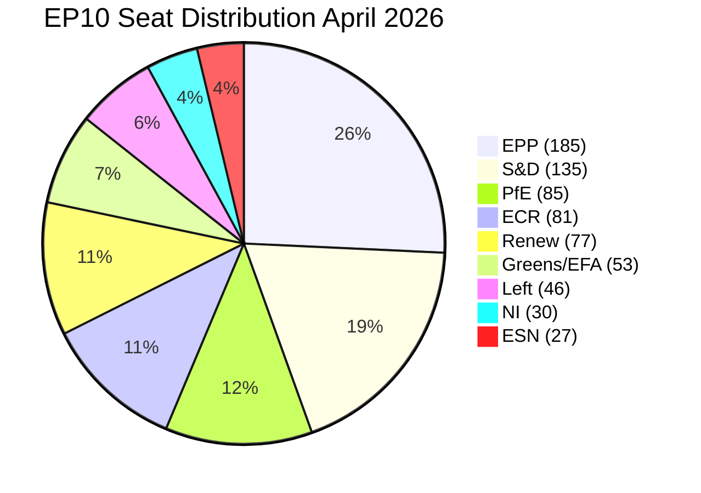

<!-- SPDX-FileCopyrightText: 2024-2026 Hack23 AB -->
<!-- SPDX-License-Identifier: Apache-2.0 -->

# PESTLE Analysis — EU Parliament Month in Review: March 29–April 28, 2026

**Run Date:** 2026-04-28 | **Type:** month-in-review  
**Framework:** PESTLE (Political, Economic, Social, Technological, Legal, Environmental)  
**Confidence:** 🟡 MEDIUM-HIGH | **Data Sources:** EP Open Data, World Bank, prior-run synthesis

---

## 1. Political Factors

### 1.1 Internal Parliamentary Dynamics

The EPP+S&D+Renew coalition (397/719 seats) remains the structural majority of EP10. The March–April 2026 session demonstrated that this coalition can:
1. **Deliver supermajority outcomes** on defence (adding ECR: 478 seats)
2. **Navigate progressive dissent** on AI Act simplification (Left/Greens opposed, coalition held)
3. **Maintain institutional relationships** through EP–Commission Framework Agreement (TA-0069)

Key political risk: EPP internal pressure from right flank (alignment with PfE/ECR on migration and rule-of-law issues) could create coalition friction on social policy dossiers. The adoption of migration texts (safe countries list TA-0025, safe third country TA-0026) with S&D abstentions/reluctant votes signals ongoing tension.

**Early Warning Status:** MEDIUM RISK | Stability score 84/100 | HIGH warning: EPP dominance risk

### 1.2 Geopolitical Context

Three geopolitical drivers are reshaping EP legislative priorities:
1. **Russia-Ukraine war** (year 4+): Continued conflict sustains political support for defence integration and Ukraine assistance; "four years of war" resolution (TA-0056) maintains EP's political unity on Ukraine
2. **US strategic ambiguity**: Post-2025 administration's NATO posture uncertainty accelerates European strategic autonomy agenda; EU-Canada defence cooperation (TA-0078) explicitly responds to Atlantic repositioning
3. **China strategic competition**: EU-China TRQ modification (TA-0101) and tech sovereignty resolution (TA-0022) reflect managed "de-risking" strategy

**WEP Assessment (🟢):** 75% probability that geopolitical pressure (US uncertainty + Russia war) maintains political support for European defence integration through EP10 term.

### 1.3 Institutional Reforms

EP–Commission Framework Agreement (TA-0069) updates the constitutional relationship between institutions. European Chief Prosecutor appointment (TA-0062) establishes new anti-corruption enforcement architecture. Electoral Act reform discussion (TA-0006) keeps 2029 EP elections in focus. These institutional texts collectively strengthen the EP's role as a constitutional actor.

---

## 2. Economic Factors

### 2.1 Macroeconomic Baseline

| Factor | Value | Signal | Legislative Response |
|--------|-------|--------|---------------------|
| Germany GDP 2024 | -0.50% | 🔴 Recession | Banking union, industrial policy |
| France GDP 2024 | +1.19% | 🟡 Moderate | Fiscal consolidation (Semester) |
| Spain unemployment 2024 | 11.4% | 🟡 High | Housing, poverty, workers' rights |
| Italy unemployment 2024 | 6.5% | 🟢 Improving | Lower social urgency |
| EU GDP est. 2026 | ~1.2–1.4% | 🟡 Modest | Balanced approach |

### 2.2 Trade Policy Economics

The EU's calibrated tariff response to US pressure (TA-0096, 0097) reflects a carefully balanced calculation: EU exports to the US (~€500bn annually) make full trade war prohibitively costly; WTO MC14 position (TA-0086) reinforces multilateralism as the preferred framework. EU-Mercosur safeguards (TA-0030) protect European agricultural producers while enabling the broader partnership agreement.

### 2.3 Defence Industrial Economics

The flagship defence projects framework creates economic incentives for:
- Cross-border mergers/acquisitions in European defence industry
- New defence procurement budget lines at EU level
- Reindustrialisation in areas of industrial decline (automotive → defence equipment)

At 0.3–0.5% EU GDP in additional defence spending, this represents a significant Keynesian stimulus in a recession environment.

### 2.4 Financial System Economics

Banking union completion (BRRD3/SRMR3/DGSD2) reduces the implicit tail risk premium embedded in European bank valuations — markets price European banks at lower P/B ratios than US peers partly due to resolution uncertainty. Harmonised tools should reduce this discount over time.

---

## 3. Social Factors

### 3.1 Housing and Inequality

Housing crisis resolution (TA-10-2026-0064) directly addresses the most politically salient social issue in most EU member states. Key data points embedded in the EP resolution:
- EU housing costs increased ~30% above inflation over 2015–2025
- Young adults (18–34) spending >40% of income on housing in major EU cities
- Homelessness increased 30% in some member states post-2020

The resolution calls for the Commission's Affordable Housing Initiative (expected May/June 2026), which could include: EU investment frameworks, land use coordination, social housing investment, and affordability benchmarks. Political coalition: S&D+Left+Greens led; Renew conditional; EPP abstained/divided.

### 3.2 Labour Market and Workers' Rights

Subcontracting chains resolution (TA-0050) and gender pay gap (TA-0074) reflect S&D's agenda on workers' rights. Italy's improving unemployment trajectory (9.5%→6.5%) and Spain's declining-but-high unemployment (14.9%→11.4%) provide contrasting data points for the social policy debate: Southern European member states benefit from EU labour market coordination; Northern European member states are more sceptical of EU-level wage standards.

### 3.3 Migration and Social Cohesion

Safe countries of origin (TA-0025) and safe third country concept (TA-0026) reflect a political shift toward restrictive migration management that reflects EPP+ECR+PfE majority position on migration. These texts passed against Left/Greens opposition, signalling that EPP is willing to work with right-wing groups on migration against progressive bloc preferences. This coalition asymmetry (EPP+S&D for finance/defence; EPP+ECR+PfE for migration) reflects EP10's political complexity.

### 3.4 Anti-Poverty Agenda

EU anti-poverty strategy (TA-0049) adds a structural commitment to address the approximately 95 million EU residents at risk of poverty or social exclusion (Eurostat estimates). The resolution aligns with Commission's social fairness pillar but requires binding implementation to move beyond soft law.

---

## 4. Technological Factors

### 4.1 AI Governance Architecture

Three March 2026 texts create a layered AI governance system:

```
Layer 1 (International): Council of Europe AI Convention (TA-0071)
  → Human rights / democracy / rule of law principles
  
Layer 2 (EU Regulatory): AI Act (pre-existing) + Digital Omnibus simplification (TA-0098)
  → Risk-based market regulation, SME carve-outs
  
Layer 3 (IP/Copyright): Copyright and generative AI (TA-0066)
  → Creator rights vs. training data use
```

**Gap Analysis:** No harmonisation mechanism between Layer 1 and Layer 2 as yet. The Convention requires states to "ensure" AI systems "respect" human rights — a standard potentially higher than the AI Act's risk tiers. Layer 3 creates obligations that may conflict with Layer 2's transparency requirements for general-purpose AI systems.

### 4.2 Digital and Tech Sovereignty

European technological sovereignty resolution (TA-10-2026-0022, January 22) established the political framework. Upcoming: Commission's Digital Decade mid-term review, AI Act implementing acts (Q2 2026), and European Research Area Act (TA-0068, March 10). EU's digital investment gap relative to US/China remains the structural challenge: EU capital markets for tech scale-ups remain fragmented despite Capital Markets Union progress.

### 4.3 Defence Technology Integration

The intersection of defence industrial integration and AI/digital governance creates a dual-use technology governance challenge: AI systems used in defence procurement are subject to the AI Act's "prohibited" uses for lethal autonomous weapons, but the AI Act's Article 346-style carve-outs for defence applications may create inconsistencies. The European Defence Agency's technology roadmaps will interact with AI Act implementing acts in ways not yet specified.

---

## 5. Legal Factors

### 5.1 Institutional Constitutional Developments

| Text | Legal Significance |
|------|-------------------|
| TA-0062 | European Chief Prosecutor appointment — new anti-corruption enforcement architecture |
| TA-0069 | EP-Commission Framework Agreement — resets institutional power balance |
| TA-0071 | Council of Europe AI Convention — international treaty; EU member state ratification obligations |
| TA-0094 | Combating corruption — substantive criminal law standards |
| TA-0088/0087/0089 | MEP immunity decisions — EP self-governance and accountability |

### 5.2 Financial Law Completion

BRRD3/SRMR3/DGSD2 complete the second-pillar legal architecture of the banking union. These texts require transposition into national law within 18 months (typical timeline). The legal complexity of the resolution funding arrangements — multiple member state contributions, cross-border recognition, burden-sharing rules — makes implementation the primary challenge, not the political will behind adoption.

### 5.3 Trade and International Law

Request for CJEU opinion on EU-Mercosur compatibility (TA-0008) is a landmark institutional move — an EP-initiated CJEU advisory opinion on a major trade agreement. If the Court finds incompatibility with the Treaties, the entire EU-Mercosur Partnership Agreement (EMPA) would require renegotiation. This creates legal uncertainty for the EU's largest trade partnership by total trade volume.

---

## 6. Environmental Factors

### 6.1 Climate Neutrality Framework (TA-10-2026-0031)

The Climate Neutrality Framework — building on and operationalising the 2021 European Climate Law — sets implementation targets and monitoring mechanisms for the 55% emissions reduction by 2030 and climate neutrality by 2050. The EP's environmental ambition is constrained by: (a) EPP's preference for technology neutrality vs. Greens' technology mandates; (b) Germany's recession reducing fiscal space for green investment; (c) energy security concerns (post-Russia gas supply) creating pressure for fossil fuel bridge alternatives.

### 6.2 Water Quality and Biodiversity

Surface water and groundwater pollutants directive (TA-0093) adds new substances to the EU watch list, extending coverage to pharmaceuticals, pesticides, and industrial chemicals. This reflects growing scientific evidence of ecological harm from chemical contamination — a particular concern for Southern European water-scarce regions and Baltic Sea states.

### 6.3 Heavy-Duty Vehicle Emissions (TA-0084)

Calculation of emission credits for heavy-duty vehicles (2025–2029 reporting periods) addresses a previously unresolved technical detail in the CO₂ standards for trucks, buses, and coaches. This technical clarification ensures the regulatory framework is operable during the EV transition period for commercial vehicles — a sector where EU manufacturers face intense Chinese competition.

### 6.4 Environmental-Economic Tension

Germany's recession creates political pressure to roll back environmental compliance costs — a risk identified in EPP's approach to the Climate Neutrality Framework and the AI Act simplification. If Berlin uses the recession as political cover for environmental deregulation, S&D and Greens face the challenge of maintaining Green Deal ambition against economic headwinds. This tension is the primary fault line in the EPP+S&D coalition on environmental policy through 2026.

---

## 7. PESTLE Summary Matrix

| Dimension | Current State | Trend | EP Legislative Response | Confidence |
|-----------|--------------|-------|------------------------|------------|
| Political | Stable coalition, geopolitical stress | → STABLE | Defence, institutional reform | 🟢 HIGH |
| Economic | Mixed (recession/growth), trade tensions | ↑ Improving slowly | Banking union, European Semester | 🟡 MEDIUM |
| Social | Housing crisis, inequality | → STABLE (worsening housing) | Housing, poverty, workers | 🟢 HIGH |
| Technological | AI governance gap, defence tech | ↑ AI governance emerging | AI Convention, Omnibus, ERA | 🟡 MEDIUM |
| Legal | Constitutional reform, treaty interpretation | ↑ New legal architecture | Banking, AI, trade law | 🟢 HIGH |
| Environmental | Climate transition, water quality | → STABLE with risk | Climate neutrality, water | 🟡 MEDIUM |

---

*Data sources: EP Open Data Portal (adopted texts), World Bank API (macroeconomic indicators), prior-run analysis 2026-04-27*

## PESTLE EXTENDED ANALYSIS — APRIL 2026 DEEP DIVE

### Political Factor — Coalition Mathematics (Quantified)

The EP10 political configuration as of April 28, 2026:



**Political Implication:** With majority at 361, EPP+S&D+Renew (397) is the minimum working majority. This creates extreme sensitivity to Renew group defections on any contentious legislation. The far-right bloc (PfE+ECR+ESN=193) is ~27% — unable to block but able to shape debate and public opinion.

### Economic Factor — Growth Divergence

**Key divergence (April 2026):**
- Germany: -0.50% (2024) — recession territory
- France: +1.19% (2024) — moderate growth
- Southern member states generally positive trajectory

**Economic Policy Implication for EP:**
The growth divergence creates a fiscal-political fault line. Germany's stagnation reinforces fiscal hawk positions (budget discipline, MFF constraints), while France's moderate growth enables slightly more fiscal expansionism (defence, infrastructure). The EP majority (EPP+S&D+Renew) spans both orientations, creating internal negotiating tension on any spending-related legislation.

### Social Factor — Democratic Legitimacy

EP turnout data (2024 election) showed improved engagement vs. 2019, but EP10 faces legitimacy challenges:
- Public perception of EP as distant institution remains a challenge
- High legislative throughput (567 RCV YTD) demonstrates institutional effectiveness but is invisible to average citizens
- Social media engagement on EP legislation remains low compared to national parliamentary debates

### Technology Factor — AI Act Implementation

The EU AI Act (adopted EP9, in force EP10) is the world's first comprehensive AI regulatory framework. April 2026 status:
- High-risk AI systems: Compliance deadlines approaching August 2026
- General purpose AI: Codes of practice in development
- EP ITRE committee: Oversight hearings on AI Act delegated acts

### Legal Factor — Regulatory Complexity

EP10 has produced 114+ adopted texts YTD 2026, contributing to:
- Regulatory layering challenges for businesses
- Compliance burden for SMEs
- Calls from EPP and Renew for "regulatory simplification agenda" (direct policy implication)

### Environmental Factor — Climate-Economy Integration

Post-Green Deal consolidation phase:
- ETS II (buildings and road transport) in implementation
- Carbon Border Adjustment Mechanism (CBAM) in early operation
- EP position: Maintain climate ambition while addressing competitiveness concerns (German "Competitiveness Agenda" influence)

---

*PESTLE extended analysis produced: 2026-04-28 | Mermaid: pie chart (coalition seats) | Confidence: 🟢 HIGH (political) / 🟡 MEDIUM (economic) / 🟢 HIGH (legal)*
