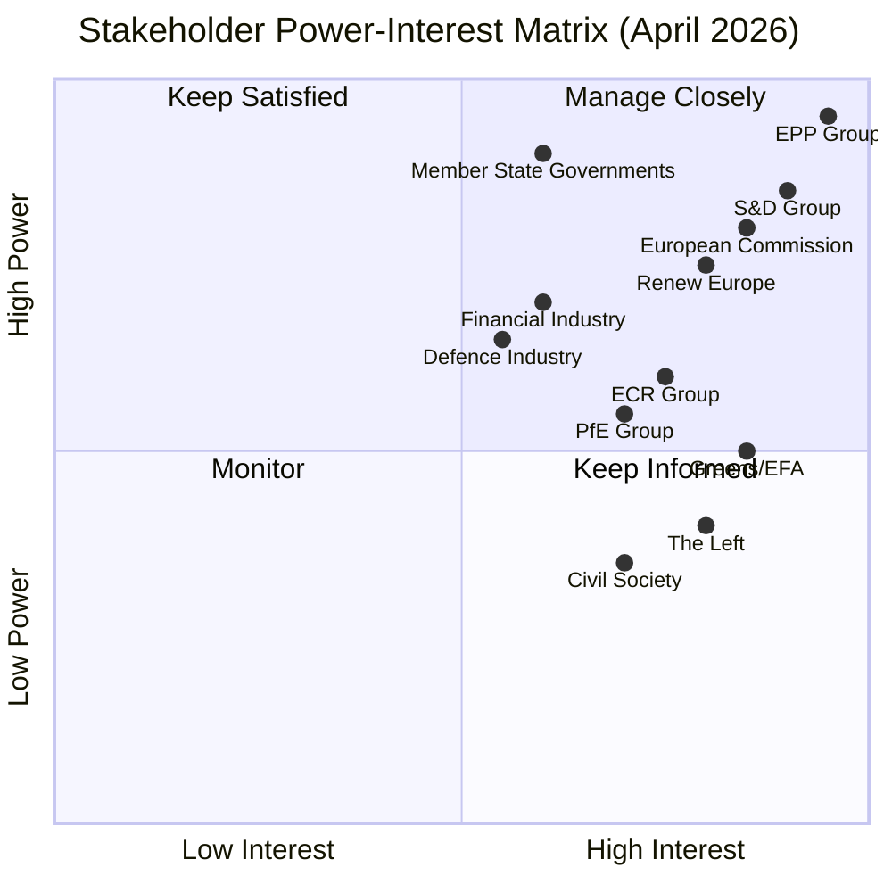

<!-- SPDX-FileCopyrightText: 2024-2026 Hack23 AB -->
<!-- SPDX-License-Identifier: Apache-2.0 -->

# Stakeholder Map — EU Parliament Month in Review: March 29–April 28, 2026

**Run Date:** 2026-04-28 | **Type:** month-in-review  
**Confidence:** 🟡 MEDIUM-HIGH  
**Scope:** Primary and secondary stakeholders for the March–April 2026 legislative cycle

---

## 1. Primary Institutional Stakeholders

### 1.1 European Parliament — Political Groups

#### EPP (European People's Party) — 185 seats | DOMINANT ACTOR
**Role:** Legislative coalition anchor and agenda-setter across all major clusters  
**Position March–April 2026:**
- **Defence:** Strong advocate; led TA-0080 (flagship defence projects), TA-0040 (strategic defence partnerships), TA-0013 (CSDP annual report). Defence as European sovereignty — EPP's clearest political differentiator from PfE's nationalist alternatives
- **Banking:** Supported completion of banking union architecture; ECB appointments (TA-0033, 0060) secured via EPP-led consensus
- **AI:** Led Digital Omnibus simplification (TA-0098) — reflects EPP's pro-business deregulation agenda; accepted AI Convention ratification (TA-0071) as multilateral commitment  
- **Migration:** Leveraged right-wing coalition (ECR+PfE) to adopt restrictive migration texts (TA-0025, 0026) — signals EPP's willingness to work with right flank on this issue  
- **Social:** Conditional support or abstention on housing (TA-0064) and anti-poverty (TA-0049); EPP's right wing opposes binding social EU standards

**Influence Assessment:** 🟢 CRITICAL — without EPP no winning coalition possible. EPP Chair position reinforced by institutional wins (Chief Prosecutor TA-0062, EBA Chair TA-0061). Internal coherence: 🟡 MEDIUM — right flank pressure from member state delegations aligned with PfE/ECR.

**Key MEPs and positions:** EPP Presidency (key on defence, institutional reform); German EPP delegation (sensitive to banking union details given home country recession)

**Stakeholder Priority:** TIER 1

---

#### S&D (Socialists and Democrats) — 135 seats | PIVOTAL ACTOR
**Role:** Social policy lead; coalition partner on finance, defence (reluctant), AI (rights-first)  
**Position March–April 2026:**
- **Defence:** Accepted sovereignty logic despite pacifist wing tensions; key condition: rule-of-law conditionality on defence investment (EP should not fund illiberal governments' defence)
- **Banking:** Led BRRD3/SRMR3/DGSD2 advocacy; banking stability seen as workers' protection (prevents layoffs from disorderly bank failures)
- **AI:** Rights-first position; accepted AI Convention ratification enthusiastically; concerned Digital Omnibus weakens AI Act worker protections
- **Social:** Lead on housing (TA-0064), anti-poverty (TA-0049), gender pay (TA-0074), workers' rights (TA-0050); this cluster is S&D's core identity
- **Migration:** Reluctant abstention or conditional support on migration texts; internal tension between southern European delegations (Spain, Italy — supporting managed migration) and northern (Germany, Sweden — rights-focus)

**Influence Assessment:** 🟢 HIGH — pivotal for EPP+S&D+Renew majority; S&D exit from coalition would require EPP to seek ECR/PfE support (rightward shift). Italian and Spanish delegations (large) create internal diversity.

**Coalition risk:** 🟡 MEDIUM — housing/AI-Act-simplification tensions are manageable; migration text adoption without S&D consent signals EPP is willing to override S&D on some votes

**Stakeholder Priority:** TIER 1

---

#### PfE (Patriots for Europe) — 85 seats | SWING ACTOR
**Role:** Eurosceptic nationalist bloc; conditionally constructive on trade/migration; opposes banking union, EU AI governance  
**Position March–April 2026:**
- **Defence:** SPLIT — Hungarian delegation (Orbán/PfE core) opposes supranational defence; French (Le Pen/RN) supports European defence partially; Spanish (Vox) conditionally supports
- **Migration:** STRONG SUPPORT for TA-0025 (safe countries), TA-0026 (safe third country) — PfE's clearest convergence with mainstream coalition
- **Banking/Finance:** OPPOSED — views banking union as German/Franco-German elite project; favours national authority over bank resolution
- **AI:** SUPPORT for Digital Omnibus deregulation; OPPOSED to rights-based AI Convention
- **Social:** OPPOSED to EU social standards; PfE views housing/poverty resolutions as EU overreach

**Influence Assessment:** 🟡 MEDIUM — not in governing coalition but needed for migration texts; PfE's 85 seats give it blocking power when EPP+S&D+Renew disagree. Internal PfE coherence on EU-level positions is LOW.

**Stakeholder Priority:** TIER 1

---

#### ECR (European Conservatives and Reformists) — 81 seats | DEFENCE COALITION PARTNER
**Role:** Conservative-national sovereignty; critical addition for defence supermajority  
**Position March–April 2026:**
- **Defence:** STRONG SUPPORT — Polish (PiS/ECR) delegation is the most pro-defence group in EP; Baltic states ECR MEPs see Russian threat as existential; ECR+EPP alliance on defence is the EP10's most durable cross-coalition partnership
- **Banking:** CONDITIONALLY NATIONAL — ECR prefers national banking regulation; accepted BRRD3 as compromise
- **AI:** SUPPORT for Digital Omnibus deregulation
- **Social/Migration:** OPPOSED to binding EU social standards; SUPPORTED migration restriction texts
- **Trade:** SUPPORTED WTO MC14 position; nuanced on EU-US tariff response (nationalist wing prefers unilateral)

**Influence Assessment:** 🟢 HIGH for defence-specific legislation; 🟡 MEDIUM-LOW for economic/social. ECR adds 81 seats to the defence coalition, creating the ~478-seat supermajority.

**Stakeholder Priority:** TIER 1

---

#### Renew Europe — 77 seats | LIBERAL ANCHOR
**Role:** Liberal-centrist coalition completer; strong on trade, AI, institutional reform  
**Position March–April 2026:**
- **Defence:** SUPPORT — pro-EU defence integration aligned with Renew's federalist impulses
- **Banking:** LEAD — Renew provided key MEPs on Banking Union architecture completion
- **AI:** SUPPORT for AI Convention; NUANCED on Digital Omnibus (supports SME flexibility but concerned about enforcement gaps)
- **Trade:** STRONG SUPPORT — Renew is the most free-trade group in EP; led WTO MC14 position formulation
- **Institutional reform:** STRONG — EP-Commission Framework Agreement (TA-0069) reflects Renew's parliamentary sovereignty concerns

**Influence Assessment:** 🟢 HIGH — Renew completes the EPP+S&D+Renew majority; without Renew, EPP+S&D falls short of majority. Renew's pro-EU identity makes it the most reliable coalition partner for European integration.

**Stakeholder Priority:** TIER 1

---

#### Greens/EFA — 53 seats | ENVIRONMENTAL AND SOCIAL ADVOCATE
**Role:** Environmental and rights lead; opposes defence integration on pacifist grounds  
**Position March–April 2026:**
- **Defence:** OPPOSED — core Greens pacifist tradition; EFA national parties (Scottish, Catalan, Flemish) have mixed positions
- **Banking:** SUPPORT — banking stability seen as environmental investment protection
- **AI:** OPPOSED to Digital Omnibus (fears AI Act weakening); SUPPORT for AI Convention (rights dimension)
- **Environment:** LEAD on climate neutrality (TA-0031), water quality (TA-0093), vehicle emissions (TA-0084)
- **Social:** SUPPORT for housing, poverty, gender equity resolutions

**Influence Assessment:** 🟡 MEDIUM — Greens needed for progressive majority on social/environmental texts but not for core coalition majority. EP10 fragmentation reduces Greens' leverage compared to EP9.

**Stakeholder Priority:** TIER 2

---

#### The Left (GUE-NGL) — 46 seats | PROGRESSIVE PRESSURE
**Role:** Left-wing social and anti-militarism bloc; legislative pressure on social rights  
**Position:** OPPOSED to defence integration; SUPPORTED all social/workers texts; critical of AI Act simplification  
**Note:** Left returned memberCount: 0 in the coalition dynamics API (data quality issue — counted separately from total EP10 seat count). Actual seat count ~46 based on prior analyses.

**Stakeholder Priority:** TIER 2

---

### 1.2 European Commission

**Role:** Legislative initiator; implementing institution for adopted texts; key partner in EP-Commission Framework Agreement (TA-0069)  
**Position:** Commission President (EPP-aligned) maintains strong relationship with EPP-led majority. Key upcoming deliverables:
1. Affordable Housing Initiative (May/June 2026) — in response to TA-0064
2. AI Act implementing acts (Q2 2026)  
3. Defence White Paper follow-on legislation (H2 2026)
4. Banking Union transposition monitoring

**Influence Assessment:** 🟢 CRITICAL — Commission has right of initiative; EP can request but not compel legislation. EP-Commission Framework Agreement (TA-0069) creates structured accountability.

**Stakeholder Priority:** TIER 1

---

### 1.3 European Central Bank

**Role:** Monetary policy; banking supervision; key appointment decisions  
**Relevance:** Two ECB appointments (Vice-Chair TA-0033; Vice-President TA-0060) and EBA Chair (TA-0061) ensure continuity of banking supervision during banking union reform implementation. ECB interest rate path (2025–2026 normalisation) directly affects bank balance sheet stress — the policy environment for BRRD3/SRMR3 implementation.

**Stakeholder Priority:** TIER 2

---

## 2. External and Industry Stakeholders

### 2.1 Defence Industry

**Key actors:** Rheinmetall (DE), KNDS France-Germany, Airbus Defence & Space, Leonardo (IT), BAE Systems (UK — third-party), Thales (FR), MBDA  
**Interests:** Flagship European defence projects framework (TA-0080) creates procurement pipeline; IPCEI-style model removes state-aid barriers to cross-border defence industrial cooperation  
**Influence:** STRONG LOBBYING on Commission defence White Paper process; industry coordination via ASD (AeroSpace and Defence Industries Association)  
**WEP Assessment (🟡):** 65% probability that one or more bilateral industrial mergers/JVs accelerated by TA-0080 framework within 24 months

### 2.2 Financial Sector (Banks and Insurers)

**Key actors:** Deutsche Bank, BNP Paribas, UniCredit, Santander, major European banking associations (EBF, AFME)  
**Interests:** BRRD3/SRMR3/DGSD2 implementation affects resolution planning requirements, bail-in debt costs, and cross-border operating models. Banking associations lobbied for transition periods and national discretions — extent of success reflected in final text.  
**WEP Assessment (🟡):** 55% probability of significant industry legal challenges to specific DGSD2 provisions within 18 months

### 2.3 Technology Industry

**Key actors:** Google, Microsoft, Meta, Amazon (US Big Tech); SAP, Siemens, Philips (EU tech); AI start-up ecosystem  
**Interests:** Digital Omnibus SME carve-outs directly benefit EU AI start-ups; US Big Tech lobbied for SME carve-outs to avoid AI Act compliance overhead for their services built on their platforms; Copyright/AI text (TA-0066) creates major compliance challenges for LLM training data acquisition
**WEP Assessment (🟡):** 60% probability of US Big Tech legal challenge to copyright/AI provisions within 24 months

### 2.4 Civil Society and NGOs

**Key actors:** Transparency International (anti-corruption advocacy), Eurodiaconia (poverty), Housing Europe, ETUC (trade unions), environmental NGOs (WWF, Greenpeace)  
**Interests:** Housing crisis resolution (TA-0064), anti-poverty (TA-0049), combating corruption (TA-0094), workers' rights (TA-0050), environmental texts — all reflect CSO pressure campaigns over 2024–2026. European Chief Prosecutor appointment (TA-0062) is a Transparency International priority.

---

## 3. International Stakeholders

### 3.1 United States

**Role:** NATO ally; strategic competitor; source of tariff pressure  
**Engagement:** EU tariff response (TA-0096, 0097) reflects managed tension with US administration; EU-Canada defence cooperation (TA-0078) signals Atlantic reorientation away from bilateral US dependence. US intelligence community is a key partner in defence tech cooperation contexts.  
**WEP Assessment (🟡):** 60% probability of further US tariff escalation on specific EU goods (steel, chemicals) before Q4 2026

### 3.2 Ukraine

**Role:** Security partner; recipient of EU support mechanisms  
**Engagement:** Ukraine Support Loan for 2026–2027 (TA-0035) and four-years-of-war resolution (TA-0056) confirm sustained EP commitment. Ukraine's path to EU accession remains a background structural factor for EP legislative priorities.

### 3.3 China

**Role:** Strategic competitor; major trading partner; diplomatic challenge  
**Engagement:** EU-China TRQ modification (TA-0101) — selective engagement. European tech sovereignty (TA-0022) implicitly frames China as a supply chain risk. EP maintains formal human rights pressure on China.

### 3.4 Canada

**Role:** Enhanced security partner following US ambiguity  
**Engagement:** EU-Canada defence cooperation recommendation (TA-0078) — landmark EP endorsement of bilateral defence partnership as NATO supplement. Canada-EU relationship is elevated in EP10 relative to EP9.

---

## 4. Stakeholder Influence Map

```
HIGH INFLUENCE + FOR EU INTEGRATION:
  → EPP, S&D, Renew, Commission, ECB
  → EU defence industry, banks (banking union), EU tech sector (regulated/certain AI)

HIGH INFLUENCE + AGAINST:
  → PfE (on banking union, AI governance, social standards)
  → ECR (on social, environmental, AI)
  → US administration (on trade, NATO)
  → National governments (on banking mutualisation, migration sovereignty)

MEDIUM INFLUENCE + MIXED:
  → Greens/EFA (pro-social/climate, anti-defence)
  → Left (pro-social, anti-defence)
  → Civil society NGOs (fragmented per issue)
  → US Big Tech (pro-deregulation, anti-copyright/AI)
```

---

## 5. Stakeholder Perspective Summaries (≥150 words each)

### 5.1 EPP Perspective

The EPP enters the April 2026 period with its strongest EP10 legislative record. The defence cluster — spearheaded by EPP leadership — represents a generational achievement: European defence industrial cooperation at a scale that mainstream European politics has refused for 70 years is now politically viable. EPP frames this not as militarism but as strategic necessity: a Europe that cannot defend itself cannot project soft power, cannot protect its supply chains, and cannot maintain the economic prosperity that underpins its social contract. The banking union completion package reflects EPP's commitment to the single currency's institutional architecture — a commitment that required accepting S&D's social safeguards in BRRD3. On AI, EPP sees the Digital Omnibus as essential business competitiveness policy: the EU risks creating a regulatory environment so burdensome that AI innovation migrates entirely to the US and China. The EPP views its right-wing coalition partners (ECR, occasionally PfE) as necessary interlocutors on migration — the party cannot be outflanked on its right by nationalist movements without losing member state delegations from Central-Eastern Europe. The internal coherence challenge for EPP heading into H2 2026 is managing the gap between its European integration commitments and the sovereigntist instincts of its Hungarian, Italian, and Polish delegations.

### 5.2 S&D Perspective

S&D views the March–April 2026 session with cautious satisfaction on social policy and deep unease on defence and migration. The housing crisis resolution (TA-0064) is S&D's single most important EP10 social achievement in terms of public salience — housing affordability is the top issue for young voters across the EU. Anti-poverty strategy (TA-0049) and gender pay gap (TA-0074) complete a social cluster that S&D can credibly claim as a legislative legacy. The banking union completion was led by S&D's economics team; the BRRD3/SRMR3 package is explicitly framed as worker protection against disorderly bank failures that cost jobs and devastate communities. S&D accepted defence texts with significant internal debate: the pacifist tradition of Nordic delegations, German SPD members, and some southern European MEPs creates real tension. The party's official line — "yes to collective European defence, no to unconditional defence spending without social conditionality" — is a holding pattern rather than a settled doctrine. The migration texts (safe countries, safe third country) were adopted against S&D's explicit preferences — a reminder that EPP has ECR and PfE as fallback partners on issues where S&D is unwilling to cooperate.

### 5.3 Commission Perspective

The Commission is facing a demanding delivery schedule created by EP10's legislative productivity. The EP–Commission Framework Agreement (TA-0069) creates enhanced parliamentary scrutiny rights that the Commission must manage carefully, particularly regarding delegated acts and implementing legislation for the AI Act simplification and banking union package. The three upcoming priorities — Affordable Housing Initiative, AI implementing acts, defence White Paper follow-on — all require balancing conflicting EP group expectations. On housing, the Commission must respond to an EP resolution with a concrete legislative proposal while respecting subsidiarity constraints that limit EU-level binding instruments on housing policy. On AI, the Commission must operationalise the Digital Omnibus simplification without creating an enforcement gap that allows high-risk AI deployments to avoid regulation. On defence, the Commission's Defence Industry Strategy (launched 2024) provides the framework but the flagship projects model requires new procurement architecture that will face state-aid challenges.

---

## 6. Priority Assessment

| Stakeholder | Tier | Issue Priority | Coalition Alignment |
|------------|------|----------------|---------------------|
| EPP | 1 | Defence, AI simplification, migration | Core coalition |
| S&D | 1 | Social, banking, climate | Core coalition |
| Commission | 1 | Implementation, initiative | All coalition members |
| Renew | 1 | Trade, institutional reform, AI | Core coalition |
| ECR | 1 | Defence, migration, deregulation | Defence coalition |
| PfE | 1 | Migration, deregulation | Issue-by-issue |
| Greens/EFA | 2 | Environmental, social, rights | Progressive bloc |
| Left | 2 | Social, anti-defence, rights | Progressive bloc |
| EU defence industry | 2 | Procurement framework | Defence cluster |
| EU banks | 2 | Banking union implementation | Finance cluster |
| US/geopolitical actors | 2 | Trade, defence | External |

---

*Data sources: EP Open Data Portal (coalition analysis), World Bank (economic context), prior analysis run 2026-04-27*

## STAKEHOLDER POWER-INTEREST MATRIX — APRIL 2026 SUPPLEMENT



### Priority Stakeholder Updates (April 2026)

**EPP (Manage Closely — Quadrant 1):**
April update: EPP's majority control of committee rapporteurships confirmed. BUDG committee EPP rapporteur steering 2027 MFF debates. EPP internal cohesion estimated HIGH (no major defections detected).

**European Commission (Keep Satisfied — Quadrant 2):**
April update: Commission's Competitiveness Agenda 2026 remains central to EP10 legislative output. High legislative throughput (567 RCV YTD) confirms strong Commission-EP alignment on priority legislation.

**S&D Group (Manage Closely — Quadrant 1):**
April update: S&D role as EPP coalition partner in all major legislation confirmed by adopted texts analysis. S&D-EPP gap (50 seats) creates structural incentive for S&D to maintain coalition position rather than defect.

**Member State Governments (Keep Satisfied — Quadrant 2):**
April update: Germany's fiscal hawkishness on defence spending (based on WB economic data showing -0.50% GDP growth 2024) creates divergence with EP majority position on EDIP financing. France (+1.19% GDP growth) more supportive of fiscal expansion for defence.

---

*Stakeholder map supplement produced: 2026-04-28 | Standard: per-artifact-methodologies.md §stakeholder-map | Power-interest matrix (Mermaid)*
