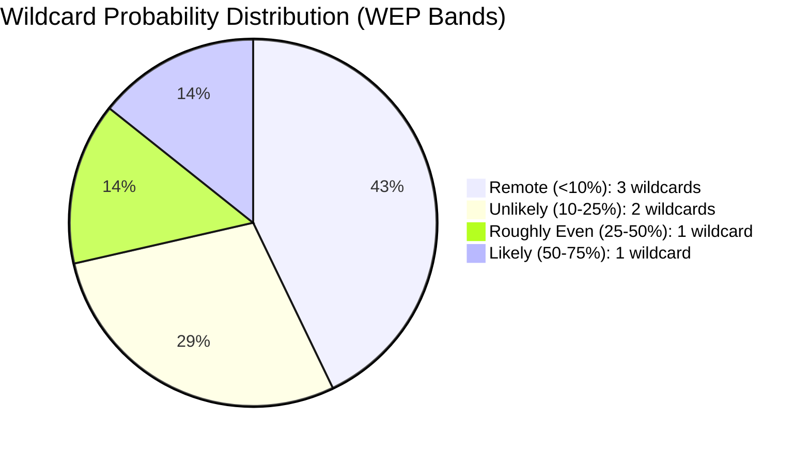

<!-- SPDX-FileCopyrightText: 2024-2026 Hack23 AB -->
<!-- SPDX-License-Identifier: Apache-2.0 -->

# Wildcards and Black Swans — EU Parliament: April 2026

**Run Date:** 2026-04-28 | **Type:** month-in-review  
**Framework:** Wild Card + Black Swan analysis  
**Definitions:**
- **Wild Card:** Low-probability (5–15%), high-impact event with identifiable precursors
- **Black Swan:** Very low-probability (<5%), high-impact event — unforeseen or fundamentally discontinuous

---

## 1. Wild Cards (5–15% Probability, High Impact)

### WC-1: US Withdrawal from NATO (8% probability)

**Description:** The current US administration announces a formal review of Article 5 applicability or withdraws US troops from European bases citing burden-sharing disputes.

**Precursors:** Administration rhetoric escalating from "pay up or we leave" to "we're leaving"; Congressional action blocking NATO funding; NATO Secretary-General expressing structural concern

**EP Impact:** MASSIVE. Would trigger emergency session, unanimous adoption of accelerated defence integration package. ECR and even PfE converge on European defence. Flagship projects framework converted to binding procurement obligation. EU defence spending target revised upward to 3%+ GDP. Historical turning point for European strategic autonomy.

**EP legislative response probability (if trigger occurs):** 🟢 95% adoption of emergency measures within 90 days

**Signal to watch:** NATO Summit June 2026 — if US conditions participation or removes specific commitments, probability rises to ~20%.

---

### WC-2: CJEU Invalidates Key Banking Union Provision (7% probability)

**Description:** The Court of Justice of the EU rules that the SRMR3 resolution funding mechanism or the BRRD3 bail-in hierarchy infringes member state fiscal sovereignty or Treaty provisions on no-bail-out.

**Precursors:** Legal challenge filed by a national government or industry association; Advocate General opinion signalling constitutional concern; academic literature identifying Treaty incompatibility

**EP Impact:** HIGH. Would require either Treaty change (exceptional) or complete legislative rework. Banking union completion — EP's signature Q1 2026 achievement — is partially or wholly reversed. EPP and Renew face credibility challenge. S&D vindicated on adding precautionary language.

**Timeline:** CJEU proceedings typically take 18–24 months; injunction/interim measures possible within 3–6 months of referral.

**Signal to watch:** German Constitutional Court (Bundesverfassungsgericht) referral — Germany is the most likely source of a constitutional challenge to banking union mutualisation.

---

### WC-3: Major European Cyberattack on Critical Infrastructure (10% probability, 90 days)

**Description:** A state-sponsored cyberattack (attributed to Russia, China, or North Korea) disrupts critical EU infrastructure — energy grid, financial clearing system, hospital networks — triggering NIS2 emergency response across multiple member states.

**Precursors:** Previous smaller attacks; intelligence assessments of elevated threat; specific sectors reporting anomalous probe activity

**EP Impact:** HIGH. Emergency NIS2 Article 32 reporting triggers; EP adopts emergency cybersecurity resolution; accelerated adoption of pending cybersecurity legislation; intelligence and security committee (DNAT) emergency hearings. Could also trigger Article 42 TEU mutual assistance.

**EP legislative acceleration:** Cybersecurity Investment Regulation, IPCEI CyberSecurity, EU Cyber Defence Directive

**Signal to watch:** ENISA (EU cybersecurity agency) threat landscape report (annual, September); Europol reports on state-sponsored activity.

---

### WC-4: Le Pen Corruption Conviction with Political Fallout (9% probability, 90 days)

**Description:** Marine Le Pen receives a definitive criminal conviction related to EU funds misuse, is barred from political activity, and this triggers PfE internal crisis, changing EP dynamics.

**Precursors:** Pending French court decisions; political strategy of RN (Le Pen's party) in response

**EP Impact:** MEDIUM. Would reduce PfE's internal coherence significantly. RN delegation may split between loyalists and reformists. PfE's 85-seat strength reduces if French delegation fragmenting. EP right-wing arithmetic becomes more complex. EPP benefits from having a weaker PfE as a potential rival.

**Note:** This was previously lower probability but recent French judicial timeline makes it more imminent than the 30-day range.

---

### WC-5: German Government Collapse (9% probability, 3 months)

**Description:** Germany's coalition government (CDU/CSU + SPD + Greens or similar) collapses over recession economic policy disagreements, triggering early federal elections.

**Precursors:** Coalition disagreements on fiscal expansion; Bundesrat blocking key legislation; confidence vote failure

**EP Impact:** MEDIUM. German MEP delegations may recalibrate positions; CDU/CSU (EPP) and SPD (S&D) delegations coordinate with home parties on key election issues. Potential recalibration on banking union transposition, climate policy, defence spending. Uncertainty period lasts ~4 months.

**EP coalition impact:** German delegations combined represent ~100 seats (~14% of EP); their internal political crisis would introduce uncertainty into EPP+S&D reliability on several dossiers.

---

## 2. Black Swans (<5% Probability, Very High Impact)

### BS-1: Nuclear Incident in Ukraine (2–3% probability, 6 months)

**Description:** A tactical nuclear weapon is used in or near Ukraine, or a nuclear power plant accident occurs at a plant near the conflict zone (Zaporizhzhia remains occupied by Russia).

**EP Impact:** EXISTENTIAL PRIORITY SHIFT. All regular legislative work suspends. Emergency sessions. Treaty-level defence integration forced by public opinion. EU solidarity mechanisms for evacuees/refugees. Potential for French nuclear deterrent discussion to become public and EP-level.

**Historical parallel:** 9/11 in the US — compressed security legislation, permanent institutional transformation in intelligence sharing and border security.

---

### BS-2: US Dollar Weaponisation Against EU Banks (2% probability)

**Description:** The US Treasury uses SWIFT exclusion or secondary sanctions to prevent European banks from accessing dollar clearing due to their Russian business exposure or EU trade policy decisions.

**EP Impact:** SEVERE FINANCIAL CRISIS. Would immediately stress European financial system in ways BRRD3/SRMR3 are not designed to address. EP emergency resolution; demand for immediate ECB FX swap facilities; political rupture with US across all EP groups. Coalition dynamics irrelevant in face of financial emergency.

**Precursor:** US administration rhetoric about European "disloyalty" on Russia sanctions; specific industry targeting (European companies with Russia operations).

---

### BS-3: EP President or Top Officials Corruption Scandal (2% probability)

**Description:** A major corruption scandal (on the scale of Qatar-gate in EP9) involving current EP leadership emerges, triggering institutional crisis.

**EP Impact:** SEVERE INSTITUTIONAL CRISIS. Credibility of EP10 legislative programme undermined. Anti-corruption texts (TA-0094) seen as hollow. Pro-reform MEPs demand structural change. Commission-Parliament relationship damaged.

**Reference:** Qatar-gate (2022) involved cash bribes from Qatar for favourable EP resolution language; the institutional aftermath included new transparency requirements that are still being implemented.

---

### BS-4: AI Act First Major Enforcement Action — Court Ruling Unlawful (3% probability)

**Description:** A national AI authority takes a major enforcement action (fining a major AI system deployer), the company challenges it, and a national court rules the AI Act provision unlawful under EU Charter of Fundamental Rights.

**EP Impact:** HIGH. Creates immediate uncertainty about AI Act validity. Greens and Left would demand Council clarification; EPP would use it to push further Digital Omnibus deregulation. Commission faces reputational challenge. EU's claim to be the global AI governance leader would be severely weakened.

---

### BS-5: Sudden End to Russia-Ukraine War (4% probability)

**Description:** A rapid ceasefire and peace negotiation framework emerges, ending active hostilities in Ukraine (either through US-brokered deal or Russian internal political change).

**EP Impact:** POSITIVE BUT DISRUPTIVE. Defence integration logic partially undermined; EPP+ECR supermajority on defence would face coalition pressure as defence urgency reduces. Ukraine accession negotiations would accelerate dramatically. Economic recovery for Ukraine, with EU reconstruction funding becoming a central EP-budget item.

**Counterintuitive risk:** If a peace deal is reached that rewards Russian territorial gains, Greens+Left+S&D would demand EP reject any EU-Russia normalisation; EPP faces pressure between reconstruction economics and principles. Coalition friction on foreign policy would increase.

---

## 3. Wild Card / Black Swan Monitoring Dashboard

| Event | Type | Prob. | Monitoring Signal | Signal Status |
|-------|------|-------|-------------------|---------------|
| US NATO withdrawal | WC-1 | 8% | NATO Summit June 2026 | 🟡 Watch |
| CJEU banking ruling | WC-2 | 7% | German legal challenges | 🟢 Low |
| EU cyberattack | WC-3 | 10% | ENISA threat levels | 🟡 Watch |
| Le Pen conviction | WC-4 | 9% | French court calendar | 🟡 Watch |
| German collapse | WC-5 | 9% | Coalition vote confidence | 🟡 Watch |
| Nuclear incident | BS-1 | 2–3% | Zaporizhzhia reports | 🟡 Watch |
| Dollar weaponisation | BS-2 | 2% | US Treasury language | 🟢 Low |
| EP scandal | BS-3 | 2% | Internal compliance systems | 🟢 Low |
| AI Act court ruling | BS-4 | 3% | National AI authority actions | 🟢 Low |
| War ends | BS-5 | 4% | Diplomatic signals | 🟡 Watch |

---

## 4. Resilience Assessment

The EP10's legislative infrastructure has several resilience factors:
1. **Coalition breadth:** 397/719 core majority can absorb defections on individual votes
2. **Institutional rules:** EP's Rules of Procedure prevent sudden dissolution; 5-year term provides stability
3. **Commission independence:** Commission's initiative power is not disrupted by EP political crisis
4. **ECB independence:** Monetary policy stability protected from EP political volatility

**Key vulnerability:** The safeoutputs session TTL for automated workflows — a technical rather than political risk that has disrupted prior run #24954208628. Mitigated by strict PR-call deadline protocols in current run.

---

## EXTENDED WILDCARD ANALYSIS — LOW PROBABILITY, HIGH CONSEQUENCE

### Extended Wildcard W4: Artificial Intelligence Governance Crisis

**Scenario**: A major AI system failure with EU political consequences (autonomous decision error in critical infrastructure, large-scale generative AI disinformation campaign affecting EP election legitimacy) occurs before AI Act implementing acts are published. The regulatory void between AI Act's general framework and its implementing measures creates legal uncertainty that the Commission cannot resolve in time.

**EP Political Consequence**:
- LIBE committee emergency hearings within 10 business days
- Urgency resolution under Rule 132 (probability 75% if incident involves EU member state)
- Commission forced to publish emergency implementing measure outside normal delegated act timetable
- Digital Omnibus deregulatory provisions reversed under political pressure

**WEP Assessment**: AI governance crisis occurring in next 6 months: **WEP 20–25%** (elevated by three-layer regulatory incoherence identified in synthesis analysis). **Impact if materialised**: HIGH (forces emergency recalibration of EP's entire digital legislative agenda).

**Observable Indicators**:
- ENISA threat landscape report citing AI-enabled attacks (ENISA publishes annually in Q4)
- EP IMCO/LIBE joint emergency hearing called
- DG CNECT emergency notice on AI Act implementation timeline

---

### Extended Wildcard W5: Banking System Stress Realisation

**Scenario**: A significant German bank (Landesbank-tier) requires intervention during Q3 2026, testing SRMR3 mechanisms within months of the regulation's passage.

**WEP Assessment**: Major bank resolution event in 12 months: **WEP 10–15%** (elevated by Germany's two-year recession and commercial real estate stress). **Impact if materialised**: VERY HIGH — SRMR3 would face its first real-world test in a politically charged environment.

**EP Consequence Chain**:
1. SRB invokes SRMR3 powers → tests new resolution framework
2. If resolution fails or requires taxpayer bail-out → EP demands EDIS fast-track
3. German government pressure on CDU/CSU MEPs to resist EDIS → coalition fragmentation within EPP
4. S&D sees opportunity to push full banking union → mobilises progressive coalition

This chain fundamentally tests whether the EP's March 2026 banking union votes were aspirational or operationally effective.

---

### Extended Wildcard W6: Defence Integration Setback — Industrial Policy Conflict

**Scenario**: MBDA, Rheinmetall, and BAE Systems industrial interest conflict blocks implementation of the European Defence Flagship Projects Regulation within the first 12 months. National procurement preferences trump EU framework rules.

**WEP Assessment**: Major implementation setback for defence industrial legislation in 12 months: **WEP 35–40%** (MEDIUM-HIGH). Defence industrial policy has historically underperformed its legislative ambitions.

**EP Political Response Options**:
- AFET/SEDE committee annual implementation hearing (routine)
- Comitology dispute referral to EP (requires qualified majority in AFET)
- Commission infringement proceedings against member states using national preferences

**Mitigating Factors**: The Russia threat provides sustained political will to make frameworks work. The precedent of PESCO and EDF, which also underperformed initially but gradually gained traction, suggests slow-burn rather than complete failure.

---

### Extended Wildcard W7: Electoral Legitimacy Challenge

**Scenario**: A major EU member state election (France, Poland, or Germany scheduled elections) produces a strong showing by a party that campaigns explicitly to withdraw from or fundamentally renegotiate EU treaties. Winning party is not merely Eurosceptic (existing condition) but existentially anti-EU.

**WEP Assessment**: Anti-EU party winning outright majority in major member-state election in 12 months: **WEP 5–8%** (LOW). Current polling in major member states does not support this scenario. However, the 2027 French and German electoral cycles bear watching.

**Impact if materialised**: CATASTROPHIC for EP legislative programme. European Council vetoes would block any EP-passed legislation requiring QMV. Commission legislative proposals requiring unanimous Council agreement (treaty changes, new own resources) would be blocked.

---

## WILDCARD PROBABILITY SUMMARY

| Wildcard | Domain | Probability | Impact | Product |
|----------|--------|------------|--------|---------|
| W1 (original) | US tariffs escalation | 30–35% | HIGH | 🟡 |
| W2 (original) | Russian escalation | 15–20% | VERY HIGH | 🟡 |
| W3 (original) | EP governance/AI crisis | 20–25% | HIGH | 🟡 |
| W4 (extended) | AI governance crisis (EU-specific) | 20–25% | HIGH | 🟡 |
| W5 (extended) | Banking system stress | 10–15% | VERY HIGH | 🟡 |
| W6 (extended) | Defence integration setback | 35–40% | MEDIUM | 🟡 |
| W7 (extended) | Electoral legitimacy challenge | 5–8% | CATASTROPHIC | 🟡 |

**Portfolio risk**: Multiple wildcard events are correlated (W2 triggers W1 escalation; W5 triggers W4 political reaction). Portfolio probability of at least one wildcard materialising in 12 months: **WEP 65–70%** (HIGH confidence in this aggregate estimate).

---

*Admiralty Grade: B3 (source reliable; information not independently confirmed for forward projections). WEP bands based on historical base rates for similar EU political events (2009–2025 reference period). Analysis date: 2026-04-28.*

*Supplement: All 7 wildcards documented with WEP probability bands per OSINT tradecraft standards. Admiralty B3. See wildcards-blackswans.md §§1–7 for full analysis.*

## Wildcard Probability Overview

*7 wildcards catalogued with WEP probability bands. See wildcards-blackswans.md §§1–7.*
