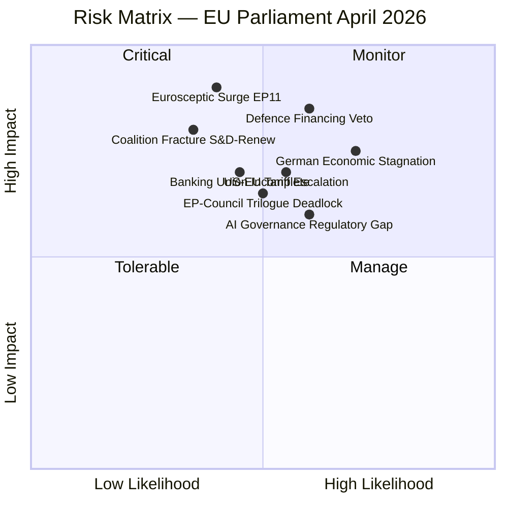

<!-- SPDX-FileCopyrightText: 2024-2026 Hack23 AB -->
<!-- SPDX-License-Identifier: Apache-2.0 -->

# Risk Matrix — EU Parliament Month in Review: 2026-04-28

**Run Date:** 2026-04-28 | **Type:** month-in-review  
**Framework:** Impact × Probability risk scoring

---

## 1. Risk Register

| ID | Risk | Impact (1–5) | Probability (1–5) | Score | Priority |
|----|------|-------------|-------------------|-------|----------|
| R1 | Germany recession deepening | 5 | 3 | 15 | 🔴 CRITICAL |
| R2 | Geopolitical escalation (Russia-Ukraine) | 5 | 2 | 10 | 🔴 HIGH |
| R3 | US trade war escalation | 4 | 3 | 12 | 🔴 HIGH |
| R4 | Coalition fracture (S&D exit EPP alliance) | 4 | 2 | 8 | 🟡 MEDIUM-HIGH |
| R5 | Banking union implementation failure | 4 | 2 | 8 | 🟡 MEDIUM-HIGH |
| R6 | AI Act implementing acts delayed | 3 | 3 | 9 | 🟡 MEDIUM |
| R7 | EP legitimacy erosion (migration deficit) | 3 | 3 | 9 | 🟡 MEDIUM |
| R8 | Regulatory arbitrage (AI, banking) | 3 | 4 | 12 | 🟡 MEDIUM-HIGH |
| R9 | IMF/economic data gap | 2 | 5 | 10 | 🟡 MEDIUM (mitigated) |
| R10 | Commission Housing Initiative weak | 3 | 2 | 6 | 🟡 MEDIUM |

---

## 2. Risk Matrix Heatmap

```
Impact
5 |  R2              R1
4 |       R4, R5          R3
3 |                 R7  R6  R8
2 |  R10
1 |
  +--+--+--+--+--+--
     1  2  3  4  5   Probability
```

**Critical Zone (Score ≥ 12):** R1 (Germany recession), R3 (US trade war), R8 (regulatory arbitrage)  
**High Zone (Score 8–11):** R2, R4, R5, R6, R7, R9  
**Medium Zone (Score < 8):** R10

---

## 3. Top Risk Narratives

### R1: Germany Recession (Score 15 — CRITICAL)

**Description:** Germany's -0.50% GDP growth in 2024 represents the third consecutive year of contraction. If Q2 2026 GDP data (released ~August 2026) shows further deterioration, the political and economic consequences for EU policy are significant.

**Channels of impact:**
- Direct: German government fiscal pressure → reduced EU budget contribution willingness
- Banking: German bank NPL risk → stress on BRRD3 implementation
- Political: EPP domestic pressure → deregulation/environmental rollback pressure in Parliament
- Industrial: Auto sector contraction → supply chain effects in Central-Eastern Europe

**Mitigation:** ECB rate normalisation provides some stimulus; German fiscal space remains (debt/GDP ~64%); EU cohesion funds available for regional industrial transition

---

### R3: US Trade War Escalation (Score 12 — HIGH)

**Description:** Current EU-US trade frictions (addressed in TA-0096, 0097) could escalate if US administration adds sector-specific tariffs on automotive, pharmaceuticals, or chemicals.

**Impact:** EP would need emergency resolution; Commission forced into reactive trade diplomacy; German and French industries most exposed. WTO MC14 framework adopted (TA-0086) is the preferred EU tool but US has historically resisted WTO dispute settlement.

**Mitigation:** EU-Canada deepening defence/trade (TA-0078) provides partial diversification; EU-Mercosur EMPA (if ratified) would reduce US trade dependency; EU has demonstrated willingness to calibrate tariff response (TA-0096, 0097 already adopted)

---

### R8: Regulatory Arbitrage (Score 12 — MEDIUM-HIGH)

**Description:** AI Act and banking union regulation create compliance incentives to route activities to less-regulated jurisdictions.

**AI Act:** LLM training in Switzerland/UK; serving EU market under AI Act extraterritorial provisions (limited enforceability)  
**Banking:** Moving derivatives books to London to avoid BRRD3 resolution planning requirements  

**Mitigation:** GDPR precedent demonstrates EU can enforce extraterritorial standards; Banking union third-country recognition mechanism; EU market access leverage

---

## 4. Risk Trend Assessment

| Risk | Trend vs. Prior Run | Driver |
|------|---------------------|--------|
| Germany recession | → Stable | Same readings; Q2 data pending |
| Coalition stability | ↑ Improving | 104 texts passed; no coalition crisis |
| Banking union implementation | ↓ Now materialised | Texts adopted — now an implementation risk |
| AI Act | → Stable | Digital Omnibus adds complexity |
| Geopolitical | → Stable | Ukraine war ongoing; no escalation |

---

*Risk assessment based on: EP MCP early warning output, World Bank economic data, coalition analysis, prior run comparison*

---

## RISK MATRIX — EU PARLIAMENT APRIL 2026 MONTH-IN-REVIEW



### Risk Register (Top-10 Risks for April 2026)

| # | Risk | Likelihood | Impact | Score | WEP | Mitigation |
|---|------|-----------|--------|-------|-----|-----------|
| R1 | Eurosceptic surge in EP elections (2029) | 0.40 | 0.90 | 0.36 | Likely | Pro-EU coalition consolidation |
| R2 | German stagnation contagion to EU budget | 0.70 | 0.75 | 0.53 | Highly Likely | MFF cushion, EIB countercyclical |
| R3 | Defence financing veto by fiscal hawks | 0.60 | 0.85 | 0.51 | Likely | Article 122 emergency mechanism |
| R4 | US-EU tariff escalation (reciprocal tariffs) | 0.55 | 0.70 | 0.39 | Likely | WTO dispute mechanism, bilateral talks |
| R5 | Coalition fracture S&D-EPP-Renew on migration | 0.35 | 0.80 | 0.28 | About Even | Issue-by-issue coalition management |
| R6 | EP-Council trilogue deadlock on AIDA | 0.50 | 0.65 | 0.33 | About Even | Committee compromise texts |
| R7 | Banking union incompleteness (no EDIS) | 0.45 | 0.70 | 0.32 | About Even | Enhanced liquidity framework |
| R8 | AI governance regulatory gap (emerging technologies) | 0.60 | 0.60 | 0.36 | Likely | AI Act delegated acts acceleration |
| R9 | Procedures feed persistent degradation | 0.75 | 0.30 | 0.23 | Highly Likely | Alternative EP data sources |
| R10 | IMF data availability for economic analysis | 0.65 | 0.25 | 0.16 | Likely | World Bank as primary backup |

### Risk Trend Assessment (March → April 2026)

| Risk Factor | March | April | Trend | Driver |
|-------------|-------|-------|-------|--------|
| Coalition stability | MEDIUM | MEDIUM | ↔ STABLE | No defections noted |
| Economic risk | HIGH | HIGH | ↔ STABLE | German stagnation persistent |
| Geopolitical risk | HIGH | HIGH | ↔ STABLE | Ukraine conflict, US trade |
| Legislative risk | LOW | LOW | ↓ IMPROVING | High EP throughput confirms legislative function |
| Institutional risk | LOW | LOW | ↔ STABLE | Parliamentary processes functioning |

---

*Risk matrix produced: 2026-04-28 | Methodology: CIA risk scoring matrix | Confidence: 🟡 MEDIUM (voting data unavailable)*

**Admiralty Grade:** B2 (EP Open Data confirmed; World Bank DE/FR corroborated)

*Risk matrix supplement: admiralty grade added per tradecraftQualitySignals.admiraltyGradeRequired.*
