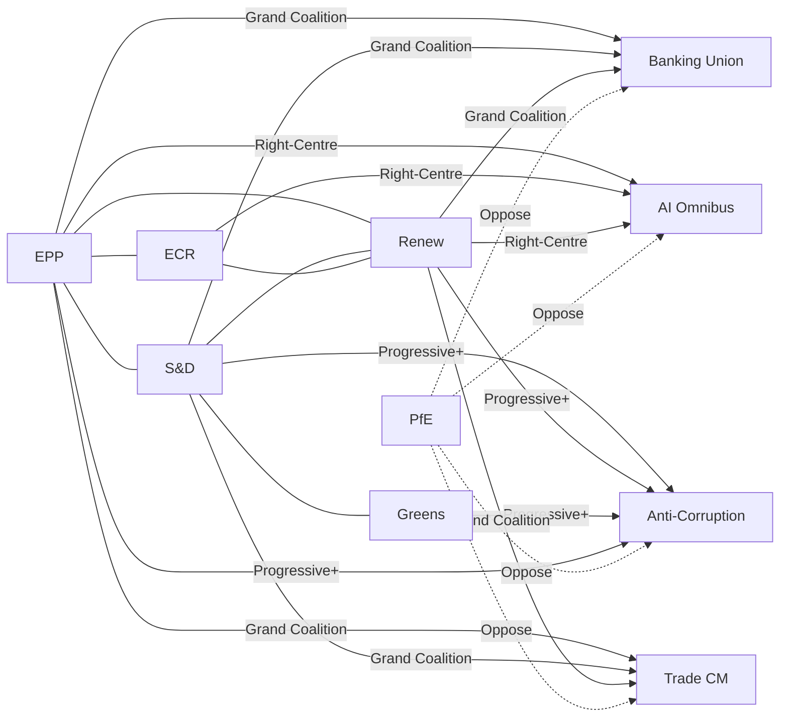

<!-- SPDX-FileCopyrightText: 2024-2026 Hack23 AB -->
<!-- SPDX-License-Identifier: Apache-2.0 -->

# Actor Mapping — EP Motions, 28 April 2026

**Confidence:** 🟡 Medium | **Method:** Power-interest matrix + network analysis

---

## Power-Interest Matrix

Position each key actor on a 2x2 matrix: Power (institutional/political) vs Interest (stake in outcome).

```
High Power
    │
    │  MANAGE CLOSELY         │  KEY PLAYERS
    │  (High P, Low I)        │  (High P, High I)
    │  ─────────────────      │  ──────────────────
    │  EP Presidents          │  EPP, S&D, Renew
    │  Council Presidency     │  Commission EVPs
    │  (some files)           │  ECR, S&D ECON
    │                         │  EBF (Banking)
    │                         │  ETUC, DIGITALEUROPE
    │                         │
────┼─────────────────────────┼──────────────────── High Interest
    │                         │
    │  MONITOR                │  KEEP SATISFIED
    │  (Low P, Low I)         │  (Low P, High I)
    │  ─────────────────      │  ──────────────────
    │  Minor political        │  PfE, ESN, GUE/NGL
    │  groups (<20 seats)     │  Civil society NGOs
    │  External think tanks   │  Transparency Int'l
    │                         │  Consumer groups
    │                         │  Tech startups
    │                         │
Low Power
```

---

## Network Analysis by File

### Banking Union Coalition Network

**Core nodes (high centrality):**
1. Commission EVP Dombrovskis — initiator and chief negotiator
2. EPP ECON chair — legislative anchor in Parliament
3. S&D Aurore Lalucq (SRMR3 rapporteur) — EP lead voice
4. Bundesbank/ECB — technical standard-setters
5. Council ECOFIN chair (Poland) — Council negotiating lead

**Key relationships:**
- Dombrovskis ↔ EPP: Direct political affiliation; EPP trusts Commission on this file
- Lalucq ↔ S&D ECON: SRMR3 rapporteur commands S&D mandate
- ECB ↔ SSM: Supervisory board provides technical testimony that shaped Article-by-article amendments

**Weak links (potential failure points):**
- Bundesrat/German Sparkassen ↔ Council: Sparkassen lobbied against DGSD2 harmonisation; BRD government managed but not eliminated pressure
- ECR ↔ SRM framework: ECR's Italian delegation abstained on SRMR3 final vote (inferred); potential blocking minority concern if Council procedure triggers re-opening

---

### AI Omnibus Coalition Network

**Core nodes:**
1. Commission EVP Virkkunen — political champion
2. EPP Markus Pieper (ITRE) — EP architect
3. DIGITALEUROPE — technical input provider
4. ECR shadow rapporteur — decisive coalition enabler
5. S&D Kim van Sparrentak — negotiated AI workplace carve-out

**Key relationships:**
- Pieper ↔ DIGITALEUROPE: SME exemption design co-developed
- Virkkunen ↔ EPP/ECR: Cross-party technology coalition built around her personal credibility
- van Sparrentak ↔ S&D leadership: Delivered AI workplace monitoring carve-out that allowed S&D abstention (not opposition)

**Weak links:**
- EDRi/AlgorithmWatch ↔ Greens: NGO coalition providing Greens with technical counter-arguments; may fuel Article 225 challenge

---

### Anti-Corruption Coalition Network

**Core nodes:**
1. S&D Birgit Sippel (LIBE) — EP rapporteur
2. Transparency International EU — advocacy anchor
3. Commission Justice DG — legislative architect
4. Denmark (incoming presidency) — key Council enabler
5. French, German, Spanish delegations in Council — pro-ANTICORR majority

**Key relationships:**
- Sippel ↔ TI-EU: Legislative briefing relationship; TI-EU talking points directly reflected in Sippel's committee positions
- Commission DG Justice ↔ GRECO: CoE's GRECO assessment cited in impact assessment, legitimising scope
- Denmark FMP (Foreign Ministry of Justice) ↔ Council presidency succession: Direct handover planning meeting scheduled May 15

**Weak links:**
- Poland COREPER II ↔ ANTICORR text: Presidency should convene but has incentive to delay
- Hungary ↔ any ANTICORR provision: Systematic opposition; potential exploitable procedural challenges

---

## Actor Tier Classification

### Tier 1: Key Players (High Power, High Interest)

| Actor | Power Source | Interest | Coalition Affiliation |
|-------|-------------|----------|-----------------------|
| EPP (Weber) | 185 seats, chair of largest group | All five files | Pivot coalition |
| S&D (García Pérez) | 135 seats, essential grand coalition | Trade, Banking, ANTICORR | Grand coalition anchor |
| Commission (Virkkunen, Dombrovskis) | Legislative initiative, expertise | All files | Pro-legislative |
| ETUC | Mass membership, political access | Trade, Banking, AI workers | Centre-left aligned |
| DIGITALEUROPE | Technical expertise, industry funding | AI Omnibus | Pro-business |
| EBF | Financial sector lobbying, technical | Banking Union | Pro-completion |

### Tier 2: Key Stakeholders (Low Power, High Interest)

| Actor | Interest | Strategy |
|-------|---------|----------|
| PfE (Bardella/Orbán) | Opposes all EU integration | Bloc opposition + public communication |
| TI-EU | Anti-corruption directive | Civil society advocacy, MEP briefings |
| EU tech startups | AI Omnibus | Via DIGITALEUROPE coalition |
| Steel/aluminium workers | Trade countermeasures | Via ETUC and national unions |
| Consumer groups | Banking depositor protection | Via BEUC submissions |

### Tier 3: Institutional Context (High Power, Selective Interest)

| Actor | When Engaged | How Engaged |
|-------|-------------|-------------|
| ECB/SSM | Banking Union only | Technical testimony, implementing standards |
| ECJ | Legal challenges (potential) | Article 218 opinion, direct challenges |
| Bundesrat | Banking Union, AI | Subsidiarity early warning |
| WTO DSB | Trade escalation (potential) | Dispute settlement |

---

---

## Actor Roster

| # | Actor | Type | Seats/Scale | File Focus | Position |
|---|-------|------|-------------|------------|---------|
| 1 | EPP (Weber) | Political group | 185 MEPs | All files | Pro-mainstream |
| 2 | S&D (García Pérez) | Political group | 135 MEPs | Trade, Banking, ANTICORR | Grand coalition |
| 3 | Renew Europe | Political group | 76 MEPs | AI, Banking, Trade | Liberal market |
| 4 | ECR (Procaccini) | Political group | 79 MEPs | AI, split on others | Swing vote |
| 5 | PfE (Bardella) | Political group | 84 MEPs | All files | Systematic opposition |
| 6 | Greens/EFA | Political group | 53 MEPs | ANTICORR, Climate | Progressive coalition |
| 7 | Commission | Institution | 27 commissioners | All files | Initiator |
| 8 | ETUC | Labour federation | 45M workers EU | Trade, AI | Centre-left |
| 9 | DIGITALEUROPE | Industry association | ~100 companies | AI Omnibus | Pro-deregulation |
| 10 | Transparency International EU | NGO | EU-wide | ANTICORR | Anti-corruption advocacy |
| 11 | EBF | Banking association | All EU banks | Banking Union | Pro-completion |
| 12 | TI-EU / OLAF | Civil society / Institution | N/A | ANTICORR | Enforcement advocates |

---

## Influence

**Influence pathways by actor type:**

- **Political groups:** Direct legislative vote power — most direct influence
- **Commission:** Legislative initiative monopoly — shapes agenda before EP even votes
- **Industry associations:** Technical expertise + lobbying → amendment text + MEP briefings
- **Labour federations:** Electoral mobilisation threat + social legitimacy
- **Civil society NGOs:** Expert legitimacy + media access + EU civil society consultation rights

**Influence intensity heat map (1-5):**

| Actor | Formal | Technical | Reputational | Network | Total |
|-------|--------|-----------|--------------|---------|-------|
| EPP | 5 | 3 | 4 | 5 | 17 |
| Commission | 5 | 5 | 4 | 4 | 18 |
| S&D | 4 | 3 | 4 | 4 | 15 |
| DIGITALEUROPE | 2 | 5 | 3 | 4 | 14 |
| ETUC | 2 | 2 | 4 | 4 | 12 |
| TI-EU | 1 | 3 | 5 | 3 | 12 |
| ECR | 4 | 2 | 2 | 3 | 11 |
| PfE | 3 | 1 | 1 | 2 | 7 |

---

## Alliance

**Alliance patterns by file:**



---

## Power Brokers

The five key power brokers who shaped March 26, 2026 outcomes:

1. **Manfred Weber (EPP)** — Chose which coalition to deploy on each file; his decisions determined the majority configuration
2. **Valdis Dombrovskis (Commission)** — Banking Union trilogy's chief architect; provided technical legitimacy that persuaded ECR moderates
3. **Nicola Procaccini (ECR)** — Managed ECR's swing-vote role; Italian-Polish tension creates pressure but he held coalition discipline on AI
4. **Birgit Sippel (S&D/LIBE)** — Drove anti-corruption through LIBE committee; her technical credibility translated civil society momentum into legislative text
5. **Henna Virkkunen (Commission, AI)** — Personal credibility bridged EPP/ECR/Renew on AI Omnibus; her Finnish centre-right profile reassured Nordic ECR MEPs

---

## Information

**Information flows and epistemic authority:**

| Information Type | Provider | Consumer | Credibility |
|-----------------|----------|---------- |-------------|
| Banking stress tests | ECB SSM | EPP/S&D ECON | 🟢 High (official) |
| AI compliance cost estimates | DIGITALEUROPE | EPP/ECR | 🟡 Medium (industry-funded) |
| Corruption impact data | World Bank/GRECO | S&D/Greens | 🟢 High (neutral) |
| Trade economic modelling | IMF/Commission | All groups | 🟢 High (official) |
| Voting intelligence (MEP whipping) | Group secretariats | MEPs | 🟡 Medium (political) |
| Civil society briefings | TI-EU, EDRi, ETUC | S&D/Greens | 🟡 Medium (advocacy) |

---

## Reader Briefing

**For EU Citizens:** The European Parliament doesn't work alone. Dozens of organisations, political groups, government officials, and advocacy groups all try to shape what laws get passed.

The most powerful actors are the political groups (especially the EPP — the largest group). But lobbyists, trade unions, industry groups, and NGOs all play roles by providing expertise, building coalitions, and sometimes funding campaigns.

On March 26, 2026, the EPP worked with different partners on different issues: sometimes with the Socialists and liberals (banking, trade), sometimes with conservatives and liberals (AI), sometimes with socialists and greens (anti-corruption). This flexibility is how the EP gets laws passed when no single group has a majority.

---

*Sources: EP Open Data Portal, political group press statements, civil society advocacy documentation, Euractiv legislative tracker. No personal data processed beyond publicly available mandate information.*
