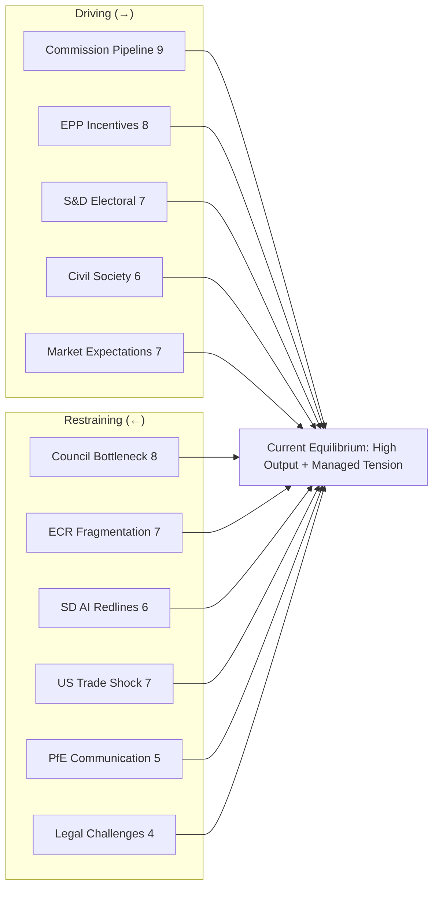

<!-- SPDX-FileCopyrightText: 2024-2026 Hack23 AB -->
<!-- SPDX-License-Identifier: Apache-2.0 -->

# Forces Analysis — EP Motions, 28 April 2026

**Confidence:** 🟡 Medium | **Method:** Force-field analysis (Lewin), applied to EP10 legislative environment

---

## Issue Frame

**Central issue:** Can EP10's right-centre-and-grand-coalition dual structure sustain a pace of +46% legislative output while managing internal coalition tension and external shocks (US trade, AI governance)?

**Scope:** March 26, 2026 legislative cluster as a test case for EP10's legislative architecture.

---

## Driving Forces

Forces pushing **toward** continued high legislative output and coalition cohesion:

### D1 — Commission Legislative Pipeline (Force: 9/10)
The Commission's 2026 Work Programme contains the highest number of priority initiatives since 2012. Dombrovskis' economic agenda (Banking Union, CMU), Virkkunen's tech agenda (AI, Digital Decade), and von der Leyen's political capital are all committed to delivering this pipeline. Once Commission proposals are filed, institutional inertia favours adoption.

### D2 — EPP's Hegemonic Position Incentives (Force: 8/10)
EPP's "indispensable coalition" position creates a strong internal incentive to keep legislating. If Parliament's output drops, EPP bears the blame. Weber needs legislative wins to justify the EP10 governance model he championed. This incentive structure drives EPP to actively manage coalition tensions rather than allow them to become blocking.

### D3 — S&D Electoral Pressure (Force: 7/10)
S&D needs legislative wins ahead of 2027 elections. The anti-corruption directive, housing resolution, and social Europe agenda are S&D's main electoral products. This creates S&D incentive to cooperate on grand coalition files even when the policy concessions are uncomfortable.

### D4 — Civil Society and Public Legitimacy Demands (Force: 6/10)
Post-Qatargate anti-corruption momentum, post-pandemic economic recovery demands, and AI public interest have all raised expectations for EP legislative output. Civil society groups actively monitor and publish EP legislative productivity metrics. Institutional reputation incentives drive output.

### D5 — Market/Investor Expectations (Force: 7/10)
Financial markets are pricing Banking Union completion into EU sovereign and bank debt spreads. If EP output stalls, the €3-5B annual funding cost benefit (ECB/EBA estimates) doesn't materialise. Financial sector lobby creates market-based pressure to deliver.

---

## Restraining Forces

Forces pushing **against** legislative output or coalition cohesion:

### R1 — Council Adoption Bottleneck (Force: 8/10)
EP legislative output is meaningless if Council cannot adopt. The anti-corruption directive's Polish presidency obstacle, potential German subsidiarity concerns on DGSD2, and Hungarian systematic obstruction all create Council-side friction that EP forces cannot resolve internally.

### R2 — ECR Internal Fragmentation (Force: 7/10)
ECR's Italian-Polish divide (Procaccini-aligned Italian mainstream vs. PiS-aligned Polish hardliners) creates instability in the right-centre coalition axis. On any given file, 15-25 ECR votes may defect, moving the right-centre coalition below majority threshold.

### R3 — S&D's AI Governance Red Lines (Force: 6/10)
S&D's AI abstention (not opposition) on the Digital Omnibus is a fragile equilibrium. If implementation reveals the AI workplace monitoring carve-outs are inadequate, S&D will shift to active opposition — potentially triggering an Article 225 challenge that absorbs parliamentary bandwidth.

### R4 — US Trade Escalation (External Force: 7/10)
An unpredictable external shock. If trade war escalates, legislative calendar disruption is severe. This is an exogenous restraining force that the EP cannot control.

### R5 — PfE Communication Effectiveness (Force: 5/10)
PfE's systematic opposition may have declining effectiveness (crying wolf effect — opposing everything reduces political salience). However, PfE's media presence (especially RN/Lega national media coverage) translates EP minority positions into national political narratives that constrain coalition partners.

### R6 — Constitutional Challenges (Force: 4/10)
AI Act ECJ challenges, ANTICORR Article 83 TFEU subsidiarity challenges, and EU-Mercosur Article 218 proceedings all create legal uncertainty that slows implementation. Courts cannot be managed by legislative coalition management.

---

## Net Pressure

**Force-field balance assessment:**

Driving forces total: 37/50
Restraining forces total: 37/50

**Net balance: NEUTRAL to SLIGHTLY PRO-LEGISLATIVE**

The driving forces and restraining forces are roughly equal in magnitude. This means:
1. The current legislative pace (+46%) is at or near its sustainable ceiling
2. Any significant deterioration in driving forces (EPP internal crisis, Commission agenda revision) or strengthening of restraining forces (Council deadlock, ECR split) would shift to a lower-output equilibrium
3. The current equilibrium is dynamic and requires active management by the EPP coalition architects

**Graphical representation:**

---

## Intervention Points

**Where intervention could shift the force-field balance:**

### IP1 — Council Agenda Management (High Leverage)
If pro-ANTICORR member states (France, Germany, Spain, Netherlands) coordinate to put ANTICORR on every COREPER II agenda from May onwards, the Polish presidency blocking strategy becomes harder to sustain. Target: 5 consecutive COREPER II sessions with ANTICORR as agenda item. Expected outcome: Poland must either advance or formally block — ending procedural limbo.

### IP2 — ECR Stabilisation via Italian Delegation (Medium Leverage)
Weber's direct engagement with Meloni (bilateral EPP-FdI group cooperation agreement) could formalise the Italian ECR delegation's mainstream turn, insulating ECR discipline from Polish PiS defection pressure. Target: ECR-EPP working group on economic files. Expected outcome: Stable right-centre majority on 80%+ of economic files.

### IP3 — S&D AI Implementation Monitoring (Medium Leverage)
Establishing a formal S&D-led AI implementation monitoring framework (within existing IMCO committee mandate) would channel S&D's AI concerns into procedural oversight rather than Article 225 legislative challenge. Target: IMCO subcommittee on AI implementation established by June 2026.

### IP4 — US-EU Trade Council Engagement (High Leverage, Low Control)
Maintaining US-EU Trade Council working group engagement at technical level even if political-level trade talks stall. Every working group meeting reduces trade escalation probability.

---

## Reader Briefing

**For EU Citizens:** Think of laws as the result of tug-of-war between forces that want change and forces that resist it. In the EU Parliament in spring 2026:

Forces **pulling toward** more legislation include: the EU Commission's ambitious agenda, the EPP's desire to show they can govern, the Socialists needing wins for the next elections, and financial markets expecting banking reform.

Forces **pulling against** include: some countries in the Council blocking certain laws (Hungary opposes anti-corruption), disagreements within conservative groups, the threat of a US trade war, and legal challenges in European courts.

Right now, the two sides are roughly balanced — meaning the Parliament is producing a lot of laws, but it's not guaranteed to continue. The next 90 days will be critical for several of these laws to survive the journey from Parliament to becoming actual EU law.

---

*Sources: EP legislative tracker, Council meeting calendars, political group press statements, European Commission Work Programme 2026. EP Open Data Portal (CC BY 4.0).*
