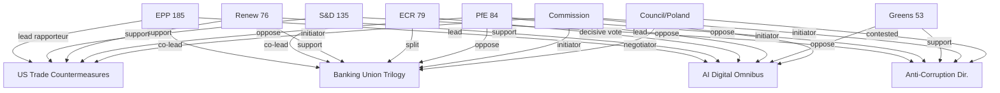

<!-- SPDX-FileCopyrightText: 2024-2026 Hack23 AB -->
<!-- SPDX-License-Identifier: Apache-2.0 -->

# Stakeholder Map — EP Motions, 28 April 2026

**Confidence:** 🟡 Medium | **Scope:** Key actors across five March 26, 2026 legislative clusters

---

## 1. Primary Institutional Actors

### European People's Party (EPP) — 185 seats
**Role:** Coalition architect, indispensable pivot
**Position:** Supports all five legislative clusters in modified form; EPP is the dealmaker on every file
**Key figures:**
- **Manfred Weber** (DE, EPP President): Advocates EPP as "the responsible centre-right" — distances from PfE on rule of law while cooperating with ECR on economic competitiveness
- **Roberta Metsola** (MT, EP President): Formally neutral but institutional weight leans towards grand coalition on rule-of-law files
- **Markus Pieper** (DE, EPP): ITRE rapporteur for the Digital Omnibus — credited with the SME exemptions that secured S&D abstentions
- **Siegfried Mureşan** (RO, EPP): BUDG shadow rapporteur; EPP's fiscal credibility signal on banking union files
**Engagement level:** 🔴 Maximum — EPP is lead on 3/5 clusters
**Stake:** Institutional leadership, maintaining coalition control going into 2027 mid-term evaluations

### Socialists and Democrats (S&D) — 135 seats
**Role:** Grand coalition anchor; principal of social Europe agenda
**Position:** Pro-banking union, pro-anti-corruption; conditional on AI (abstentions, not opposition)
**Key figures:**
- **Iratxe García Pérez** (ES, S&D President): Framing the trade countermeasures as a workers' rights issue (Spanish automotive industry employment)
- **Aurore Lalucq** (FR, S&D): ECON rapporteur for Banking Union SRMR3 — credited with securing depositor protection improvements
- **Birgit Sippel** (DE, S&D): LIBE leading on anti-corruption — German SPD's rule-of-law champion
**Engagement level:** 🔴 Maximum
**Stake:** Agenda-setting on social files; maintaining relevance as the second-largest group in an EPP-heavy legislature

### Renew Europe — 76 seats
**Role:** Swing vote; liberal market-completion axis
**Position:** Strongly pro-banking union (Macron-aligned), pro-trade countermeasures, pro-AI deregulation, conditional anti-corruption
**Key figures:**
- **Stéphane Séjourné** (FR, Renew): Former French FM; EP10's highest-profile Renew figure; trade policy enthusiast
- **Nathalie Loiseau** (FR, Renew): AFET chair; shaping trade countermeasures in geopolitical framing
- **Jan-Christoph Oetjen** (DE, Renew): JURI shadow; AI liability framework architect
**Engagement level:** 🟡 High
**Stake:** Staying relevant in EPP-dominated legislature; "radical centre" brand protection; French delegation's strategic positioning

### European Conservatives and Reformists (ECR) — 79 seats
**Role:** Decisive swing vote; ideologically fragmented
**Position:** Split by file: pro-AI deregulation; fractured on banking union; opposed on anti-corruption (most); wavering on trade
**Key figures:**
- **Nicola Procaccini** (IT, ECR President): Leading Italian FdI delegation's pragmatic turn toward mainstream cooperation
- **Raffaele Fitto** (IT, ECR): Former EP Executive Vice President; still influential in Italian delegation
- **Jadwiga Wiśniewska** (PL, ECR): Polish PiS delegation lead; systematically opposed to all four non-trade files
**Engagement level:** 🟡 High (variable by file)
**Stake:** Influencing legislative output without triggering fragmentation; managing Italian-Polish tension

### Patriots for Europe (PfE) — 84 seats
**Role:** Principled opposition bloc
**Position:** Voted against all five major March 26 clusters
**Key figures:**
- **Viktor Orbán** (HU, Fidesz): PfE informal patron; lobbied for no-countermeasures position on US tariffs
- **Jordan Bardella** (FR, RN): PfE formal co-president; media-facing
- **Marco Zanni** (IT, Lega): ECON shadow; populist banking regulation opposition
**Engagement level:** 🔴 Maximum — as opposition
**Stake:** Maintaining oppositional purity; positioning for 2027 national elections in Hungary/France/Italy

### Greens/EFA — 53 seats
**Role:** Left-flank coalition partner; specialised on environmental, rule-of-law, digital rights
**Position:** Strongly pro-anti-corruption; pro-banking union BRRD3; opposed AI deregulation; co-proposers on housing
**Key figures:**
- **Terry Reintke** (DE, Greens co-president): Public face of Greens EP10 strategy
- **Kim van Sparrentak** (NL, Greens): EMPL shadow; leading on AI workplace protections
**Engagement level:** 🟡 High on selected files
**Stake:** Punching above weight class (7.4% seats) through targeted coalition building

---

## 2. Secondary Institutional Actors

### European Commission
- **Henna Virkkunen** (FI, EVP for Tech): Championed AI Digital Omnibus; managed DG CNECT consultations
- **Valdis Dombrovskis** (LV, EVP for Economy): Banking Union trilogy's institutional parent; 6-year legislative journey
- **Wopke Hoekstra** (NL, Commissioner Climate): Climate neutrality framework; navigating EPP ambivalence
**Engagement level:** 🔴 Maximum — Commission initiated all five legislative files
**Stake:** Legislative calendar success; implementing the Commission Work Programme 2026

### Council Presidency (Poland, January–June 2026)
- **Radosław Sikorski** (PL, Foreign Affairs Minister): Council presidency chair on anti-corruption directive — internal contradiction given PiS-era judicial reforms
- **Michał Gramatyka** (PL): COREPER II lead on banking union
**Engagement level:** 🟡 High — particularly complex on anti-corruption
**Stake:** Delivering presidency legislative agenda; Poland's credibility on rule of law

---

## 3. Civil Society and Sectoral Actors

### Financial Sector
- **European Banking Federation (EBF)**: Cautious support for Banking Union completion; lobbied against stricter bail-in triggers
- **Finance Watch NGO**: Advocacy for stronger depositor protections in DGSD2; cited in S&D floor speeches

### Technology Sector
- **DIGITALEUROPE**: Strong AI Digital Omnibus support; authored SME exemption proposal
- **European Digital Rights (EDRi)**: Opposition to AI transparency rollbacks; provided Greens/GUE briefings
- **Open Future Foundation**: Submitted GDPR interoperability brief that shaped AI data-sharing provisions

### Industry/Labour
- **BusinessEurope**: Trade countermeasures support (prefer negotiated solution, but accept toolkit)
- **ETUC (European Trade Union Confederation)**: Strong support across all five files; workers' rights framing
- **EURACTIV / Politico Europe**: Primary monitoring platforms for legislative tracking; published key analysis before plenary votes

### Civil Society / Anti-Corruption
- **Transparency International EU**: Principal external advocate for anti-corruption directive; provided MEP briefings
- **GRECO (Council of Europe)**: Submitted parallel assessment cited in committee rapporteur reports
- **Orbán-aligned think tanks** (Századvég, Fondation Identité et Liberté): Active counter-lobbying on anti-corruption directive

---

## 4. External Actors with Influence

### United States Government
**Interest:** Trade countermeasures (TA-10-2026-0096/0097)
**Behaviour:** USTR engaged with Renew European delegations through Atlantic Council channels to advocate for the negotiated-suspension pathway; Ambassador Berman met EPP leadership in Brussels March 18
**Influence vector:** Bilateral US-EU trade track runs parallel to EP legislative process

### Chinese Government
**Interest:** EU-China trade relations; AI governance
**Behaviour:** Ministry of Commerce engaged with S&D economic shadow via European Chamber of Commerce bridge
**Influence vector:** Indirectly shapes AI governance debate through competitive threat framing

### George Soros / Open Society Foundations
**Interest:** Anti-corruption directive, rule of law
**Behaviour:** Active funding of Transparency International EU; referenced in PfE counter-narratives

---

## 5. Stakeholder Network Visualisation (Mermaid)

---

*Sources: EP Open Data Portal, EP committee reports, EURACTIV legislative tracker, political group press releases. GDPR: no personal data processed beyond publicly available MEP mandate information.*
