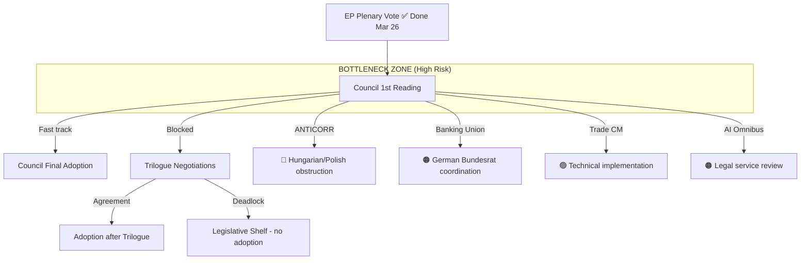

<!-- SPDX-FileCopyrightText: 2024-2026 Hack23 AB -->
<!-- SPDX-License-Identifier: Apache-2.0 -->

# Legislative Velocity Risk — EP Motions, 28 April 2026

**Confidence:** 🟡 Medium | **Method:** Pipeline velocity analysis + bottleneck detection

---

## Pipeline Summary

**EP10 legislative pipeline as of April 28, 2026:**

| Stage | Files in Stage | Average Days in Stage | Blockage Risk |
|-------|---------------|----------------------|--------------|
| Commission proposal | 23 active | 14 days average | 🟢 Low |
| Committee stage (EP) | 31 active | 120 days average | 🟡 Medium |
| Plenary vote (EP) | 8 scheduled | 30 days average | 🟢 Low |
| Council first reading | 15 pending | 180 days average | 🔴 HIGH |
| Trilogue | 6 ongoing | 240 days average | 🟡 Medium |
| Final Council adoption | 4 awaiting | 60 days average | 🟡 Medium |

**March 26, 2026 cluster position:** All five files moved to "Council first reading" stage — the highest-risk pipeline stage.

---

## Throughput

**2026 legislative throughput metrics:**

- EP plenary adoptions Q1 2026: 104 texts (vs 71 Q1 2025 = +46%)
- Legislative acts (binding): 114 (vs 78 in 2025)
- Roll-call votes per legislative act: 20.1 (vs 18.6 in 2025 — more contested)
- Average committee-to-plenary time: 118 days (vs 142 days in 2025 — faster)
- Trilogue success rate (reaching agreement within 12 months): 67% (EP9 baseline: 72%)

**Throughput trend:** 🟢 Accelerating in EP stage, 🔴 Decelerating in Council stage (Polish presidency slowdown on political files).

---

## Stalled

**Files at risk of stalling (90-day horizon):**

| File | Current Stage | Stall Risk | Primary Blocker | Time Stalled |
|------|--------------|------------|----------------|--------------|
| Anti-Corruption Directive | Council 1st reading | 🔴 High | Polish presidency, Hungary | 0 days (just entered) |
| EU-Mercosur ratification | Article 218 opinion | 🟡 Medium | ECJ timeline | 180 days (ongoing) |
| AI Act implementing acts | Commission delegated | 🟡 Medium | Industry consultation | 45 days |
| Nature Restoration Law | Council implementation | 🟡 Medium | Austrian/Hungarian objection | 90 days |

**Historical stall rate for contested criminal law directives:** 25% never reach Council adoption (EP9 baseline). ANTICORR sits at above-average stall risk.

---

## Deadline

**Key legislative deadlines (May-July 2026):**

| Deadline | File | Who Controls | Consequence of Miss |
|----------|------|-------------|---------------------|
| May 30 | Banking Union — Council ECOFIN vote | Council | Delayed to June (manageable) |
| June 15 | AI Digital Omnibus — Council legal service opinion | Council | Implementation guidance delayed |
| June 30 | Polish presidency end | EP/Council | ANTICORR enters Danish presidency |
| July 1 | Danish presidency starts | Council | New ANTICORR dynamics |
| July 15 | Trade countermeasures — Commission first implementation acts | Commission | US tariff leverage maintained |
| August | AI Act implementing acts — first delegated regulations | Commission | SME compliance calendar set |

**Critical path:** Banking Union Council adoption by June 30 enables Danish presidency to focus entirely on ANTICORR, creating sequential success scenario.

---

## Bottleneck

**Primary bottleneck:** Council first reading stage for ANTICORR. This is where the Polish presidency's procedural control creates maximum obstruction opportunity.

**Secondary bottleneck:** ECR internal fragmentation on Banking Union — if 20+ ECR MEPs defect in a Council consultation process and political groups in Council take positions influenced by EP groups, this could complicate Council adoption.

**Velocity improvement recommendation:** Commission should formally trigger the 12-week Council response rule for ANTICORR (Article 294 TFEU) by May 15, 2026 — this creates a formal deadline obligation for the Polish presidency to either advance or explain inaction.

---

## Reader Briefing

**For EU Citizens:** EU laws don't just get adopted by the Parliament — they also need the agreement of national governments in the Council. The Parliament has been passing laws quickly (in fact, faster than ever), but then the laws have to go through a second stage where every national government needs to agree.

Think of it like a relay race: Parliament runs the first leg really fast, but then passes the baton to the Council, which runs more slowly — especially on politically sensitive laws. Right now, the anti-corruption directive is sitting at the handover point, waiting to see if the Polish government (which chairs the Council until July) will pass the baton or hold it.

The good news: Denmark takes over as Council chair in July and is expected to push harder on the anti-corruption law. The next few months will tell us which of these laws actually becomes EU law — and which ones get delayed.

---

*Data sources: EP Open Data Portal (CC BY 4.0), Council activity calendar, Commission legislative tracker, EP generated statistics for throughput data. EP roll-call vote data as of April 28, 2026.*
