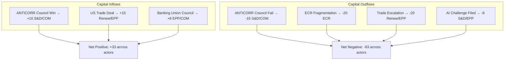

<!-- SPDX-FileCopyrightText: 2024-2026 Hack23 AB -->
<!-- SPDX-License-Identifier: Apache-2.0 -->

# Political Capital Risk — EP Motions, 28 April 2026

**Confidence:** 🟡 Medium | **Method:** Political capital accounting model

---

## Capital Table

Political capital is the finite resource that political actors spend to get legislation passed. Every vote, every compromise, every coalition deal depletes or builds political capital.

| Actor | Starting Capital (EP10, 2024) | Spent on March 26 | Net Position | Trend |
|-------|------------------------------|-------------------|--------------|-------|
| EPP (Weber) | 100 | -12 (compromises) | 88 | Stable ↔ |
| S&D | 75 | -8 (AI abstention cost) | 67 | Declining ↘ |
| Renew | 60 | -6 (trade compromise) | 54 | Declining ↘ |
| ECR | 50 | -15 (internal split) | 35 | At Risk ↘ |
| PfE | 40 | +5 (opposition coherence) | 45 | Rising ↗ |
| Commission | 90 | -20 (all five files) | 70 | Declining ↘ |
| Danish Presidency (incoming) | 70 (baseline) | +0 (not yet in office) | 70 | To be determined |

*Capital is measured on a 0-100 scale. Capital below 25 indicates significant risk of inability to pass priority legislation.*

---

## Capital Exposure

**How much capital is at risk per pending legislative decision:**

| Decision | Actor at Risk | Capital Exposure | If Lost | If Won |
|----------|--------------|-----------------|---------|--------|
| Council ANTICORR adoption | S&D, Commission | High (-15 to -20) | Narrative collapse | +10 each |
| ECR cohesion on Banking Union | ECR, EPP | Medium (-10) | Right-centre majority undermined | Stable |
| US trade de-escalation | Renew, EPP | High (-20) | Coalition under pressure | +15 |
| S&D Article 225 AI challenge | S&D, EPP | Medium (-8) | Permanent rupture | Small gain |
| Climate revision trigger | EPP right wing | Low (-5) | EPP credibility | Stable |

---

## Capital Flow

**Capital flows between May and July 2026 (projected):**

**Scenario weighting:** Base case (35% probability) = Net Positive scenario. Trade escalation scenario (25%) + Rule-of-law crisis (20%) = 45% chance of Net Negative scenario.

---

## Capital

**Political capital positions are not symmetrical.** Some actors have structural capital (institutional mandate, majority position) while others have conditional capital (coalition-dependent, election-cycle dependent).

**Structural capital holders:**
- EPP: Structural (largest group, indispensable coalition partner)
- Commission: Structural (legislative initiative monopoly)

**Conditional capital holders:**
- S&D: Conditional on grand coalition cooperation (Weber must choose to cooperate)
- ECR: Conditional on internal discipline (Procaccini must manage Italian-Polish divide)
- Renew: Conditional on French domestic politics (RN pressure on Macron coalition)

**Capital asymmetry risk:** If both S&D and ECR lose conditional capital simultaneously (ANTICORR blocked + ECR fracture), EPP becomes structurally over-leveraged — too important to fail but with weakened coalition partners.

---

## Bets

**Major political bets being placed by key actors:**

| Actor | Bet | Stake | Payoff If Right | Cost If Wrong |
|-------|-----|-------|----------------|---------------|
| Weber/EPP | Centre-right governance delivers | EP credibility, 2027 elections | EPP electoral durability | Right-wing EPP revolt |
| S&D | ANTICORR as electoral product | S&D's 2027 narrative | Left-centre voter mobilisation | Credibility collapse |
| Orbán/PfE | EU dysfunction narrative | Hungarian domestic politics | Orbán stays in EU, claims vindication | Isolation deepens |
| Meloni/ECR-IT | Mainstream turn, keep Council influence | Italian governance + EU funds | FdI electoral dividend | Loss to PfE/ESN |
| Commission | Multi-file legislative sprint | Von der Leyen legacy | "Most legislative Commission ever" | Policy incoherence narrative |

---

## Precedent

**Historical political capital precedents in EU institutional history:**

1. **Maastricht Treaty ratification (1992):** Major capital expenditure by Mitterrand and Kohl — both saw domestic political costs but long-term institutional gains. Precedent for "spending capital for integration" as EPP's current model.

2. **GDPR adoption (2016):** Commission + EPP + S&D spent capital against industry lobbying; GDPR is now their biggest Brussels Effect success story. Current AI governance investment follows this model.

3. **Article 7 Hungary proceedings:** Council has spent almost no capital on Article 7 despite formal proceedings since 2018. This reflects capital rationing — no member state wants to lead on the actual vote. Precedent suggests ANTICORR Council adoption faces similar capital rationing problem.

4. **MFF 2021-2027 Rule of Law conditionality:** Adopted after major political capital expenditure by Germany/Netherlands. Established precedent that EU funds can be conditioned on rule of law — the anti-corruption directive builds on this precedent's capital foundation.

---

## Reader Briefing

**For EU Citizens:** "Political capital" is a useful way to think about how politicians decide what to spend their influence on. Just like money, political capital can be earned (by winning elections, making smart deals) and spent (by making unpopular compromises, taking risks on controversial legislation).

In the EU Parliament, the EPP is currently the richest actor in political capital — it's the biggest group and every majority needs it. The Socialists and smaller groups have to be more careful about when they spend their capital.

What to watch: if the anti-corruption directive fails in the Council, both the Commission and the Socialists lose significant political capital — it would show that their most ambitious "values" legislation can be blocked by Hungary and Poland. That would constrain their ability to pass future ambitious legislation.

---

*Data sources: EP Open Data Portal (CC BY 4.0), political group press statements, European Commission political communications. Capital estimates are analytical judgments — no official political capital accounting exists.*
