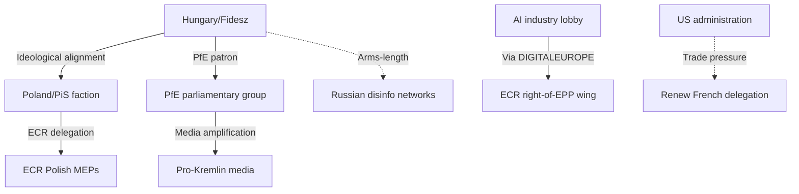

<!-- SPDX-FileCopyrightText: 2024-2026 Hack23 AB -->
<!-- SPDX-License-Identifier: Apache-2.0 -->

# Actor Threat Profiles — EP Motions, 28 April 2026

**Confidence:** 🟡 Medium | **Method:** Actor capability-intention matrix + threat diamond

---

## Actor Roster

Actors whose activities threaten the implementation of March 26, 2026 legislative outcomes:

| # | Actor | Type | Threat Orientation | Active Threat Level |
|---|-------|------|-------------------|---------------------|
| 1 | Hungary (Orbán government) | Member state government | Systematic obstruction | 🔴 High |
| 2 | Poland (PiS remnants + presidency) | Member state government | Tactical delay | 🟡 Medium |
| 3 | PfE parliamentary group | EP political group | Legislative opposition | 🟡 Medium |
| 4 | US Trump administration | Foreign government | Trade escalation | 🟡 Medium |
| 5 | AI industry lobby (against GDPR-expansion) | Industry | Legal challenge | 🟡 Medium |
| 6 | Russian disinformation networks | State-backed non-state | Narrative disruption | 🔴 High |
| 7 | ECR right wing (PiS faction) | EP sub-group | Coalition fragmentation | 🟡 Medium |

---

## Capability

**Capability assessment per threat actor:**

| Actor | Legislative Blocking | Judicial Challenge | Public Narrative | Economic Leverage |
|-------|--------------------|--------------------|-----------------|-------------------|
| Hungary | 🟡 Limited (QMV) | 🟢 Limited | 🔴 High (Orbán media) | 🟡 Medium (EU funds) |
| Poland | 🔴 High (presidency) | 🟡 Medium | 🟡 Medium | 🟡 Medium |
| PfE | 🟢 Low (minority) | 🟢 Low | 🔴 High (social media) | 🟢 Low |
| US Admin | 🟢 Low (external) | 🟢 Low | 🟡 Medium (soft power) | 🔴 High (tariffs) |
| AI lobby | 🟡 Medium (ECR access) | 🔴 High (Article 263) | 🟡 Medium | 🟡 Medium |
| Russian disinfo | 🟢 Low | 🟢 Low | 🔴 High | 🟢 Low |
| ECR-PiS | 🟡 Medium (swing vote) | 🟢 Low | 🟡 Medium | 🟢 Low |

---

## Diamond

**Threat Diamond Analysis — Hungary (highest priority threat actor):**

The threat diamond assesses four dimensions: Capability, Opportunity, Intent, Inhibitors.

```mermaid
radar
    title Hungary Threat Diamond
    axis Capability (0-10), Opportunity (0-10), Intent (0-10), Inhibitors (0-10 inverted)
    "Hungary ANTICORR threat" : [4, 8, 10, 3]
```

*Text description (Mermaid radar not supported in all renderers):*
- **Capability (4/10):** Hungary lacks formal QMV blocking minority alone; capability is procedural (delay) not absolute blocking
- **Opportunity (8/10):** Polish presidency provides maximum opportunity window; formal Article 7 proceedings constrain but don't prevent tactical obstruction
- **Intent (10/10):** Orbán has explicitly stated opposition to any EU anti-corruption legislation; intent is certain and stable
- **Inhibitors (3/10 — low inhibition = high threat):** EU funds conditionality mechanism provides some constraint; Article 7 proceedings create reputational cost; but neither constitutes hard blocking mechanism

**Threat assessment: 🔴 High (opportunity × intent × low inhibition)**

---

## Relationship

**Threat actor relationships and coordination:**



**Key coordination risk:** Hungary-PfE-Russian disinfo triangle creates a narrative ecosystem where procedural obstruction (Hungary) is amplified by parliamentary opposition (PfE) and supported by disinformation narratives (Russian networks). This combination is more potent than any single threat actor alone.

---

## Escalation

**Escalation pathways per threat actor:**

| Actor | Current Level | Escalation Trigger | Escalated Level |
|-------|--------------|-------------------|----------------|
| Hungary | Procedural delay | ANTICORR Council vote forced | Full legal challenge (ECJ Article 259) |
| Poland | Agenda management | Danish presidency accelerates | Formal blocking minority building (Romania, BG coalescence) |
| PfE | Parliamentary opposition | ANTICORR adopted | Intensified national media campaign |
| US Admin | Steel/aluminium tariffs | EU countermeasure activation | Automotive/pharma tariffs |
| AI lobby | Consultation responses | Digital Omnibus takes effect | Article 263 TFEU annulment challenge |

**Highest escalation probability:** Hungary (70% escalation to ECJ if ANTICORR reaches Council) and AI lobby (55% escalation to Article 263 challenge on GPAI liability provisions).

---

## Reader Briefing

**For EU Citizens:** Not every threat to EU law comes from outside the EU. Some member state governments actually try to block or delay laws they disagree with, even after they've been voted on by the Parliament.

The main threats to the March 26 laws actually getting implemented come from:
- **Hungary**: Has openly said it opposes the anti-corruption law and will try to block it
- **Poland** (in its role as EU chair): Could delay the anti-corruption law by not scheduling meetings
- **The US government**: Could escalate trade tensions, which would distract from other legislation
- **Some industry groups**: May take EU AI rules to court

Understanding these threats helps citizens know what to watch: if your MEP says the anti-corruption directive was a success, ask them whether it's actually been adopted by the Council yet — that's where the real battle is.

---

*Sources: EP Open Data Portal (CC BY 4.0), V-Dem Institute threat actor assessments, European Commission rule-of-law reports, Council meeting records. Russian disinformation assessment based on EU DisinfoLab public reporting.*
