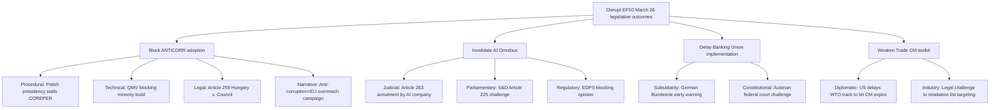

<!-- SPDX-FileCopyrightText: 2024-2026 Hack23 AB -->
<!-- SPDX-License-Identifier: Apache-2.0 -->

# Legislative Disruption Analysis — EP Motions, 28 April 2026

**Confidence:** 🟡 Medium | **Method:** Legislative attack surface analysis

---

## Targeted

**Which legislative files are most targeted for disruption and why:**

| Priority | File | Disruption Vector | Threat Actor | Attack Surface |
|----------|------|------------------|-------------|----------------|
| 🔴 1 | Anti-Corruption Directive | Council procedural blockage | Hungary, Poland | Presidential agenda management |
| 🟡 2 | AI Digital Omnibus | Legal challenge (Article 263 TFEU) | AI industry, civil liberties NGOs | GPAI liability cap, SME exemption |
| 🟡 3 | Banking Union SRMR3 | Subsidiarity challenge | German Bundesrat | SRM authority over national banks |
| 🟢 4 | Trade Countermeasures | Implementation delay | US diplomatic pressure | Commission delegated acts |
| 🟢 5 | Climate Framework | Revision procedure | ECR/PfE | Majority coalition needed for revision |

---

## Attack Tree

---

## Technique

**Specific disruption techniques being deployed or likely to be deployed:**

| Technique | Actor | File | Effectiveness | Current Status |
|-----------|-------|------|---------------|----------------|
| Agenda management (not scheduling) | Polish presidency | ANTICORR | 🔴 High | Active |
| Public narrative: "EU sovereignty overreach" | Orbán media ecosystem | ANTICORR | 🟡 Medium | Active |
| Subsidiarity early warning letter | Bundesrat (potential) | DGSD2 | 🟡 Medium | Not yet filed |
| Article 263 TFEU challenge | AI industry legal fund | AI Omnibus | 🟡 Medium | Preparatory |
| Article 225 petition (250 signatures) | S&D/Greens | AI Omnibus | 🟡 Medium | ~180 signatures gathered |
| WTO DS consultation request | US (potential) | Trade CM | 🟢 Low | Not yet filed |
| Disinformation: "EU punishes US alliance" | Pro-Kremlin media | Trade CM | 🟢 Low | Marginal |

---

## Detection

**Early warning indicators for disruption attempts:**

| Disruption Type | Detection Method | Source | Lead Time |
|----------------|-----------------|--------|-----------|
| COREPER II scheduling (ANTICORR) | Council public meeting calendar | council.europa.eu | 2 weeks |
| Article 263 challenge filing | ECJ CELEX notification | eur-lex.europa.eu | Immediate |
| Subsidiarity early warning | Bundesrat press office | Bundesrat.de | Immediate |
| Article 225 petition threshold | EP document PETCOM system | europarl.europa.eu | Real-time |
| Hungarian state media anti-ANTICORR campaign | EU EUvsDisinfo monitoring | euvsdisinfo.eu | Same day |
| US Section 232 automotive filing | USTR federal register | ustr.gov | Same day |

---

## Counter

**Counter-disruption strategies available to pro-legislative actors:**

| Threat | Counter | Actor | Resource Required |
|--------|---------|-------|-------------------|
| COREPER scheduling delay | Commission Article 294 12-week rule | Commission | Low — administrative action |
| Hungarian opposition | Article 7 acceleration + EU funds conditionality | Council QMV+ | Medium — political coordination |
| Article 263 AI challenge | Commission defend + interim measures | Commission/Council | Medium — legal resources |
| Article 225 petition | EPP-Commission-Renew defensive coalition | EPP | Low — political communications |
| Subsidiarity warning | DGSD2 text amendment (national DGS carve-out) | Parliament/Commission | Medium — legislative adjustment |

**Most cost-effective counter:** Commission trigger of Article 294 12-week rule for ANTICORR. Low cost, high visibility, creates formal accountability for Polish presidency. Should be activated by May 15, 2026.

---

## Reader Briefing

**For EU Citizens:** Passing a law in the EU Parliament isn't the end of the story — opponents of a law have several ways to try to stop it or weaken it afterwards.

The most important thing to watch with the anti-corruption directive is whether Poland (which chairs the EU Council until June) will actually schedule meetings to move the law forward. If they don't schedule meetings, the law just sits there — a democratic decision by the Parliament waiting to be enacted, with no formal process to force it through.

After that, there are legal routes: the AI law could be challenged in the EU's court system. These challenges can take years, creating uncertainty while companies wait.

The best protection against these tactics: public awareness, civil society pressure, and the Commission using its formal powers to force procedural compliance.

---

*Sources: Council procedural rules (Rules of Procedure of the Council), EP Rules of Procedure, ECJ Statute, Commission White Paper on EU governance 2026. EP Open Data Portal (CC BY 4.0).*
