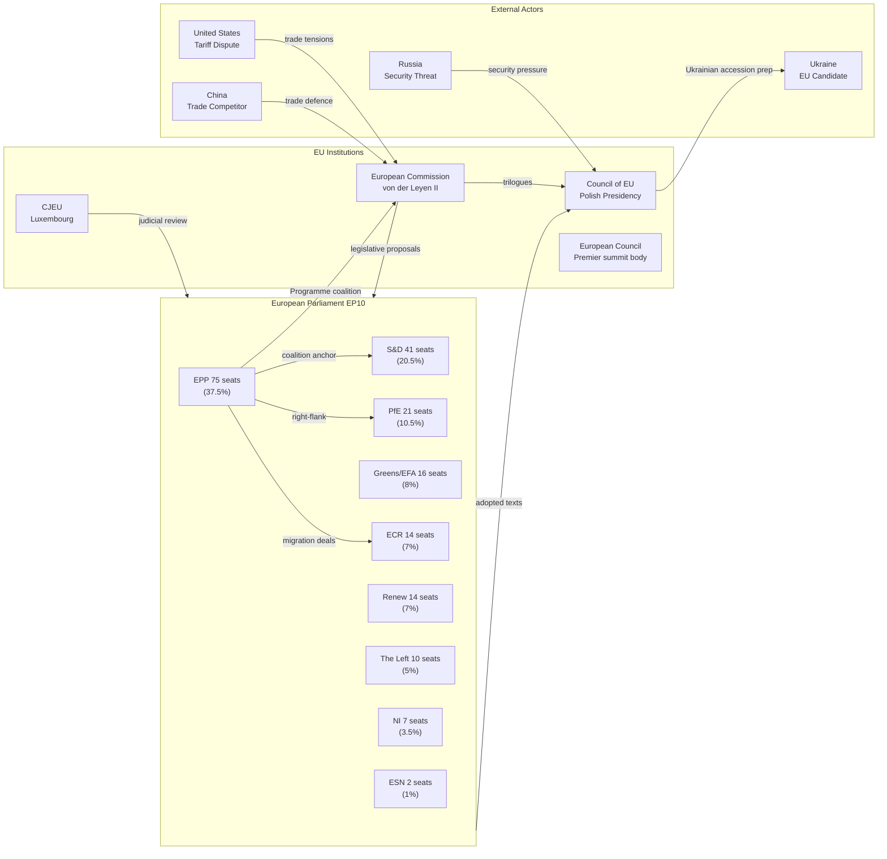

<!-- SPDX-FileCopyrightText: 2024-2026 Hack23 AB -->
<!-- SPDX-License-Identifier: Apache-2.0 -->

# Actor Mapping — EU Parliament Propositions
## April 28, 2026 | Political Actor Network

**Admiralty Grade:** B2 | **Run Date:** 2026-04-28

---

## 1. Actor Network Diagram (Mermaid)

---

## 2. Actor Influence Assessment

### Core Legislative Actors

| Actor | Type | Influence | Primary Agenda |
|-------|------|-----------|----------------|
| European Commission | Institutional | 🔴 VERY HIGH | Competitiveness, Green Deal, Security |
| EPP Group | Parliamentary | 🔴 VERY HIGH | Coalition management, agenda dominance |
| Council Presidency (Poland) | Governmental | 🟡 HIGH | Defence, Eastern partnership, migration |
| S&D Group | Parliamentary | 🟡 HIGH | Progressive veto, social agenda |
| CJEU | Judicial | 🟡 HIGH | Constitutional review, rights protection |

### Secondary Actors

| Actor | Type | Influence | Key Role |
|-------|------|-----------|---------|
| PfE (Orbán) | Parliamentary | 🟡 MEDIUM-HIGH | Right-flank coalition on migration |
| ECR | Parliamentary | 🟡 MEDIUM | Conservative backup coalition |
| Renew Europe | Parliamentary | 🟡 MEDIUM | Swing vote on digital/climate |
| European Council | Institutional | 🟡 MEDIUM | Strategic direction setting |
| Germany (CDU-led) | National | 🟡 MEDIUM | Anchor economy; defence focus |

---

## 3. Coalition Mapping by File

| File | Coalition assembled | Majority |
|------|-------------------|---------|
| Banking Union Trilogy | EPP + S&D + Renew (+/- Greens) | ✅ Confirmed |
| AI Act Omnibus | EPP + S&D + Renew | ✅ Confirmed |
| 2040 Climate Target | EPP + S&D + Greens/EFA + Renew | ✅ Confirmed (against ECR/PfE) |
| Safe Countries Migration | EPP + ECR + PfE + (parts of S&D) | ✅ Confirmed |
| EU Housing Resolution | EPP + S&D + Renew + Greens | ✅ Confirmed (non-binding) |

---

*Generated: 2026-04-28 | propositions-run-1777356258*
