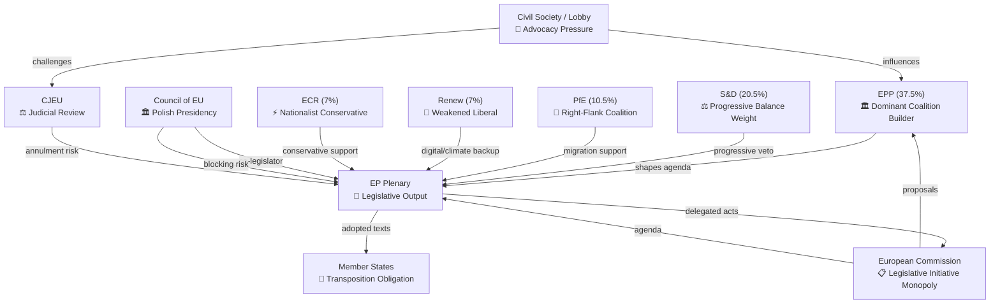

<!-- SPDX-FileCopyrightText: 2024-2026 Hack23 AB -->
<!-- SPDX-License-Identifier: Apache-2.0 -->

# Forces Analysis — EU Parliament Propositions
## April 28, 2026 | Porter's 5 Forces + Political Dynamics

**Admiralty Grade:** B2 | **Run Date:** 2026-04-28

---

## 1. Legislative Forces Diagram (Mermaid)

---

## 2. Force Analysis Narrative

### Force 1: Coalition Bargaining Power

The EP's legislative output depends entirely on constructing working majorities. With 9 groups and no group above 37.5%, every vote requires negotiation. The critical dynamic is EPP's choice of coalition partner:

- **EPP + S&D + Renew** (traditional "grand coalition"): ~65% of seats → sufficient for constitutional majorities
- **EPP + ECR + PfE** (right-wing coalition): ~55–60% → sufficient for simple majority
- **EPP alone**: ~37.5% → insufficient

The procedures feed RECESS_MODE prevents direct observation of which coalition is being used on pending files.

### Force 2: Commission Agenda-Setting

The Commission holds the monopoly on legislative initiative (Article 17 TEU). Von der Leyen II's agenda is:
1. Green Deal completion (legally binding targets now in place)
2. Competitiveness Compass (Draghi Report response)
3. EU Defence and Security Union

The Commission's choice of which proposals to prioritise and when directly shapes the EP's legislative agenda. High correlation between Commission and EPP priorities (both von der Leyen II products).

### Force 3: Council Veto Power

For Ordinary Legislative Procedure, Council QMV is required. Key Council dynamics:
- Polish Presidency (Jan–Jun 2026) is pro-EU on defence but complex on migration
- Hungary under Orbán: consistent spoiler on rule of law, migration solidarity
- Italian interest in Banking Union (UniCredit/banking sector concerns)

### Force 4: Judicial Review Constraint

The CJEU acts as the ultimate constitutional check. Its jurisprudence on:
- Migration: strict proportionality review of asylum procedure restrictions
- Data protection: consistent enforcement of fundamental rights in digital regulation
- Financial: established "AFSJ" (Area of Freedom, Security and Justice) boundary limits

Three of Q1 2026's highest-profile texts (Safe Countries, AI Omnibus GPAI provisions, Banking Union extension to payment institutions) face potential CJEU scrutiny.

### Force 5: Civil Society and Industry Influence

NGOs, think tanks, and industry associations exert influence through:
- Committee hearing testimony
- MEP networks and information asymmetry
- Legal challenges post-adoption

The EBF (banking), EFA (farmers), Digital Europe (tech), and CAN Europe (climate) are the highest-influence civil society actors for this legislation cycle.

---

## 3. Force Intensity Assessment

| Force | Intensity (1–5) | Direction | Notes |
|-------|-----------------|-----------|-------|
| Coalition bargaining | 5/5 | ↕ Volatile | 9-group fragmentation peak |
| Commission initiative | 4/5 | → Stable | Strong EPP-Commission alignment |
| Council veto | 3/5 | ← Moderate constraint | Polish Presidency cooperative |
| CJEU review | 3/5 | ↑ Increasing | Multiple contested texts in pipeline |
| Civil society | 2/5 | → Stable | Normal advocacy; no exceptional campaigns |

---

*Generated: 2026-04-28 | propositions-run-1777356258*
