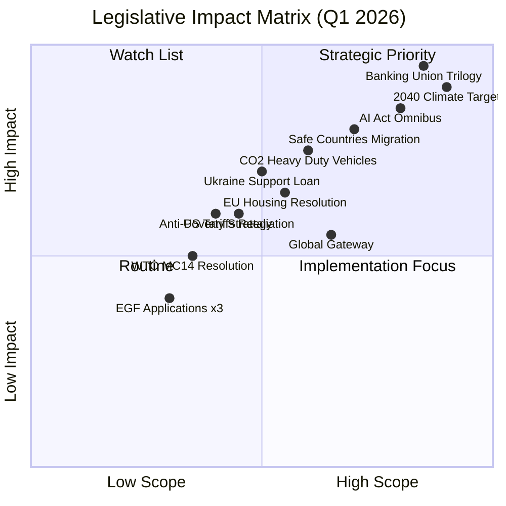

<!-- SPDX-FileCopyrightText: 2024-2026 Hack23 AB -->
<!-- SPDX-License-Identifier: Apache-2.0 -->

# Impact Matrix — EU Parliament Propositions
## April 28, 2026 | Legislative Impact Classification

**Admiralty Grade:** B2 | **Run Date:** 2026-04-28

---

## 1. Impact Matrix (Mermaid)

---

## 2. Impact Classification Narrative

### Strategic Priority (High Scope, High Impact)

**Banking Union Trilogy** (SRMR3/BRRD3/DGSD2):
- Scope: All EU member states, all banks >€30bn assets
- Impact: Systemic financial stability; depositor protection; bank resolution
- Status: Adopted ✅

**2040 Climate Target Framework**:
- Scope: All EU member states, all sectors
- Impact: Legally binding 90% GHG reduction by 2040; transforms investment landscape for 15 years
- Status: Adopted ✅

**AI Act Omnibus**:
- Scope: All EU AI developers, deployers, operators across all sectors
- Impact: Clarifies risk categorisation for largest AI models; compliance framework for €50bn+ EU AI market
- Status: Adopted ✅

### Watch List (Low Scope, High Impact)

**Safe Countries Migration**:
- Scope: Asylum seekers from designated "safe" countries
- Impact: Significant reduction in processing times; risk of protection gaps
- Status: Adopted ✅ | CJEU challenge risk 🔴

**CO2 Standards Heavy-Duty Vehicles**:
- Scope: Truck/bus manufacturers and fleet operators
- Impact: Accelerates commercial vehicle fleet decarbonisation; major investment signal for charging infrastructure
- Status: Adopted ✅

### Implementation Focus (High Scope, Low Impact)

**Global Gateway Framework**:
- Scope: EU-Africa/Asia infrastructure investment
- Impact: Modest direct legislative change; significant political signalling
- Status: Adopted ✅

---

## 3. Cumulative Impact Score (Q1 2026)

| Policy Area | Texts | Combined Weight | Score |
|------------|-------|-----------------|-------|
| Financial/Banking | 3 | HIGH x3 | 🔴 9/10 |
| Climate/Environment | 3 | HIGH x3 | 🔴 9/10 |
| Digital/AI | 1 | HIGH x1 | 🟡 7/10 |
| Migration | 2 | HIGH x2 | 🟡 7/10 |
| Trade | 2 | MEDIUM x2 | 🟡 6/10 |
| Social/Housing | 2 | MEDIUM x2 | 🟡 5/10 |
| Budget/EGF | 4+ | LOW x4 | 🟢 4/10 |

---

*Generated: 2026-04-28 | propositions-run-1777356258*
