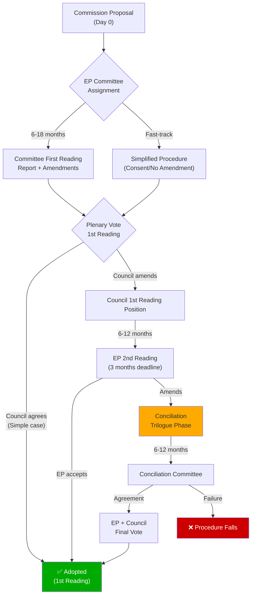

<!-- SPDX-FileCopyrightText: 2024-2026 Hack23 AB -->
<!-- SPDX-License-Identifier: Apache-2.0 -->

# Legislative Velocity Risk — EU Parliament Propositions
## April 28, 2026 | Procedural Speed Risk Assessment

**Admiralty Grade:** B2 | **Run Date:** 2026-04-28

---

## 1. Legislative Velocity Risk Diagram (Mermaid)

---

## 2. Velocity Risk by Procedure Stage

### Stage: Committee Phase (6–18 months typical)

**Velocity risks in EP10 committee stage**:
- **Reporting load**: With 9 groups and fragmented majorities, committee coordinators face higher negotiation burden to agree rapporteur positions
- **Compromise text iterations**: More groups = more shadow rapporteur amendments to reconcile
- **Committee chair influence**: EPP dominates committee chairs (proportional allocation); faster progress on EPP-priority files

**WEP for on-time delivery**: 65–75% for EPP-priority files; 45–55% for contested cross-cutting files

### Stage: Plenary First Reading (typical 1–2 days of scheduling)

**Velocity risks**:
- **Majority construction**: As documented, no stable working majority — each vote requires re-negotiation
- **Agenda competition**: Limited plenary time (12 sessions/year, ~4 days each); high-priority files displace lower-priority
- **Parliamentary questions "filibuster" pattern**: Rare but used for contentious files

**Current session (April 27–30)**: 4-day session; estimated 20–40 texts can be voted; strategic scheduling of highest-priority files.

### Stage: Trilogue/Conciliation (6–12 months typical)

**Velocity risks**:
- **Council Presidency commitment**: Polish Presidency (ending June 2026) incentivised to close files; Danish Presidency (July+) may reprioritise
- **Rotation gap**: Complex files started under Polish Presidency may stall at Danish handover
- **EP mandate validity**: If EP plenary mandate expires before trilogue concludes, new mandate vote needed

**Assessment**: 3 files currently in Council second-reading stage (visible from external documents feed) → these are the highest-velocity risk files for Q2 2026.

---

## 3. Velocity Benchmark

| File Category | EP9 Average Time | EP10 Expectation | Risk |
|--------------|-----------------|-----------------|------|
| Simple legislation (single-position) | 12 months | 10–14 months | 🟢 LOW |
| Complex financial regulation | 30 months | 24–36 months | 🟡 MEDIUM |
| Cross-border security/migration | 24 months | 30–48 months | 🔴 HIGH |
| Constitutional/treaty articles | 48–72 months | 60+ months | 🔴 HIGH |
| Budget/EGF (annual cycle) | 3–6 months | 3–6 months | 🟢 LOW |

---

## 4. Velocity Risk Matrix

| Risk Factor | Probability | Velocity Impact | Net Risk |
|------------|------------|-----------------|---------|
| Coalition breakdown delays vote | 35% | 2–6 months delay | 🟡 MEDIUM |
| Council blocking minority | 45% | 3–12 months delay | 🟡 MEDIUM |
| CJEU annulment forces re-proposal | 40% | 18–36 months | 🔴 HIGH |
| Presidency rotation gap | 30% | 1–3 months delay | 🟢 LOW-MED |
| Emergency session disruption | 20% | 1–2 months disruption | 🟢 LOW-MED |

---

*Generated: 2026-04-28 | propositions-run-1777356258*
