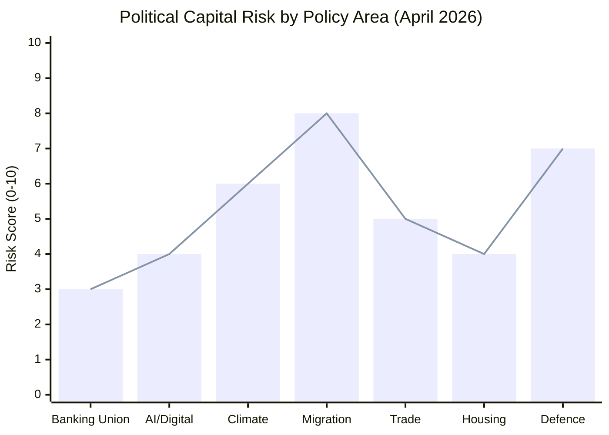

<!-- SPDX-FileCopyrightText: 2024-2026 Hack23 AB -->
<!-- SPDX-License-Identifier: Apache-2.0 -->

# Political Capital Risk — EU Parliament Propositions
## April 28, 2026 | Political Risk Scoring

**Admiralty Grade:** B2 | **Run Date:** 2026-04-28

---

## 1. Political Capital Risk Diagram (Mermaid)

---

## 2. Risk Score Methodology

Political capital risk = composite of:
- Coalition fragility for the file (0–4 points)
- External pressure/lobbying intensity (0–3 points)
- CJEU/legal uncertainty (0–2 points)
- National government sensitivity (0–1 point)

### Banking Union (Score: 3/10 — LOW)

Coalition for Banking Union was broad (EPP+S&D+Renew) and legislation is now adopted. Main residual risk is Level 2 implementing acts where Council may resist specific calibrations (Italy/UniCredit sensitivity). Political capital risk is LOW post-adoption.

**Key risks**: Council blocking minority on MREL requirements for smaller banks; DGSD2 extension to payment institutions faces practical implementation resistance.

### AI / Digital Regulation (Score: 4/10 — LOW-MEDIUM)

The AI Omnibus resolved the key political tensions from the original AI Act. Remaining political capital risk relates to:
- Biometric identification provisions (US tech firms lobbying)
- GPAI model obligations (OpenAI/Google/Meta European entities)
- SME regulatory sandbox access (Renew and EPP want more flexibility)

### Climate Legislation (Score: 6/10 — MEDIUM)

The 2040 Climate Target is adopted but faces political risk during Level 2 implementation:
- Member state contributions (nationally determined) will generate political battles
- Nature Restoration Law derogations (agricultural lobby)
- CO2 Heavy-Duty vehicles compliance timeline (automotive sector)
- EPP internal tension between climate credibility (Western MEPs) and industrial protection (Central/Eastern MEPs)

### Migration (Score: 8/10 — HIGH)

Highest political capital risk in the EP10 term:
- CJEU challenge to Safe Countries regulation (40% probability)
- Pact on Migration implementation deadlines approaching (June 2026 for some directives)
- Real-world migration patterns may not match legislative assumptions
- Far-right can exploit any perceived "failure" for political gain

### Trade (Score: 5/10 — MEDIUM)

US tariff dispute (retaliation authorised, TA-10-2026-0096) creates ongoing political capital pressure:
- If retaliatory measures escalate, business lobby (EPP base) will demand reversal
- Agricultural safeguards in Mercosur deal satisfy farmers but face WTO challenge risk
- EU-Africa trade development requires sustained political commitment

### Housing (Score: 4/10 — LOW-MEDIUM)

Own-initiative resolution adopted (non-binding) calling for EU Housing Action Plan. Political capital risk is:
- Commission may not deliver legislative proposal on EP timeline
- Member states will resist EU intrusion into housing policy (subsidiarity)
- Gap between EP rhetoric and available EU legal competence

### Defence (Score: 7/10 — HIGH)

Not directly visible in Q1 2026 adopted texts but emerging as the dominant political issue:
- NATO 2% spending target: political capital battle in Germany, Italy, Spain
- European Defence Industrial Strategy: Commission proposal in pipeline
- Ukraine support (Loan adopted) requires continued political will
- EPP coalition with ECR/PfE on defence creates contradictions (Orbán/Putin relationship)

---

## 3. Political Capital Risk Summary

| Policy Area | Risk Score | Primary Risk Driver |
|------------|-----------|---------------------|
| Migration | 8/10 🔴 HIGH | CJEU challenge, implementation gap |
| Defence | 7/10 🔴 HIGH | NATO commitments vs. domestic fiscal |
| Climate | 6/10 🟡 MEDIUM | Level 2 implementation battles |
| Trade | 5/10 🟡 MEDIUM | US tariff escalation risk |
| Housing | 4/10 🟡 MEDIUM | Subsidiarity resistance |
| AI/Digital | 4/10 🟡 MEDIUM | Lobbying pressure on implementing acts |
| Banking | 3/10 🟢 LOW | Post-adoption L2 resistance |

---

*Generated: 2026-04-28 | propositions-run-1777356258*
