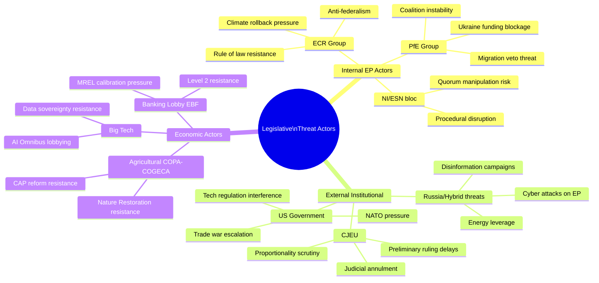

<!-- SPDX-FileCopyrightText: 2024-2026 Hack23 AB -->
<!-- SPDX-License-Identifier: Apache-2.0 -->

# Actor Threat Profiles — EU Parliament Propositions
## April 28, 2026 | Legislative Threat Actor Assessment

**Admiralty Grade:** B2 | **Run Date:** 2026-04-28

---

## 1. Actor Threat Profile Diagram (Mermaid)

---

## 2. High-Priority Threat Actor Profiles

### Actor: Patriots for Europe (PfE) Group

**Category**: Internal EP (Parliamentary)  
**Threat type**: Coalition leverage / blocking  
**Primary threat vectors**:
- On Ukraine support files: Orbán's Fidesz anchors PfE; will demand concessions for EPP coalition support
- On migration: PfE is EPP's right-flank partner; EPP must accommodate PfE demands to maintain this coalition
- On rule of law: PfE opposes Article 7 proceedings; coalition dependency gives Orbán leverage

**Probability of adverse action**: 45–55% that PfE successfully extracts a concession from EPP on at least one major H2 2026 file  
**Impact**: MEDIUM-HIGH — individual file delays or policy dilution; not systemic

### Actor: CJEU

**Category**: Judicial  
**Threat type**: Legal annulment / interpretation  
**Primary threat vectors**:
- Safe Countries of Origin: High risk of preliminary reference or direct challenge
- AI Act Omnibus GPAI provisions: Potential for data protection fundamental rights challenge
- Banking Union DGSD2 extension: Legal boundary of deposit guarantee schemes

**Probability of adverse ruling**: 35–45% for at least one Q1 2026 text within 24 months  
**Impact**: HIGH — annulment forces Commission re-proposal; implementation gap

### Actor: US Technology Companies (collective)

**Category**: External industry  
**Threat type**: Lobbying / legal challenge / trade retaliation  
**Primary threat vectors**:
- AI Act implementing acts lobbying (GPAI threshold, biometric ID exemptions)
- DSA/DMA enforcement challenges in US courts
- Using US-EU trade dispute as leverage against digital regulation

**Probability of material impact on legislation**: 40–50% that tech lobbying secures at least one meaningful concession in AI Act L2 delegated acts  
**Impact**: MEDIUM — compliance dilution risk; EU sovereignty agenda weakened

---

## 3. Threat Actor Influence Comparison

| Actor | Reach | Resources | Access | Threat Score |
|-------|-------|-----------|--------|-------------|
| PfE (Orbán) | Internal EP | Institutional | Direct | 🔴 HIGH |
| CJEU | All EU law | Judicial authority | Via courts | 🔴 HIGH |
| US Tech (Apple/Google/Meta/OpenAI) | Global | $100bn+ lobbying | MEP contacts, legal | 🟡 MEDIUM-HIGH |
| EBF (Banking) | EU/Global | Concentrated | Commissioner access | 🟡 MEDIUM |
| COPA-COGECA | EU member states | Concentrated | National ministers | 🟡 MEDIUM |
| Russia (hybrid) | External | State resources | Disinformation | 🟡 MEDIUM (quality) |

---

*Generated: 2026-04-28 | propositions-run-1777356258*
