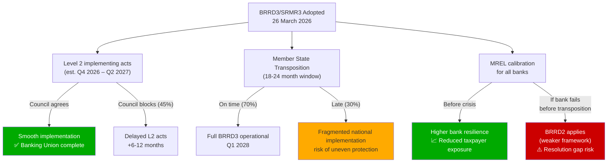
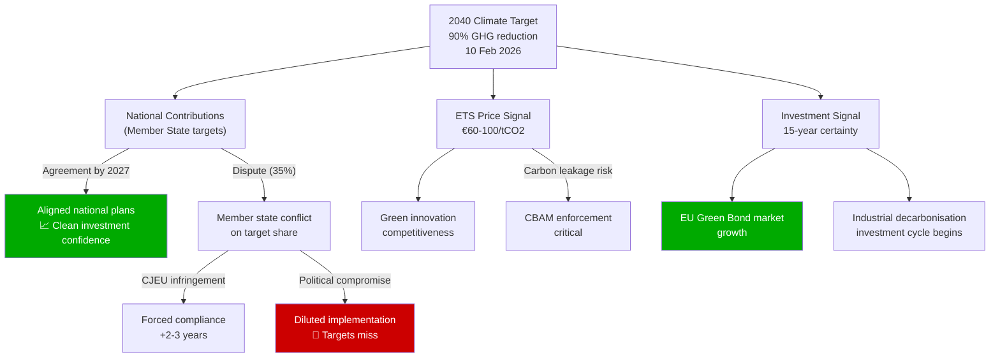
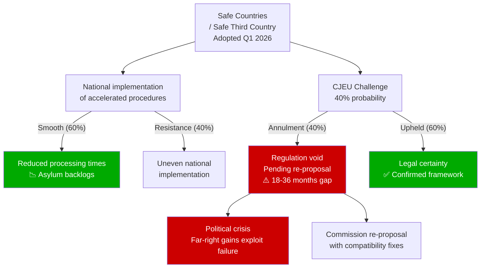

<!-- SPDX-FileCopyrightText: 2024-2026 Hack23 AB -->
<!-- SPDX-License-Identifier: Apache-2.0 -->

# Consequence Trees — EU Parliament Propositions
## April 28, 2026 | Legislative Consequence Analysis

**Admiralty Grade:** B2 | **Run Date:** 2026-04-28

---

## 1. Banking Union Consequence Tree (Mermaid)

---

## 2. Climate Consequence Tree (Mermaid)

---

## 3. Migration Consequence Tree

---

## 4. Consequence Priority Assessment

| Consequence Branch | Probability | Impact | Priority |
|-------------------|------------|--------|----------|
| Banking Union smooth L2 implementation | 55% | Very High (positive) | 🟢 Monitor |
| Banking Union Council delay | 45% | High (negative) | 🔴 Watch |
| Climate 2040 aligned national plans | 65% | Very High (positive) | 🟢 Monitor |
| Climate diluted implementation | 35% | Very High (negative) | 🔴 Watch |
| Migration CJEU annulment | 40% | High (negative) | 🔴 Critical |
| Migration confirmed framework | 60% | High (positive) | 🟢 Track |

---

*Generated: 2026-04-28 | propositions-run-1777356258*
