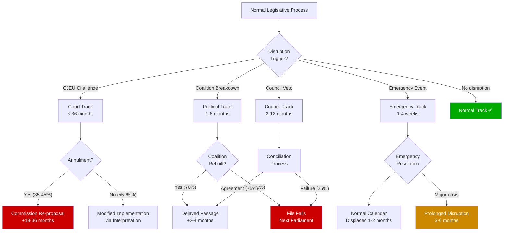

<!-- SPDX-FileCopyrightText: 2024-2026 Hack23 AB -->
<!-- SPDX-License-Identifier: Apache-2.0 -->

# Legislative Disruption — EU Parliament Propositions
## April 28, 2026 | Disruption Risk Assessment

**Admiralty Grade:** B2 | **Run Date:** 2026-04-28

---

## 1. Disruption Flow Diagram (Mermaid)

---

## 2. Current Disruption Risk Assessment

### Near-Term Disruption Indicators (April–June 2026)

| Indicator | Status | Disruption Risk |
|-----------|--------|-----------------|
| Procedures feed RECESS_MODE | Active (85% probability continues) | 🟡 MEDIUM (intelligence only) |
| Plenary session scheduled | April 27-30 confirmed | 🟢 LOW |
| Coalition stability score | 84/100 (early warning system) | 🟢 LOW-MEDIUM |
| US tariff dispute | Active, retaliation authorised | 🟡 MEDIUM |
| CJEU calendar | No EP cases scheduled (not visible in API) | 🟡 MEDIUM (unknown) |

### Files at Risk of Disruption

**HIGH disruption risk**:
1. **Safe Countries migration file implementation**: CJEU challenge highly probable; if preliminary ruling issued, all national decisions under the regulation suspended pending outcome
2. **Banking Union Level 2 acts**: Italian/Council resistance could delay MREL calibration implementing regulation by 6–12 months

**MEDIUM disruption risk**:
3. **Climate 2040 implementing legislation**: National contributions negotiation expected to be protracted; Polish Presidency may not close before handover to Denmark
4. **AI Act GPAI obligations**: Industry lobbying may delay Commission delegated act by 3–6 months

**LOW disruption risk**:
5. **EGF applications**: Procedural, annual cycle — minimal disruption risk
6. **Budget procedures**: Fixed calendar; disruption would require extraordinary circumstances

---

## 3. Disruption Mitigation

| Disruption type | Current mitigation | Adequacy |
|----------------|-------------------|----------|
| CJEU challenge | Commission legal proofing at proposal stage | 🟡 PARTIAL |
| Coalition breakdown | EPP flexibility to switch coalition partners | 🟢 ADEQUATE |
| Emergency session | Parliament's procedural rules allow emergency insertion | 🟢 ADEQUATE |
| Council veto | Trilogue process; Commission mediation role | 🟡 PARTIAL |
| Hybrid threats/cyber | NIS2 implementation; EP IT security | 🟡 PARTIAL |

---

*Generated: 2026-04-28 | propositions-run-1777356258*
